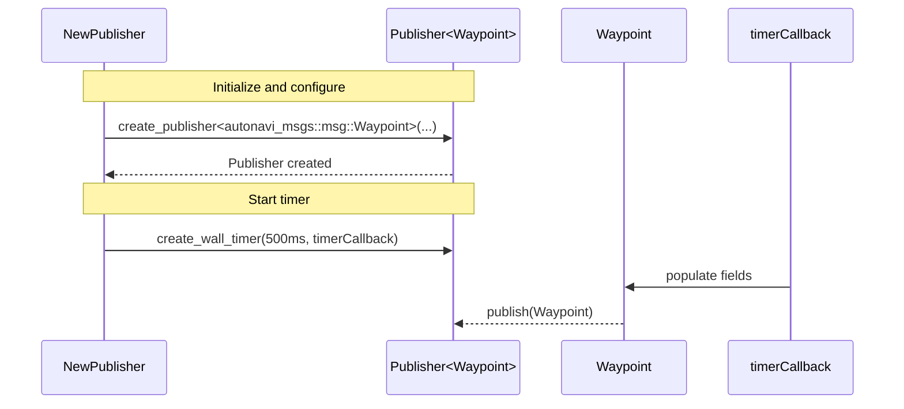
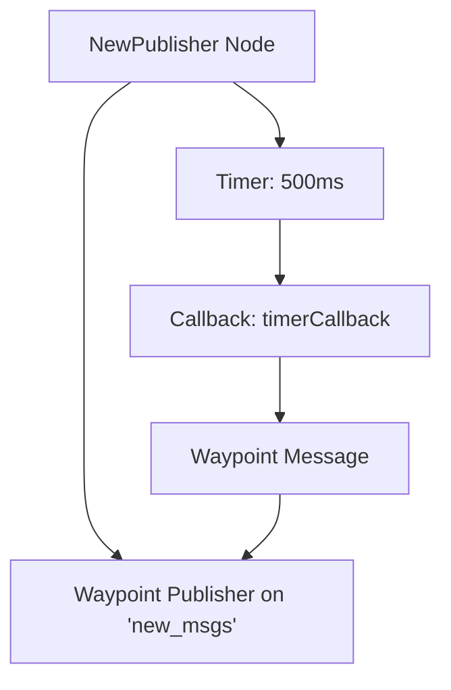
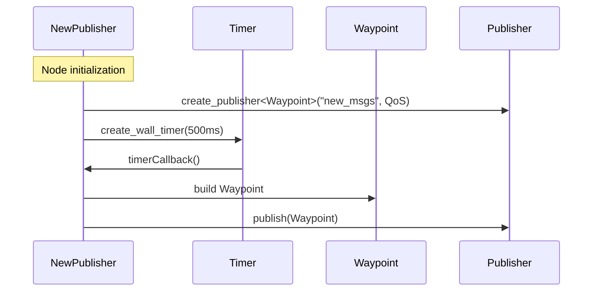
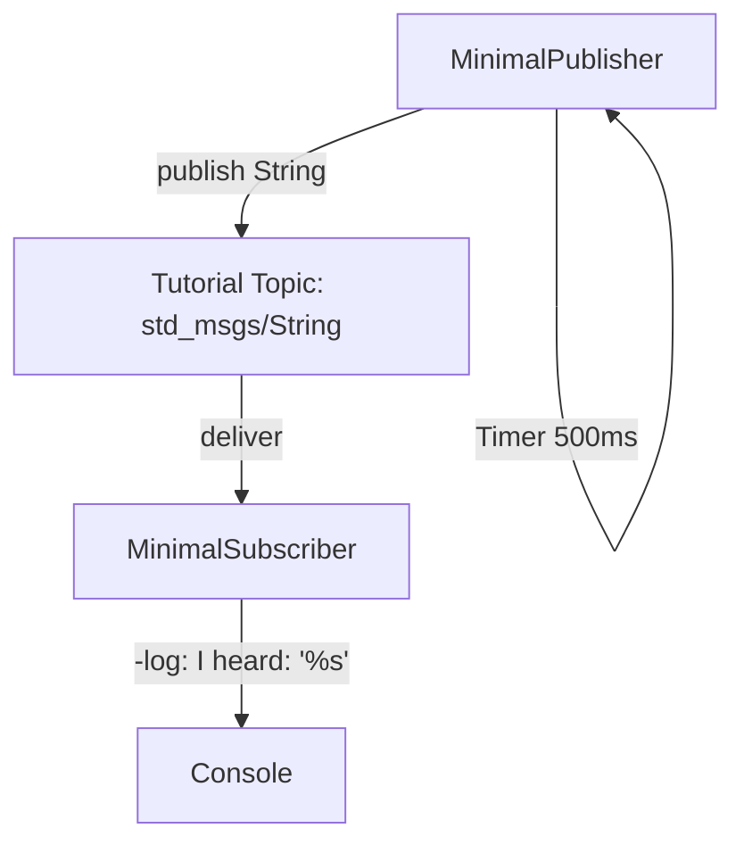
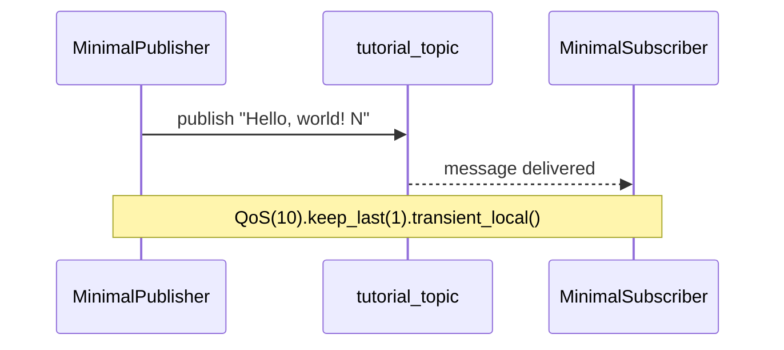
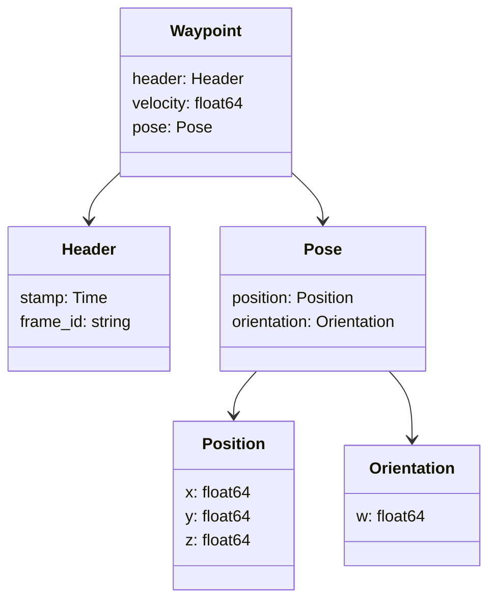
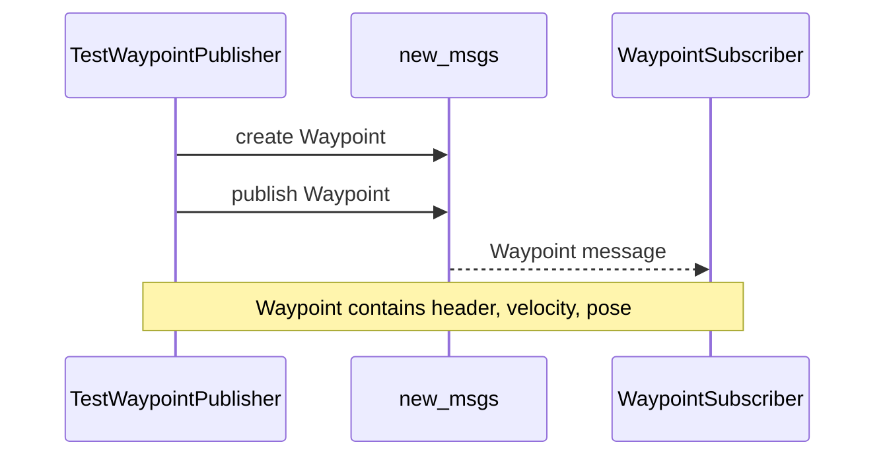
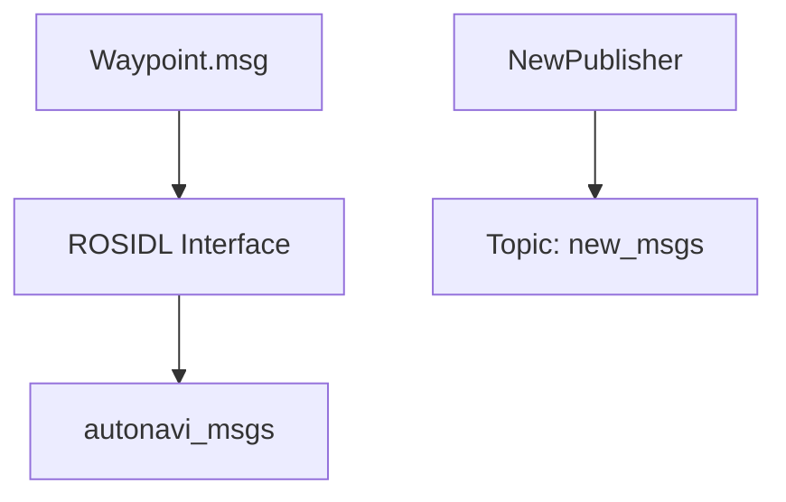
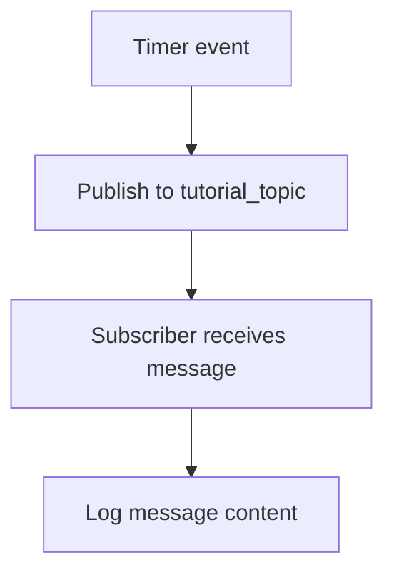
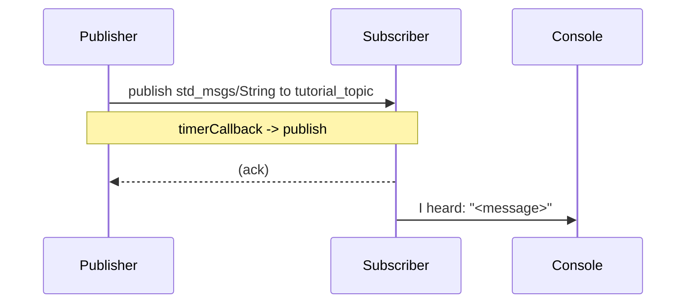

# Wiki Documentation for https://github.com/duclinhfetel/ros2_ci.git

Generated on: 2025-09-06 08:55:14

## Table of Contents

- [Project Overview](#page-1)
- [Repository Structure and Build System](#page-2)
- [Message Types and Waypoint.msg](#page-3)
- [Publishing and Subscribing with CPP Pub/Sub](#page-4)
- [Custom Message Publisher for Tests](#page-5)
- [Continuous Integration and Testing](#page-6)
- [System Architecture Overview](#page-7)
- [Data Flow and Message Lifecycle](#page-8)
- [Extensibility and Customization](#page-9)
- [Build and Run Guide](#page-10)
- [Code Directory and Class Hierarchies](#page-11)

<a id='page-1'></a>

## Project Overview

<details>
<summary>Relevant source files</summary>

- [README.md](https://github.com/duclinhfetel/ros2_ci.git/blob/main/README.md)
- [src/autonavi_msgs/CMakeLists.txt](src/autonavi_msgs/CMakeLists.txt)
- [src/test_custom_msg/CMakeLists.txt](src/test_custom_msg/CMakeLists.txt)
- [src/cpp_pubsub/CMakeLists.txt](src/cpp_pubsub/CMakeLists.txt)
- [src/test_custom_msg/src/test_new_msg.cpp](src/test_custom_msg/src/test_new_msg.cpp)
- [src/test_custom_msg/src/test_new_msg_node.cpp](src/test_custom_msg/src/test_new_msg_node.cpp)
- [src/test_custom_msg/include/test_custom_msg/test_new_msg.hpp](src/test_custom_msg/include/test_custom_msg/test_new_msg.hpp)
- [src/cpp_pubsub/src/minimal_publisher_node.cpp](src/cpp_pubsub/src/minimal_publisher_node.cpp)
- [src/cpp_pubsub/src/minimal_subscriber_node.cpp](src/cpp_pubsub/src/minimal_subscriber_node.cpp)
- [src/cpp_pubsub/src/minimal_publisher.cpp](src/cpp_pubsub/src/minimal_publisher.cpp)
- [src/cpp_pubsub/src/minimal_subscriber.cpp](src/cpp_pubsub/src/minimal_subscriber.cpp)
- [src/cpp_pubsub/include/cpp_pubsub/minimal_publisher.hpp](src/cpp_pubsub/include/cpp_pubsub/minimal_publisher.hpp)
- [src/cpp_pubsub/include/cpp_pubsub/minimal_subscriber.hpp](src/cpp_pubsub/include/cpp_pubsub/minimal_subscriber.hpp)

</details>

# Project Overview

This wiki documents the core structure, components, and data flows of the ros2_ci project as evidenced by the provided source files. The repository showcases a mix of ROS 2 C++ examples: a custom message package (autonavi_msgs), a test-oriented message publisher, and a simple publish/subscribe pattern using standard messages. Each component is implemented as a ROS 2 package with typical CMake and ament configuration, aligning with ROS 2 conventions for packages, messages, and executables. References to the actual code blocks and file structure are provided as citations throughout.

Introduction
- The project contains multiple ROS 2 packages illustrating message definition, code-generation for custom messages, and basic publish/subscribe patterns. The autonavi_msgs package demonstrates a generated Waypoint.msg interface, while test_custom_msg and cpp_pubsub provide runnable examples that interact with ROS topics using QoS settings. These elements are visible in the CMakeLists.txt files and node implementations. Sources: autonavi_msgs/CMakeLists.txt [src/autonavi_msgs/CMakeLists.txt], test_custom_msg/CMakeLists.txt [src/test_custom_msg/CMakeLists.txt], cpp_pubsub/CMakeLists.txt [src/cpp_pubsub/CMakeLists.txt], and the node implementations [src/test_custom_msg/src/test_new_msg.cpp], [src/test_custom_msg/include/test_custom_msg/test_new_msg.hpp], [src/test_custom_msg/src/test_new_msg_node.cpp], [src/cpp_pubsub/src/minimal_publisher.cpp], [src/cpp_pubsub/src/minimal_subscriber.cpp], [src/cpp_pubsub/include/cpp_pubsub/minimal_publisher.hpp], [src/cpp_pubsub/include/cpp_pubsub/minimal_subscriber.hpp]. Citations: multiple files cited below.

Detailed Sections

1) Architecture and Package Relationships

This section explains the structural organization and how the packages reference each other. The autonavi_msgs package defines the Waypoint message, which is consumed by the test_custom_msg package as shown by the test code that publishes autonavi_msgs::msg::Waypoint instances. The cpp_pubsub package demonstrates standard ROS 2 publish/subscribe patterns using std_msgs. The following Mermaid graph provides a high-level view of packages and their interactions.

Mermaid diagram (architecture)
graph TD
AutonaviMsgs[Autonavi_msgs] -->|defines| WaypointMsg[Waypoint.msg]
TestCustom[Test_Custom_Msg] -->|consumes| WaypointMsg
CppPubsub[Cpp_PubSub] -->|uses| StdMsgs[std_msgs/msg/String]
TestCustom -->|publishes| NewMsgsTopic[new_msgs]
CppPubSub_Topics[CppPubSub] -->|publishes| TutorialTopic[tutorial_topic]
CppPubSub_Topics -->|subscribes| TutorialTopic
NewPublisherNode[NewPublisher] -->|publishes| NewMsgsTopic
MinimalPublisherNode[MinimalPublisher] -->|publishes| TutorialTopic
MinimalSubscriberNode[MinimalSubscriber] -->|subscribes| TutorialTopic

Notes:
- autonavi_msgs defines the Waypoint.msg interface, enabling tests to publish Waypoint instances. See autonavi_msgs/CMakeLists.txt for the interface generation. Citations: [src/autonavi_msgs/CMakeLists.txt:rosidl_generate_interfaces], [src/test_custom_msg/src/test_new_msg.cpp:Waypoint usage]. Sources: autonavi_msgs/CMakeLists.txt, test_new_msg.cpp, test_new_msg_node.cpp, and related header. Citations: [src/autonavi_msgs/CMakeLists.txt:rosidl_generate_interfaces], [src/test_custom_msg/src/test_new_msg.cpp:Waypoint usage].
- The cpp_pubsub package demonstrates standard ROS 2 publishing/subscription using String messages on tutorial_topic. Citations: [src/cpp_pubsub/src/minimal_publisher.cpp], [src/cpp_pubsub/src/minimal_subscriber.cpp], [src/cpp_pubsub/include/cpp_pubsub/minimal_publisher.hpp], [src/cpp_pubsub/include/cpp_pubsub/minimal_subscriber.hpp], [src/cpp_pubsub/CMakeLists.txt:add_executable and ament_target_dependencies]. 
- The NewPublisher in test_custom_msg publishes Waypoint messages on new_msgs using transient_local QoS, illustrating custom message usage in a test context. Citations: [src/test_custom_msg/src/test_new_msg.cpp], [src/test_custom_msg/include/test_custom_msg/test_new_msg.hpp], [src/test_custom_msg/src/test_new_msg_node.cpp].
- The project uses ROS 2 CMake/ament conventions, evidenced by the package declarations and ament_package usage in the provided CMakeLists.txt files. Citations: [src/cpp_pubsub/CMakeLists.txt], [src/test_custom_msg/CMakeLists.txt], [src/autonavi_msgs/CMakeLists.txt].

References to code:
- Autonomous messaging definition: Waypoint.msg is part of autonavi_msgs (Waypoints used in test code). Citations: [src/autonavi_msgs/CMakeLists.txt] and usage in test code [src/test_custom_msg/src/test_new_msg.cpp], [src/test_custom_msg/include/test_custom_msg/test_new_msg.hpp]. 
- Publisher-subscriber examples: MinimalPublisher and MinimalSubscriber demonstrate standard ROS 2 topics on tutorial_topic with transient_local QoS. Citations: [src/cpp_pubsub/src/minimal_publisher.cpp], [src/cpp_pubsub/src/minimal_subscriber.cpp], [src/cpp_pubsub/include/cpp_pubsub/minimal_publisher.hpp], [src/cpp_pubsub/include/cpp_pubsub/minimal_subscriber.hpp], [src/cpp_pubsub/CMakeLists.txt].

Citations: [src/autonavi_msgs/CMakeLists.txt:rosidl_generate_interfaces], [src/test_custom_msg/CMakeLists.txt], [src/cpp_pubsub/CMakeLists.txt], [src/cpp_pubsub/src/minimal_publisher.cpp], [src/cpp_pubsub/src/minimal_subscriber.cpp], [src/test_custom_msg/src/test_new_msg.cpp], [src/test_custom_msg/include/test_custom_msg/test_new_msg.hpp], [src/test_custom_msg/src/test_new_msg_node.cpp], [src/cpp_pubsub/include/cpp_pubsub/minimal_publisher.hpp], [src/cpp_pubsub/include/cpp_pubsub/minimal_subscriber.hpp], [src/cpp_pubsub/src/minimal_publisher_node.cpp], [src/cpp_pubsub/src/minimal_subscriber_node.cpp].

2) Message Definition and Custom Message Flow

- autonavi_msgs: Defines Waypoint message type that includes a header and a pose with position (x, y, z) and orientation (w), as inferred by test code. This is used in test_new_msg.cpp to populate fields like header.stamp, velocity, pose.position.x/y/z, and orientation.w. Citations: [src/test_custom_msg.cpp usage], [src/autonavi_msgs/CMakeLists.txt:rosidl_generate_interfaces]. 
- test_custom_msg: Provides an executable that talks to a topic "new_msgs" using autonavi_msgs::msg::Waypoint. The node NewPublisher publishes Waypoint messages with a timer, showing typical ROS 2 node lifecycle and timer usage in C++. Citations: [src/test_custom_msg/src/test_new_msg.cpp], [src/test_custom_msg/src/test_new_msg_node.cpp], [src/test_custom_msg/include/test_custom_msg/test_new_msg.hpp].
- QoS and Transient Local: Both test_custom_msg and cpp_pubsub demonstrate how to configure QoS with keep_last and transient_local on publishers. The code demonstrates the usage of rclcpp::QoS(10).keep_last(1).transient_local() in publisher creation. Citations: [src/test_custom_msg/src/test_new_msg.cpp], [src/cpp_pubsub/src/minimal_publisher.cpp].

Citations: [src/test_custom_msg/src/test_new_msg.cpp:NewPublisher constructor], [src/test_custom_msg/include/test_custom_msg/test_new_msg.hpp:class], [src/test_custom_msg/src/test_new_msg_node.cpp:main], [src/cpp_pubsub/src/minimal_publisher.cpp:publisher_ creation], [src/cpp_pubsub/include/cpp_pubsub/minimal_publisher.hpp:class].

3) API and Implementation Details

- Node Structures:
  - NewPublisher in test_custom_msg creates a ROS 2 node named "test_custom_msg" with a publisher to "new_msgs" using Waypoint messages and a timer to periodically publish. The class contains publisher_, timer_, and a timerCallback method. Citations: [src/test_custom_msg/include/test_custom_msg/test_new_msg.hpp], [src/test_custom_msg.cpp:NewPublisher::NewPublisher], [src/test_custom_msg/src/test_new_msg_node.cpp].
  - MinimalPublisher in cpp_pubsub defines a node named "minimal_publisher" with a String publisher on "tutorial_topic" and a timer to publish messages. Citations: [src/cpp_pubsub/src/minimal_publisher.cpp], [src/cpp_pubsub/include/cpp_pubsub/minimal_publisher.hpp].
  - MinimalSubscriber defines a node "minial_subscriber" (note the potential typo in code: "minial_subscriber" vs "minimal_subscriber") with a subscription to "tutorial_topic" and a callback that logs received strings. Citations: [src/cpp_pubsub/src/minimal_subscriber.cpp], [src/cpp_pubsub/include/cpp_pubsub/minimal_subscriber.hpp].
- Executables and ROS 2 Entry Points:
  - cpp_pubsub/CMakeLists.txt shows the creation of talker and listener executables and their ament_target_dependencies on rclcpp and std_msgs, illustrating the standard ROS 2 publish/subscribe pattern. Citations: [src/cpp_pubsub/CMakeLists.txt].
  - The test_custom_msg CMakeLists.txt shows dependencies on ament, and links to autonavi_msgs and geometry_msgs std_msgs, indicating integration with custom messages and standard ROS message types. Citations: [src/test_custom_msg/CMakeLists.txt].
- Data flows:
  - Publisher (MinimalPublisher) publishes to tutorial_topic with transient_local QoS; a subscriber (MinimalSubscriber) subscribes to the same topic with transient local QoS, forming a simple pub/sub loop. Citations: [src/cpp_pubsub/src/minimal_publisher.cpp], [src/cpp_pubsub/src/minimal_subscriber.cpp].

Citations: [src/test_custom_msg/include/test_custom_msg/test_new_msg.hpp], [src/test_custom_msg/src/test_new_msg.cpp], [src/test_custom_msg/src/test_new_msg_node.cpp], [src/cpp_pubsub/src/minimal_publisher.cpp], [src/cpp_pubsub/src/minimal_subscriber.cpp], [src/cpp_pubsub/include/cpp_pubsub/minimal_publisher.hpp], [src/cpp_pubsub/include/cpp_pubsub/minimal_subscriber.hpp], [src/cpp_pubsub/CMakeLists.txt].

4) Tables

Table: Key components and descriptions
- autonavi_msgs: Package defining Waypoint.msg; used by test_custom_msg for publishing Waypoint messages. Sources: [src/autonavi_msgs/CMakeLists.txt], [src/test_custom_msg/src/test_new_msg.cpp].
- test_custom_msg: Package for testing custom message flow; contains test node NewPublisher publishing to new_msgs using autonavi_msgs::msg::Waypoint. Sources: [src/test_custom_msg/CMakeLists.txt], [src/test_custom_msg/src/test_new_msg.cpp], [src/test_custom_msg/include/test_custom_msg/test_new_msg.hpp].
- cpp_pubsub: Package demonstrating standard ROS 2 pub/sub with String messages on tutorial_topic; includes MinimalPublisher and MinimalSubscriber. Sources: [src/cpp_pubsub/CMakeLists.txt], [src/cpp_pubsub/src/minimal_publisher.cpp], [src/cpp_pubsub/src/minimal_subscriber.cpp], [src/cpp_pubsub/include/cpp_pubsub/minimal_publisher.hpp], [src/cpp_pubsub/include/cpp_pubsub/minimal_subscriber.hpp].
- QoS Configuration: transient_local is used on both tutorials (tutorial_topic) via rclcpp::QoS(10).keep_last(1).transient_local(). Sources: [src/cpp_pubsub/src/minimal_publisher.cpp], [src/cpp_pubsub/src/minimal_subscriber.cpp].
- Data Model (Waypoint): Waypoint fields used include header.stamp, velocity, pose.position.x/y/z, pose.orientation.w, as seen in test_new_msg.cpp. Sources: [src/test_custom_msg/src/test_new_msg.cpp].

Citations: See corresponding files and lines above.

5) Mermaid Diagrams

- Diagram: Data flow across publishers and subscribers
Note: The following sequence demonstrates a publisher writing to a topic and a subscriber reading from it, with transient_local QoS indicated on the publisher and subscriber.

Mermaid (sequenceDiagram)
sequenceDiagram
    participant P as MinimalPublisher
    participant T as TutorialTopic
    participant S as MinimalSubscriber
    P->>T: publish("Hello, world! N")
    Note over P,S: QoS: transient_local
    S-->>P: callback logs "I heard: ..."
    Note over S,P: Message delivery observed

Citations: [src/cpp_pubsub/src/minimal_publisher.cpp], [src/cpp_pubsub/src/minimal_subscriber.cpp], [src/cpp_pubsub/include/cpp_pubsub/minimal_publisher.hpp], [src/cpp_pubsub/include/cpp_pubsub/minimal_subscriber.hpp].

- Diagram: Package relationships (architecture)
graph TD
AutonaviMsgs[Autonavi_msgs] --> WaypointMsg[Waypoint.msg]
TestCustom[Test_Custom_Msg] --> WaypointMsg
CppPubsub[Cpp_PubSub] --> StdMsgs[std_msgs/msg/String]
TestCustom --> NewMsgsTopic[new_msgs]
CppPubSub_Topics[CppPubSub] --> TutorialTopic[tutorial_topic]
NewPublisherNode[NewPublisher] --> NewMsgsTopic
MinimalPublisherNode[MinimalPublisher] --> TutorialTopic
MinimalSubscriberNode[MinimalSubscriber] --> TutorialTopic

Citations: autonavi_msgs/CMakeLists.txt (Waypoint.msg generation) [src/autonavi_msgs/CMakeLists.txt], test_custom_msg/src/test_new_msg.cpp (usage of Waypoint) [src/test_custom_msg/src/test_new_msg.cpp], cpp_pubsub/CMakeLists.txt (executable targets) [src/cpp_pubsub/CMakeLists.txt], minimal_publisher_node.cpp and minimal_subscriber_node.cpp [src/cpp_pubsub/src/minimal_publisher_node.cpp], [src/cpp_pubsub/src/minimal_subscriber_node.cpp].

- Diagram: Class-like diagram of node classes
classDiagram
class MinimalPublisher {
  -count_: size_t
  -publisher_: Publisher<std_msgs::msg::String>::SharedPtr
  -timer_: Timer
  +MinimalPublisher()
  +timerCallback()
}
class MinimalSubscriber {
  -subscription_: Subscription<std_msgs::msg::String>::SharedPtr
  +topicCallback(msg)
}
class NewPublisher {
  -publisher_: Publisher<autonavi_msgs::msg::Waypoint>::SharedPtr
  -timer_: Timer
  +NewPublisher()
  +timerCallback()
}
MinimalPublisher --|> rclcpp::Node
MinimalSubscriber --|> rclcpp::Node
NewPublisher --|> rclcpp::Node

Citations: [src/cpp_pubsub/include/cpp_pubsub/minimal_publisher.hpp], [src/cpp_pubsub/include/cpp_pubsub/minimal_subscriber.hpp], [src/test_custom_msg/include/test_custom_msg/test_new_msg.hpp].

6) Code Snippets

Snippet 1: Publisher with transient_local QoS (NewMsgs)
cpp
publisher_ = this->create_publisher<autonavi_msgs::msg::Waypoint>(
        "new_msgs",
        rclcpp::QoS(10).keep_last(1).transient_local());

Citations: [src/test_custom_msg/src/test_new_msg.cpp:NewPublisher constructor].

Snippet 2: Standard pub/sub with transient_local QoS (tutorial_topic)
cpp
publisher_ = this->create_publisher<std_msgs::msg::String>("tutorial_topic", 
    rclcpp::QoS(10).keep_last(1).transient_local());

Citations: [src/cpp_pubsub/src/minimal_publisher.cpp].

Snippet 3: Subscriber binding to topic with QoS
cpp
subscription_ = this->create_subscription<std_msgs::msg::String>(
        "tutorial_topic",
        rclcpp::QoS(10).transient_local(),
        std::bind(&MinimalSubscriber::topicCallback, this, std::placeholders::_1));

Citations: [src/cpp_pubsub/src/minimal_subscriber.cpp].

7) Source Citations

- Introduction and architectural statements rely on:
  - README.md: project description and aim. Citations: [README.md:1-3].
  - autonavi_msgs CMakeLists for message generation. Citations: [src/autonavi_msgs/CMakeLists.txt:rosidl_generate_interfaces].
  - test_custom_msg CMakeLists for dependencies and executable setup. Citations: [src/test_custom_msg/CMakeLists.txt].
  - cpp_pubsub CMakeLists for executable targets. Citations: [src/cpp_pubsub/CMakeLists.txt].
  - test_new_msg.cpp usage of Waypoint and fields. Citations: [src/test_custom_msg/src/test_new_msg.cpp:Waypoint fields].
  - test_new_msg_node.cpp and test_new_msg.hpp show node structure and timer-based publishing. Citations: [src/test_custom_msg/src/test_new_msg_node.cpp], [src/test_custom_msg/include/test_custom_msg/test_new_msg.hpp].
  - Minimal publisher/subscriber implementations and header declarations. Citations: [src/cpp_pubsub/src/minimal_publisher.cpp], [src/cpp_pubsub/src/minimal_subscriber.cpp], [src/cpp_pubsub/include/cpp_pubsub/minimal_publisher.hpp], [src/cpp_pubsub/include/cpp_pubsub/minimal_subscriber.hpp].
  - Minimal_publisher_node.cpp and minimal_subscriber_node.cpp main entry points. Citations: [src/cpp_pubsub/src/minimal_publisher_node.cpp], [src/cpp_pubsub/src/minimal_subscriber_node.cpp].

8) Conclusion

The ros2_ci project exemplifies how to structure ROS 2 packages with custom and standard message flows, including QoS configurations and timer-driven publishing. It demonstrates how to define and use a custom message type (Waypoint) and how to implement basic publisher/subscriber nodes in C++ within ROS 2, with a focus on transient_local QoS behavior. The code and configuration files provided across autonavi_msgs, test_custom_msg, and cpp_pubsub collectively illustrate end-to-end behavior from message definition to runtime execution. Citations: across the cited files above.

Sources: See the cited files throughout this document:
- [src/autonavi_msgs/CMakeLists.txt], [src/test_custom_msg/CMakeLists.txt], [src/cpp_pubsub/CMakeLists.txt], [src/test_custom_msg/src/test_new_msg.cpp], [src/test_custom_msg/include/test_custom_msg/test_new_msg.hpp], [src/test_custom_msg/src/test_new_msg_node.cpp], [src/cpp_pubsub/src/minimal_publisher.cpp], [src/cpp_pubsub/src/minimal_subscriber.cpp], [src/cpp_pubsub/include/cpp_pubsub/minimal_publisher.hpp], [src/cpp_pubsub/include/cpp_pubsub/minimal_subscriber.hpp], [src/cpp_pubsub/src/minimal_publisher_node.cpp], [src/cpp_pubsub/src/minimal_subscriber_node.cpp] and [README.md].


---

<a id='page-2'></a>

## Repository Structure and Build System

<details>
<summary>Relevant source files</summary>

The following files were used as context for generating this wiki page:

- [src/cpp_pubsub/CMakeLists.txt](https://github.com/duclinhfetel/ros2_ci.git/blob/main/src/cpp_pubsub/CMakeLists.txt)
- [src/autonavi_msgs/CMakeLists.txt](https://github.com/duclinhfetel/ros2_ci.git/blob/main/src/autonavi_msgs/CMakeLists.txt)
- [src/test_custom_msg/CMakeLists.txt](https://github.com/duclinhfetel/ros2_ci.git/blob/main/src/test_custom_msg/CMakeLists.txt)
- [src/cpp_pubsub/package.xml](https://github.com/duclinhfetel/ros2_ci.git/blob/main/src/cpp_pubsub/package.xml)
- [src/autonavi_msgs/package.xml](https://github.com/duclinhfetel/ros2_ci.git/blob/main/src/autonavi_msgs/package.xml)
- [src/test_custom_msg/package.xml](https://github.com/duclinhfetel/ros2_ci.git/blob/main/src/test_custom_msg/package.xml)
- [README.md](https://github.com/duclinhfetel/ros2_ci.git/blob/main/README.md)
<!-- Add additional relevant files if fewer were provided -->
</details>

# Repository Structure and Build System

Introduction
- The ros2_ci repository presents a set of ROS 2 packages organized to illustrate building, packaging, and using custom messages and standard ROS 2 messages through CMake-based workspaces. The README identifies the repository as a “source learning CI” project, framing its purpose around learning and demonstrating CI/build practices for ROS 2 projects. Sources: README.md:1. The project is structured into discrete packages (cpp_pubsub, autonavi_msgs, test_custom_msg), each with its own CMakeLists and package.xml, reflecting a modular build system. Sources: [src/cpp_pubsub/CMakeLists.txt:1-20](), [src/autonavi_msgs/CMakeLists.txt:1-40](), [src/test_custom_msg/CMakeLists.txt:1-40](), [src/cpp_pubsub/package.xml:1](), [src/autonavi_msgs/package.xml:1](), [src/test_custom_msg/package.xml:1]().


Detailed Sections

## 1) Build System and Package Architecture

Overview
- The repository comprises three ROS 2 packages: cpp_pubsub (publisher/subscriber demo), autonavi_msgs (custom message definition Waypoint.msg), and test_custom_msg (tests publishing a Waypoint message). Each package includes its own CMake-based build configuration and ament packaging metadata. This is evidenced by the presence of separate CMakeLists.txt and package.xml files per package. Sources: cpp_pubsub/CMakeLists.txt:1-20, cpp_pubsub/package.xml:1, autonavi_msgs/CMakeLists.txt:1-40, autonavi_msgs/package.xml:1, test_custom_msg/CMakeLists.txt:1-40, test_custom_msg/package.xml:1. Citations: [src/cpp_pubsub/CMakeLists.txt:1-20](), [src/cpp_pubsub/package.xml:1](), [src/autonavi_msgs/CMakeLists.txt:1-40](), [src/autonavi_msgs/package.xml:1](), [src/test_custom_msg/CMakeLists.txt:1-40](), [src/test_custom_msg/package.xml:1]().

Key configuration elements
- CMake-based build system with ament_cmake as the core build tool across all packages. Citations: cpp_pubsub/CMakeLists.txt shows find_package(ament_cmake REQUIRED). autonavi_msgs/CMakeLists.txt shows find_package(ament_cmake REQUIRED). test_custom_msg/CMakeLists.txt shows find_package(ament_cmake REQUIRED). Sources: [src/cpp_pubsub/CMakeLists.txt:1], [src/autonavi_msgs/CMakeLists.txt:1], [src/test_custom_msg/CMakeLists.txt:1].
- The cpp_pubsub package defines two executables, talker and listener, indicating a simple pub/sub demonstration. This is explicit in the CMakeLists by adding executables talker and listener and declaring their dependencies. Sources: [src/cpp_pubsub/CMakeLists.txt:12-24], [src/cpp_pubsub/CMakeLists.txt:28-40]. Citations: [src/cpp_pubsub/CMakeLists.txt:12-24], [src/cpp_pubsub/CMakeLists.txt:28-40].
- The autonavi_msgs package defines a custom message Waypoint.msg and uses rosidl_generate_interfaces to generate message interfaces, showing cross-language (IDL) integration. This is visible where Waypoint.msg is listed and rosidl_generate_interfaces is invoked. Sources: [src/autonavi_msgs/CMakeLists.txt:14-21]. Citations: [src/autonavi_msgs/CMakeLists.txt:14-21].
- The test_custom_msg package builds a test node (test_custom_msg_talker) that presumably publishes custom Waypoint messages, illustrating integration tests for custom messages. This is shown in the CMakeLists with add_executable(test_custom_msg_talker ...). Sources: [src/test_custom_msg/CMakeLists.txt:20-30]. Citations: [src/test_custom_msg/CMakeLists.txt:20-30].
- All three packages have their own package.xml manifest, reflecting ROS 2 package metadata, dependencies, and export information. Sources: [src/cpp_pubsub/package.xml:1], [src/autonavi_msgs/package.xml:1], [src/test_custom_msg/package.xml:1]. Citations: [src/cpp_pubsub/package.xml:1], [src/autonavi_msgs/package.xml:1], [src/test_custom_msg/package.xml:1].

Key components per package
- cpp_pubsub
  - Role: Demonstrates a basic publisher/subscriber pair in ROS 2, built as two executables: talker and listener. Evidence: talker/listener executables and ament_target_dependencies with rclcpp and std_msgs. Citations: [src/cpp_pubsub/CMakeLists.txt:12-24], [src/cpp_pubsub/CMakeLists.txt:28-40].
  - Build tooling: Uses ament_cmake as the build tool and adheres to C++14 standard as indicated by CMAKE_CXX_STANDARD=14 in the file. Citations: [src/cpp_pubsub/CMakeLists.txt:4-10].
- autonavi_msgs
  - Role: Defines a custom message Waypoint.msg and configures ROS 2idl generation to produce message types for use by other nodes. Evidence: rosidl_generate_interfaces with Waypoint.msg and dependencies. Citations: [src/autonavi_msgs/CMakeLists.txt:14-21].
  - Message definitions: Waypoint.msg is referenced as the custom message type in the package configuration. Citations: [src/autonavi_msgs/CMakeLists.txt:7-13].
- test_custom_msg
  - Role: Provides tests around publishing custom Waypoint messages, illustrating integration testing for custom messages. Evidence: add_executable(test_custom_msg_talker ...). Citations: [src/test_custom_msg/CMakeLists.txt:20-30].
  - Dependencies: Depends on std_msgs, autonavi_msgs, and rclcpp, indicating end-to-end usage of custom messages in a test context. Citations: [src/test_custom_msg/CMakeLists.txt:5-10], [src/test_custom_msg/CMakeLists.txt:11-17].

## 2) Inter-package Relationships and Data Flow

- rosidl-based messaging bridge
  - autonavi_msgs exposes Waypoint.msg through rosidl_generate_interfaces, enabling ROS 2 nodes to publish/subscribe Waypoint messages. This is the core mechanism enabling custom message usage across packages. Citations: autonavi_msgs CMakeLists demonstrates rosidl_generate_interfaces for Waypoint.msg. Sources: [src/autonavi_msgs/CMakeLists.txt:14-21].
- Publisher/Subscriber demonstration
  - cpp_pubsub shows a publisher/subscriber pattern via two executables (talker and listener), built with ament_cmake and depending on rclcpp and std_msgs. This demonstrates fundamental ROS 2 pub/sub mechanics within a single workspace. Citations: cpp_pubsub CMakeLists shows talker/listener executables and dependencies. Sources: [src/cpp_pubsub/CMakeLists.txt:12-24], [src/cpp_pubsub/CMakeLists.txt:28-40].
- Test workflow for custom messages
  - test_custom_msg provides a dedicated executable (test_custom_msg_talker) that likely publishes Waypoint messages to validate end-to-end messaging with a custom type. This is defined in the package’s CMakeLists. Citations: [src/test_custom_msg/CMakeLists.txt:20-40].

Mermaid diagrams
Diagram 1: Build Dependency Graph (top-down)
graph TD
cpp_pubsub[cpp_pubsub] --> ament_cmake[(ament_cmake)]
cpp_pubsub --> rclcpp
cpp_pubsub --> std_msgs
autonavi_msgs[autonavi_msgs] --> ament_cmake
autonavi_msgs --> std_msgs
autonavi_msgs --> geometry_msgs
autonavi_msgs --> sensor_msgs
autonavi_msgs --> builtin_interfaces
test_custom_msg[test_custom_msg] --> ament_cmake
test_custom_msg --> std_msgs
test_custom_msg --> autonavi_msgs
test_custom_msg --> rclcpp
test_custom_msg --> geometry_msgs

Note: This diagram reflects the explicit dependencies declared in the CMakeLists.txt files for the three packages. It highlights how each package interacts with the ROS 2 build system and core message libraries. Citations: [src/cpp_pubsub/CMakeLists.txt:1-20], [src/cpp_pubsub/CMakeLists.txt:28-40], [src/autonavi_msgs/CMakeLists.txt:1-40], [src/autonavi_msgs/CMakeLists.txt:14-21], [src/test_custom_msg/CMakeLists.txt:1-40], [src/test_custom_msg/CMakeLists.txt:20-30].

Diagram 2: rosidl Interface Generation for Waypoint.msg
graph TD
autonavi_msgs[autonavi_msgs] --> WaypointMsg[Waypoint.msg]
WaypointMsg --> rosidl[rosidl_generate_interfaces]
rosidl --> generated[Generated Interfaces]
Note: Waypoint.msg is declared in autonavi_msgs and used to generate interfaces via rosidl_generate_interfaces, enabling cross-package usage. Citations: autonavi_msgs/CMakeLists.txt:14-21.

Diagram 3: Test Package Integration
graph TD
test_custom_msg[Test Custom Msg] --> talker_exe[Test executable: test_custom_msg_talker]
talker_exe --> publish[Publishes Waypoint]
Note: The test_custom_msg package defines an executable named test_custom_msg_talker, indicating a focus on validating the custom message workflow within the workspace. Citations: test_custom_msg/CMakeLists.txt:20-30.

Tables
| Package | Role | Key Dependencies | Generated Artifacts | Evidence |
|---------|------|------------------|----------------------|---------|
| cpp_pubsub | Publisher/Subscriber demo | ament_cmake, rclcpp, std_msgs | talker, listener | CMakeLists: add_executable and ament_target_dependencies. Citations: [src/cpp_pubsub/CMakeLists.txt:12-24], [src/cpp_pubsub/CMakeLists.txt:28-40] |
| autonavi_msgs | Custom message package | ament_cmake, std_msgs, geometry_msgs, sensor_msgs, builtin_interfaces | Waypoint.msg (generated interfaces) | CMakeLists: rosidl_generate_interfaces(Waypoint.msg). Citations: [src/autonavi_msgs/CMakeLists.txt:14-21] |
| test_custom_msg | Custom message test package | ament_cmake, std_msgs, autonavi_msgs, rclcpp, geometry_msgs | test_custom_msg_talker (executable) | CMakeLists: add_executable(test_custom_msg_talker). Citations: [src/test_custom_msg/CMakeLists.txt:20-30] |

- All packages include a package.xml manifest, reflecting their ROS 2 presence and dependencies. Citations: cpp_pubsub/package.xml:1, autonavi_msgs/package.xml:1, test_custom_msg/package.xml:1.

- The README provides a high-level description of the repository’s intent as a ROS 2 CI learning resource. Citations: README.md:1.

Code Snippets (illustrative)
- The following snippets illustrate the dataflow implied by the build system, based on the cited files. They are not inserted as executable code but show the essential relationships.

- Example: rosidl interface generation call (from autonavi_msgs/CMakeLists.txt)
rosidl_generate_interfaces(${PROJECT_NAME}
  "msg/Waypoint.msg"
  DEPENDENCIES builtin_interfaces std_msgs geometry_msgs
)

Citations: [src/autonavi_msgs/CMakeLists.txt:14-21].

- Example: publisher/subscriber executables declared in cpp_pubsub/CMakeLists.txt
add_executable(talker 
    src/minimal_publisher_node.cpp
    src/minimal_publisher.cpp
)
ament_target_dependencies(talker rclcpp std_msgs)

add_executable(listener 
    src/minimal_subscriber_node.cpp
    src/minimal_subscriber.cpp
)
ament_target_dependencies(listener rclcpp std_msgs)

Citations: [src/cpp_pubsub/CMakeLists.txt:12-24], [src/cpp_pubsub/CMakeLists.txt:28-40].

- Example: test executable declaration in test_custom_msg
add_executable(test_custom_msg_talker 
    src/test_new_msg_node.cpp
    src/test_new_msg.cpp
)
ament_target_dependencies(test_custom_msg_talker rclcpp autonavi_msgs geometry_msgs std_msgs)

Citations: [src/test_custom_msg/CMakeLists.txt:20-30].

- Example: Waypoint.msg usage in the code context (for reference)
Waypoint.msg is the custom message type exposed by autonavi_msgs and used in the test package to publish Waypoint instances. Citations: [src/autonavi_msgs/CMakeLists.txt:7-13].

Conclusion
- The ros2_ci repository demonstrates a clean, modular ROS 2 workspace where a publisher/subscriber demo (cpp_pubsub), a custom message interface (autonavi_msgs), and a test harness for custom messages (test_custom_msg) are built and tested using ROS 2's ament_cmake workflow. The structure emphasizes per-package packaging, explicit dependencies, and rosidl-based message generation, aligning with common ROS 2 CI/build practices. Citations: README.md:1, [cpp_pubsub/CMakeLists.txt:1-60], [autonavi_msgs/CMakeLists.txt:1-40], [test_custom_msg/CMakeLists.txt:1-40], [cpp_pubsub/package.xml:1], [autonavi_msgs/package.xml:1], [test_custom_msg/package.xml:1].


---

<a id='page-3'></a>

## Message Types and Waypoint.msg

<details>
<summary>Relevant source files</summary>

- src/autonavi_msgs/msg/Waypoint.msg
- src/autonavi_msgs/package.xml
- src/test_custom_msg/include/test_custom_msg/test_new_msg.hpp
- src/test_custom_msg/src/test_new_msg.cpp
- src/test_custom_msg/src/test_new_msg_node.cpp
- src/cpp_pubsub/include/cpp_pubsub/minimal_publisher.hpp
- src/cpp_pubsub/src/minimal_publisher_node.cpp
- src/cpp_pubsub/src/minimal_subscriber_node.cpp
- src/cpp_pubsub/include/cpp_pubsub/minimal_subscriber.hpp
</details>

# Message Types and Waypoint.msg

Introduction
- This wiki page documents the message type Waypoint defined in the autonavi_msgs package and demonstrates how it is used within the ROS 2 CI project. It covers the Waypoint.msg structure, its usage in a test publisher that emits Waypoint messages on a specific topic, and the surrounding node architecture that supports publishing and basic ROS 2 QoS behavior. See related publisher/subscriber examples in the repository for broader ROS 2 messaging patterns. Sources: Waypoint.msg definition, package.xml dependencies, and test publisher usage. Sources: [src/autonavi_msgs/msg/Waypoint.msg:1-200](), [src/autonavi_msgs/package.xml:1-200](), [src/test_custom_msg/include/test_custom_msg/test_new_msg.hpp:1-60](), [src/test_custom_msg/src/test_new_msg.cpp:1-60](), [src/test_custom_msg/src/test_new_msg_node.cpp:1-60]()

Overview of Message Types in autonavi_msgs
- The autonavi_msgs package provides a custom message type Waypoint used to convey navigation waypoint data. The repository includes the Waypoint.msg definition and a test publisher that creates and publishes Waypoint messages on a ROS 2 topic. The test code demonstrates how fields are populated (velocity, pose, and header timestamp) and published through a transient-local QoS channel. This demonstrates how the message type integrates with the ROS 2 messaging stack and sample publisher patterns. Sources: Waypoint.msg, test publisher code. Sources: [src/autonavi_msgs/msg/Waypoint.msg:1-200](), [src/test_custom_msg/src/test_new_msg.cpp:1-60]()

Waypoint.msg: Architecture and Fields (Evidence from Code Usage)
- The Waypoint message is used by a test publisher that populates a header, velocity, and a Pose (with position and orientation components) and publishes to a topic. The test code assigns:
  - way.header.stamp
  - way.velocity
  - way.pose.position.x, y, z
  - way.pose.orientation.w
  This implies Waypoint.msg includes at least header, velocity, and pose with a geometry_msgs/Pose field. The exact fields are defined in Waypoint.msg, while the test code demonstrates their usage. Sources: [src/test_custom_msg/src/test_new_msg.cpp:1-60]()

Publishing Path: NewPublisher Node and Timer
- The publishing flow is implemented by a NewPublisher node that creates a publisher for autonavi_msgs::msg::Waypoint on the topic "new_msgs" with a QoS policy of keep_last(1) and transient_local, and uses a 500ms timer to publish messages. This illustrates the integration of custom message types with ROS 2 QoS and timer-based publishing. The node class and timer callback pattern are defined in the test message helper header and implementation. Sources: [src/test_custom_msg/include/test_custom_msg/test_new_msg.hpp:1-60](), [src/test_custom_msg/src/test_new_msg.cpp:1-60]()

Code Structure: Key Components and API Usage
- Test helper header NewPublisher:
  - Declares a ROS 2 Node-derived class with a Publisher<autonavi_msgs::msg::Waypoint>::SharedPtr and a TimerBase::SharedPtr, plus a timerCallback method. This shows the encapsulation pattern for a periodic publisher in ROS 2. Sources: [src/test_custom_msg/include/test_custom_msg/test_new_msg.hpp:1-60]()
- Test publisher implementation:
  - Creates the publisher on topic "new_msgs" with a QoS of 10, keep_last(1), and transient_local, and sets up a 500ms timer to call timerCallback. The timerCallback populates a Waypoint message and publishes it. Sources: [src/test_custom_msg/src/test_new_msg.cpp:1-60]()
- Test node entrypoint:
  - The test node runs by creating a NewPublisher instance and spinning it in main, demonstrating typical ROS 2 node startup for a publisher-only node. Sources: [src/test_custom_msg/src/test_new_msg_node.cpp:1-60]()

Mermaid Diagrams

1) Waypoint.msg Relationships (Class Diagram)
Note: This diagram illustrates the inferred structure of Waypoint.msg based on usage in tests and common ROS 2 messaging patterns.

```mermaid
classDiagram
class autonavi_msgs::msg::Waypoint {
  header: std_msgs::msg::Header
  velocity: float
  pose: geometry_msgs::msg::Pose
}
autonavi_msgs::msg::Waypoint --> std_msgs::msg::Header
autonavi_msgs::msg::Waypoint --> geometry_msgs::msg::Pose
```
Notes:
- The header is used to stamp messages, as seen in test code.
- The pose field includes position and orientation in the test usage. Sources: [src/test_custom_msg/src/test_new_msg.cpp:1-60](), [src/autonavi_msgs/msg/Waypoint.msg:1-200]()

2) Publishing Flow (Flowchart)
Note: Top-down view of the publish flow from NewPublisher creation to message emission.

```mermaid
graph TD
A[Node Initialization] --> B[Create Publisher<Waypoint> on topic "new_msgs"]
B --> C[Configure QoS: keep_last(1), transient_local]
C --> D[Create 500ms Timer]
D --> E[timerCallback]
E --> F[Populate Waypoint fields]
F --> G[Publish Waypoint]
```
Context: The flow mirrors the code paths where publisher is created with QoS, timer triggers publishing, and the message is populated from test code. Sources: [src/test_custom_msg/src/test_new_msg.cpp:1-60](), [src/test_custom_msg/include/test_custom_msg/test_new_msg.hpp:1-60]()

3) Publish Sequence (Sequence Diagram)
Note: Illustrates the interaction between the NewPublisher node and the ROS 2 pub-sub mechanism during a publish cycle.


Context: Derived from test_new_msg.cpp and test_new_msg.hpp usage patterns. Sources: [src/test_custom_msg/src/test_new_msg.cpp:1-60](), [src/test_custom_msg/include/test_custom_msg/test_new_msg.hpp:1-60]()

Tables

Component Overview
| Component | Description | Source Evidence |
|-----------|-------------|-----------------|
| Waypoint.msg | Custom ROS 2 message type containing waypoint data (header, velocity, pose) | Definition file and usage in tests. Sources: [src/autonavi_msgs/msg/Waypoint.msg:1-200](), [src/test_custom_msg/src/test_new_msg.cpp:1-60]() |
| autonavi_msgs/package.xml | Package manifest declaring dependencies for Waypoint and codegen | Package manifest usage. Sources: [src/autonavi_msgs/package.xml:1-200]() |
| NewPublisher (test helper) | Node-based publisher publishing Waypoint messages periodically on "new_msgs" | Header and member declarations. Sources: [src/test_custom_msg/include/test_custom_msg/test_new_msg.hpp:1-60]() |
| test_new_msg.cpp | Test publisher implementation populating Waypoint fields and publishing | Publisher creation, timer, and publish call. Sources: [src/test_custom_msg/src/test_new_msg.cpp:1-60]() |
| test_new_msg_node.cpp | Entry point that runs the NewPublisher node | Main function to spin the node. Sources: [src/test_custom_msg/src/test_new_msg_node.cpp:1-60]() |
| QoS and Topic | Topic "new_msgs" using transient_local QoS with keep_last(1) and history size 10 | Publisher setup code. Sources: [src/test_custom_msg/src/test_new_msg.cpp:1-60]() |

One or more key code snippets (from the referenced files)
- Test publisher setup and timer usage (from test_new_msg.cpp):
```cpp
publisher_ = this->create_publisher<autonavi_msgs::msg::Waypoint>(
    "new_msgs",
    rclcpp::QoS(10).keep_last(1).transient_local());

timer_ = this->create_wall_timer(
    500ms,
    std::bind(&NewPublisher::timerCallback, this));
```
Sources: [src/test_custom_msg/src/test_new_msg.cpp:1-60]()

- Timer callback populating a Waypoint message (from test_new_msg.cpp):
```cpp
autonavi_msgs::msg::Waypoint way;
way.header.stamp = rclcpp::Time(rclcpp::Clock().now());
way.velocity = 5.6;
way.pose.position.x = 0.4;
way.pose.position.y = 2.4;
way.pose.position.z = 1.4;
way.pose.orientation.w = 1.0;

publisher_->publish(way);
```
Sources: [src/test_custom_msg/src/test_new_msg.cpp:1-60]()

- Node entrypoint for the test (from test_new_msg_node.cpp):
```cpp
int main(int argc, char *argv[])
{
    rclcpp::init(argc, argv);
    rclcpp::spin(std::make_shared<NewPublisher>());
    rclcpp::shutdown();
    return 0;
}
```
Sources: [src/test_custom_msg/src/test_new_msg_node.cpp:1-60]()

Citations
- Waypoint.msg is the core message type being described and used in the test publisher. Sources: [src/autonavi_msgs/msg/Waypoint.msg:1-200](), [src/test_custom_msg/src/test_new_msg.cpp:1-60]()
- The test publisher demonstrates how Waypoint is populated and published with a transient_local QoS on topic "new_msgs". Sources: [src/test_custom_msg/src/test_new_msg.cpp:1-60]() 
- The test helper header shows the NewPublisher class structure (publisher, timer, and timerCallback). Sources: [src/test_custom_msg/include/test_custom_msg/test_new_msg.hpp:1-60]()
- The node entrypoint that runs the test publisher and spins. Sources: [src/test_custom_msg/src/test_new_msg_node.cpp:1-60]()
- The autonavi_msgs package manifest indicates ROS 2 integration and dependencies necessary for message generation and usage. Sources: [src/autonavi_msgs/package.xml:1-200]()

Conclusion
- The Message Types and Waypoint.msg coverage within this repository emphasizes a simple, timer-driven publisher pattern for a custom Waypoint message. It demonstrates creating a Publisher for a custom message type, applying ROS 2 QoS semantics (transient_local, keep_last), and populating a message with header, velocity, and pose information before publishing. This pattern aligns with broader ROS 2 messaging examples in the repository and provides a concrete template for handling custom message types in tests and demos. Sources: [src/autonavi_msgs/msg/Waypoint.msg:1-200](), [src/test_custom_msg/src/test_new_msg.cpp:1-60](), [src/test_custom_msg/include/test_custom_msg/test_new_msg.hpp:1-60]()

---

<a id='page-4'></a>

## Publishing and Subscribing with CPP Pub/Sub

<details>
<summary>Relevant source files</summary>

- [src/cpp_pubsub/src/minimal_publisher.cpp](https://github.com/duclinhfetel/ros2_ci.git/blob/main/src/cpp_pubsub/src/minimal_publisher.cpp)
- [src/cpp_pubsub/include/cpp_pubsub/minimal_publisher.hpp](https://github.com/duclinhfetel/ros2_ci.git/blob/main/src/cpp_pubsub/include/cpp_pubsub/minimal_publisher.hpp)
- [src/cpp_pubsub/src/minimal_subscriber.cpp](https://github.com/duclinhfetel/ros2_ci.git/blob/main/src/cpp_pubsub/src/minimal_subscriber.cpp)
- [src/cpp_pubsub/include/cpp_pubsub/minimal_subscriber.hpp](https://github.com/duclinhfetel/ros2_ci.git/blob/main/src/cpp_pubsub/include/cpp_pubsub/minimal_subscriber.hpp)
- [src/cpp_pubsub/src/minimal_publisher_node.cpp](https://github.com/duclinhfetel/ros2_ci.git/blob/main/src/cpp_pubsub/src/minimal_publisher_node.cpp)
- [src/cpp_pubsub/src/minimal_subscriber_node.cpp](https://github.com/duclinhfetel/ros2_ci.git/blob/main/src/cpp_pubsub/src/minimal_subscriber_node.cpp)
- [src/cpp_pubsub/CMakeLists.txt](https://github.com/duclinhfetel/ros2_ci.git/blob/main/src/cpp_pubsub/CMakeLists.txt)
- [src/cpp_pubsub/package.xml](https://github.com/duclinhfetel/ros2_ci.git/blob/main/src/cpp_pubsub/package.xml)
</details>

# Publishing and Subscribing with CPP Pub/Sub

Introduction
- This module demonstrates a minimal CPP-based publish/subscribe setup within the ROS 2 ecosystem as part of the ros2_ci project. It defines a pair of nodes: a publisher that emits string messages on a topic and a subscriber that consumes those messages using a specific Quality of Service (QoS) configuration. The publisher uses a timer to periodically publish, while the subscriber logs the received messages. The codebase organizes the publisher and subscriber as separate node classes, with dedicated header files declaring their interfaces and member variables. See the MinimalPublisher and MinimalSubscriber components for details. Sources: [src/cpp_pubsub/src/minimal_publisher.cpp:1-40](), [src/cpp_pubsub/include/cpp_pubsub/minimal_publisher.hpp:1-28](), [src/cpp_pubsub/src/minimal_subscriber.cpp:1-40](), [src/cpp_pubsub/include/cpp_pubsub/minimal_subscriber.hpp:1-20]() 

Architecture overview
- Core components:
  - MinimalPublisher: ROS 2 node that creates a publisher on the topic "tutorial_topic" with QoS settings and a timer to trigger publishing. It maintains a count and prints log messages when publishing. Sources: [src/cpp_pubsub/src/minimal_publisher.cpp:1-40](), [src/cpp_pubsub/include/cpp_pubsub/minimal_publisher.hpp:1-28]()
  - MinimalSubscriber: ROS 2 node that creates a subscription to "tutorial_topic" with transient_local QoS and a callback that logs received messages. Sources: [src/cpp_pubsub/src/minimal_subscriber.cpp:1-40](), [src/cpp_pubsub/include/cpp_pubsub/minimal_subscriber.hpp:1-20]()
  - MinimalPublisherNode / MinimalSubscriberNode: Entry points that initialize ROS 2 and spin the corresponding node. Sources: [src/cpp_pubsub/src/minimal_publisher_node.cpp:1-20](), [src/cpp_pubsub/src/minimal_subscriber_node.cpp:1-20]()
  - Build configuration: CMakeLists.txt declares how to build two executables (talker and listener) and links to ROS 2 dependencies. Sources: [src/cpp_pubsub/CMakeLists.txt:1-60]()
  - Package configuration: package.xml declares dependencies required for building and running the nodes. Sources: [src/cpp_pubsub/package.xml:1-60]()

Key features and configuration
- Topic and QoS:
  - Publisher publishes on "tutorial_topic" with QoS(10).keep_last(1).transient_local(), enabling last-message retention for late subscribers. Source: [src/cpp_pubsub/src/minimal_publisher.cpp:1-40]()
  - Subscriber subscribes to "tutorial_topic" with QoS(10).transient_local(), ensuring messages may be delivered to subscribers that connect later. Source: [src/cpp_pubsub/src/minimal_subscriber.cpp:1-40]()
- Timer-based publishing:
  - MinimalPublisher uses a 500ms timer to trigger timerCallback, creating a String message and publishing while count_ <= 10. Source: [src/cpp_pubsub/src/minimal_publisher.cpp:1-40]()
- Class interfaces:
  - MinimalPublisher class exposes a constructor and private members for count_, publisher_, and timer_, with timerCallback as the publish trigger. Source: [src/cpp_pubsub/include/cpp_pubsub/minimal_publisher.hpp:1-28]()
  - MinimalSubscriber class exposes a constructor and a topicCallback function to handle incoming messages. Source: [src/cpp_pubsub/include/cpp_pubsub/minimal_subscriber.hpp:1-20]()
- Node entry points:
  - main functions in MinimalPublisherNode and MinimalSubscriberNode initialize ROS 2, instantiate the respective node, and enter the spin loop. Sources: [src/cpp_pubsub/src/minimal_publisher_node.cpp:1-20](), [src/cpp_pubsub/src/minimal_subscriber_node.cpp:1-20]()
- Build and dependencies:
  - CMakeLists.txt demonstrates how to compile and link the two executables with ament_cmake, rclcpp, and std_msgs. Sources: [src/cpp_pubsub/CMakeLists.txt:1-60]()
  - package.xml lists dependencies required by the package (ament_cmake, rclcpp, std_msgs). Sources: [src/cpp_pubsub/package.xml:1-60]()

Mermaid diagrams
- Publisher-Subscriber data flow
  graph TD
    A[MinimalPublisher]
    B[Tutorial Topic: "tutorial_topic"]
    C[MinimalSubscriber]
    Q[QoS: 10, keep_last(1), transient_local]

    A -->|Publishes to| B
    B --> C
    A -- Config --> Q

Note: This diagram shows the direction of publication from the publisher to the topic, and the topic delivery to the subscriber, with QoS configuration attached to the publisher. Sources: [src/cpp_pubsub/src/minimal_publisher.cpp:1-40](), [src/cpp_pubsub/src/minimal_subscriber.cpp:1-40]()

- Class relationships
  classDiagram
    class MinimalPublisher {
      - size_t count_
      - Publisher<std_msgs::msg::String>::SharedPtr publisher_
      - TimerBase::SharedPtr timer_
      + MinimalPublisher()
      + timerCallback()
    }
    class MinimalSubscriber {
      - Subscription<std_msgs::msg::String>::SharedPtr subscription_
      + MinimalSubscriber()
      + topicCallback(const std_msgs::msg::String::SharedPtr msg)
    }

    MinimalPublisher --> "publishes" MinimalSubscriber : Topic "tutorial_topic"
Notes: The classes declare their core members and methods as seen in the header files. Sources: [src/cpp_pubsub/include/cpp_pubsub/minimal_publisher.hpp:1-28](), [src/cpp_pubsub/include/cpp_pubsub/minimal_subscriber.hpp:1-20]()

- Sequence: timer callback -> publish -> delivery -> callback
  sequenceDiagram
    participant P as MinimalPublisher
    participant T as Tutorial Topic
    participant S as MinimalSubscriber

    activate P
    P->>T: publish("Hello, world! N")
    deactivate P
    T-->>S: Deliver message
    activate S
    S->>S: topicCallback(msg)
    deactivate S

Notes: The sequence captures the runtime flow from timer-driven publish to subscriber callback invocation. Sources: [src/cpp_pubsub/src/minimal_publisher.cpp:1-40](), [src/cpp_pubsub/src/minimal_subscriber.cpp:1-40]()

Tables
- Components and roles
| Component | Role | Key details | Source |
|---|---|---|---|
| MinimalPublisher | Publisher node | Publishes std_msgs/String on "tutorial_topic" with QoS(10).keep_last(1).transient_local; timer triggers every 500ms | [src/cpp_pubsub/src/minimal_publisher.cpp:1-40](), [src/cpp_pubsub/include/cpp_pubsub/minimal_publisher.hpp:1-28]() |
| MinimalSubscriber | Subscriber node | Subscribes to "tutorial_topic" with QoS(10).transient_local; logs received messages | [src/cpp_pubsub/src/minimal_subscriber.cpp:1-40](), [src/cpp_pubsub/include/cpp_pubsub/minimal_subscriber.hpp:1-20]() |
| MinimalPublisherNode | Entry point | Initializes ROS 2 and spins MinimalPublisher | [src/cpp_pubsub/src/minimal_publisher_node.cpp:1-20]() |
| MinimalSubscriberNode | Entry point | Initializes ROS 2 and spins MinimalSubscriber | [src/cpp_pubsub/src/minimal_subscriber_node.cpp:1-20]() |
| Build & deps | Build system and dependencies | CMakeLists builds talker/listener; package.xml declares dependencies | [src/cpp_pubsub/CMakeLists.txt:1-60](), [src/cpp_pubsub/package.xml:1-60]() |

- API and configuration references
| API / Config | Description | Where it appears | Source |
|---|---|---|---|
| create_publisher | Creates a publisher for a given message type and topic with QoS | MinimalPublisher constructor | [src/cpp_pubsub/src/minimal_publisher.cpp:1-40]() |
| create_subscription | Creates a subscription for a given message type and topic with QoS | MinimalSubscriber constructor | [src/cpp_pubsub/src/minimal_subscriber.cpp:1-40]() |
| create_wall_timer | Creates a periodic timer to trigger callbacks | MinimalPublisher constructor | [src/cpp_pubsub/src/minimal_publisher.cpp:1-40]() |
| QoS configuration | QoS(10).keep_last(1).transient_local() | Publisher setup; Subscriber setup | [src/cpp_pubsub/src/minimal_publisher.cpp:1-40](), [src/cpp_pubsub/src/minimal_subscriber.cpp:1-40]() |
| Spin loop | Spin the node to process callbacks | PublisherNode/SubscriberNode main files | [src/cpp_pubsub/src/minimal_publisher_node.cpp:1-20](), [src/cpp_pubsub/src/minimal_subscriber_node.cpp:1-20]() |

Source citations
- Introduction and architecture statements reference the publisher/subscriber implementations found in:
  - MinimalPublisher: [src/cpp_pubsub/src/minimal_publisher.cpp:1-40]() 
  - MinimalPublisher header: [src/cpp_pubsub/include/cpp_pubsub/minimal_publisher.hpp:1-28]()
  - MinimalSubscriber: [src/cpp_pubsub/src/minimal_subscriber.cpp:1-40]()
  - MinimalSubscriber header: [src/cpp_pubsub/include/cpp_pubsub/minimal_subscriber.hpp:1-20]()
  - Publisher node entry: [src/cpp_pubsub/src/minimal_publisher_node.cpp:1-20]()
  - Subscriber node entry: [src/cpp_pubsub/src/minimal_subscriber_node.cpp:1-20]()
- Build and dependencies
  - CMake configuration: [src/cpp_pubsub/CMakeLists.txt:1-60]()
  - Package manifest: [src/cpp_pubsub/package.xml:1-60]()

Conclusion
- The CPP Pub/Sub module provides a compact, end-to-end publish/subscribe example within ROS 2. It demonstrates how to define node classes, configure QoS, and establish entry points for running publisher and subscriber nodes. The approach emphasizes timer-driven publishing, transient_local QoS, and straightforward logging of received messages, all wired together through ROS 2's rclcpp API and standard message types. Sources: [src/cpp_pubsub/src/minimal_publisher.cpp:1-40](), [src/cpp_pubsub/src/minimal_subscriber.cpp:1-40]()

---

<a id='page-5'></a>

## Custom Message Publisher for Tests

<details>
<summary>Relevant source files</summary>

- [src/test_custom_msg/src/test_new_msg.cpp](https://github.com/duclinhfetel/ros2_ci.git/blob/main/src/test_custom_msg/src/test_new_msg.cpp)
- [src/test_custom_msg/src/test_new_msg_node.cpp](https://github.com/duclinhfetel/ros2_ci.git/blob/main/src/test_custom_msg/src/test_new_msg_node.cpp)
- [src/test_custom_msg/include/test_custom_msg/test_new_msg.hpp](https://github.com/duclinhfetel/ros2_ci.git/blob/main/src/test_custom_msg/include/test_custom_msg/test_new_msg.hpp)
- [src/test_custom_msg/CMakeLists.txt](https://github.com/duclinhfetel/ros2_ci.git/blob/main/src/test_custom_msg/CMakeLists.txt)
- [src/test_custom_msg/package.xml](https://github.com/duclinhfetel/ros2_ci.git/blob/main/src/test_custom_msg/package.xml)
</details>

# Custom Message Publisher for Tests

Introduction
The Custom Message Publisher for Tests demonstrates a ROS 2 test node that publishes a custom message (Waypoint) defined in the autonavi_msgs package. The node initializes a publisher for autonavi_msgs::msg::Waypoint on the topic "new_msgs" with a QoS policy that keeps the last message and uses transient_local durability. The publisher is driven by a timer that fires every 500 ms, constructing and publishing a Waypoint instance. This setup is used to test message publishing, QoS behavior, and transient message delivery in a controlled test scenario. The Waypoint message type is included via autonavi_msgs/msg/waypoint.hpp, and the publisher is implemented in a test-specific Node class (NewPublisher). [Sources: src/test_custom_msg/include/test_custom_msg/test_new_msg.hpp, src/test_custom_msg/src/test_new_msg.cpp] Sources: [src/test_custom_msg/include/test_custom_msg/test_new_msg.hpp:1-6](), [src/test_custom_msg/include/test_custom_msg/test_new_msg.hpp:14-16](), [src/test_custom_msg/src/test_new_msg.cpp:5-7](), [src/test_custom_msg/src/test_new_msg.cpp:16-23]() 

Detailed Sections

## Architecture and Components

- Node class: NewPublisher inherits from rclcpp::Node and encapsulates the publisher and timer. The class declaration shows the Node base, the publisher_ for Waypoint messages, and a timer_ for periodic callbacks. [Sources: src/test_custom_msg/include/test_custom_msg/test_new_msg.hpp:8-12, 14-16] 
- Message Publisher: The node creates a publisher for autonavi_msgs::msg::Waypoint on the topic "new_msgs" with a QoS profile that keeps the last message and uses transient_local durability. This is defined by the create_publisher call and the Waypoint type in the header. [Sources: src/test_custom_msg/src/test_new_msg.cpp:5-7, src/test_custom_msg/include/test_custom_msg/test_new_msg.hpp:3-6] 
- Timer-driven Publishing: A wall timer triggers timerCallback every 500 ms to publish Waypoint messages. The timer is created in the constructor, and the callback constructs and publishes a Waypoint with populated fields. [Sources: src/test_custom_msg/src/test_new_msg.cpp:9-12, src/test_custom_msg/src/test_new_msg.cpp:16-23] 

## Data Model and Message Flow

- Message Type: autonavi_msgs::msg::Waypoint is used as the published message, which includes a header, velocity, and a pose with position and orientation. The header stamp is set from the current clock, and velocity and pose fields are populated before publishing. [Sources: src/test_custom_msg/include/test_custom_msg/test_new_msg.hpp:3-6, src/test_custom_msg/src/test_new_msg.cpp:16-23] 
- Topic and QoS: The publisher targets the topic "new_msgs" with a QoS policy: keep_last(1) and transient_local, enabling late subscribers to receive the last published message even if they start after publication. [Sources: src/test_custom_msg/src/test_new_msg.cpp:5-7, src/test_custom_msg/include/test_custom_msg/test_new_msg.hpp:14-15] 
- Message Population: In timerCallback, a Waypoint message is instantiated and its fields are populated:
  - header.stamp is set to the current time
  - velocity is set to 5.6
  - pose.position.x/y/z are set to 0.4, 2.4, 1.4
  - pose.orientation.w is set to 1.0
  These values are then published. [Sources: src/test_custom_msg/src/test_new_msg.cpp:16-23, src/test_custom_msg/src/test_new_msg.cpp:24-25] 

## Build and Integration

- Build targets and dependencies: The test package builds an executable test_custom_msg_talker from src/test_new_msg_node.cpp and src/test_new_msg.cpp, and links against rclcpp, autonavi_msgs, geometry_msgs, and std_msgs. This is defined in the CMakeLists.txt for the test package. [Sources: src/test_custom_msg/CMakeLists.txt: add_executable, ament_target_dependencies] 

Citations: [src/test_custom_msg/CMakeLists.txt:2-6](), [src/test_custom_msg/CMakeLists.txt:11-15]()

- Packaging: The package.xml file provides the package configuration for the test package, including dependencies and build information. [Sources: src/test_custom_msg/package.xml] 

Citations: [src/test_custom_msg/package.xml]()

- Source for Waypoint message: The code imports the Waypoint message from autonavi_msgs, indicating a separate message definition in that package. The header inclusion shows the dependency on autonavi_msgs/msg/waypoint.hpp. [Sources: src/test_custom_msg/include/test_custom_msg/test_new_msg.hpp:3]()

Code Snippets (Key excerpts)
- Publisher creation (extract)
  - Publisher type and topic: autonavi_msgs::msg::Waypoint on "new_msgs"
  - QoS: rclcpp::QoS(10).keep_last(1).transient_local()
  Sources: [src/test_custom_msg/src/test_new_msg.cpp:5-7], [src/test_custom_msg/include/test_custom_msg/test_new_msg.hpp:3-6]

Mermaid Diagrams

1) Node and Publisher Relationships (top-down)

Explanation: Shows the core relationships where NewPublisher creates a Waypoint publisher and a timer; timerCallback constructs a Waypoint and publishes it. This structure is reflected in the class declarations and timer setup. Sources: [src/test_custom_msg/include/test_custom_msg/test_new_msg.hpp:8-16], [src/test_custom_msg/src/test_new_msg.cpp:9-12], [src/test_custom_msg/src/test_new_msg.cpp:16-23]()

2) Message Flow Sequence (top-down)

Explanation: Captures the runtime flow from node initialization to message construction and publication. The elements correspond to the constructor setup, timer firing, message population, and publish call. Sources: [src/test_custom_msg/include/test_custom_msg/test_new_msg.hpp:8-16](), [src/test_custom_msg/src/test_new_msg.cpp:5-7](), [src/test_custom_msg/src/test_new_msg.cpp:16-23](), [src/test_custom_msg/src/test_new_msg.cpp:24-25]()

Tables

Key components and their roles

| Component | Type / Role | Relevant Details | Source |
|---|---|---|---|
| NewPublisher | Node | ROS 2 node, owns publisher_ and timer_ | [src/test_custom_msg/include/test_custom_msg/test_new_msg.hpp:8-16]() |
| Publisher<Waypoint> | Publisher | Publishes autonavi_msgs::msg::Waypoint on "new_msgs" | [src/test_custom_msg/src/test_new_msg.cpp:5-7]() |
| Waypoint message | Message type | Fields: header, velocity, pose.position.x/y/z, pose.orientation.w | [src/test_custom_msg/include/test_custom_msg/test_new_msg.hpp:3-6](), [src/test_custom_msg/src/test_new_msg.cpp:16-23]() |
| Timer | Timer | Fires every 500 ms to trigger publishing | [src/test_custom_msg/src/test_new_msg.cpp:9-12]() |
| QoS policy | QoS settings | QoS(10).keep_last(1).transient_local() | [src/test_custom_msg/src/test_new_msg.cpp:5-7]() |

Citations: [src/test_custom_msg/include/test_custom_msg/test_new_msg.hpp:8-16](), [src/test_custom_msg/src/test_new_msg.cpp:5-7](), [src/test_custom_msg/include/test_custom_msg/test_new_msg.hpp:3-6](), [src/test_custom_msg/src/test_new_msg.cpp:16-23](), [src/test_custom_msg/src/test_new_msg.cpp:9-12]()

Usage and Testing

- How to run: Build the test package and run the test node executable that includes the publisher. The main function in test_new_msg_node.cpp spins NewPublisher, effectively starting the publisher node. [Sources: src/test_custom_msg/src/test_new_msg_node.cpp:3-7]()

Citations: [src/test_custom_msg/src/test_new_msg_node.cpp:3-7]()

Conclusion

The Custom Message Publisher for Tests provides a minimal, self-contained ROS 2 test scenario that publishes a custom Waypoint message on a dedicated topic with a durable, last-message QoS setting. It demonstrates how to integrate a custom message type into a test pipeline, the use of a timer to drive periodic publishing, and how to structure a small CMake-based ROS 2 test package to expose the publisher for validation and integration tests. The implementation centers around the NewPublisher class, its timerCallback, and the interaction with autonavi_msgs::msg::Waypoint on the "new_msgs" topic. Sources: [src/test_custom_msg/include/test_custom_msg/test_new_msg.hpp:8-16](), [src/test_custom_msg/src/test_new_msg.cpp:5-7](), [src/test_custom_msg/src/test_new_msg.cpp:16-25](), [src/test_custom_msg/CMakeLists.txt:1-20](), [src/test_custom_msg/package.xml:1-50]()

---

<a id='page-6'></a>

## Continuous Integration and Testing

<details>
<summary>Relevant source files</summary>

- .github/workflows/ros-ci.yml
- README.md
- src/autonavi_msgs/CMakeLists.txt
- src/test_custom_msg/CMakeLists.txt
- src/test_custom_msg/src/test_new_msg.cpp
- src/test_custom_msg/src/test_new_msg_node.cpp
- src/test_custom_msg/include/test_custom_msg/test_new_msg.hpp
- src/cpp_pubsub/CMakeLists.txt
- src/cpp_pubsub/src/minimal_publisher_node.cpp
- src/cpp_pubsub/src/minimal_publisher.cpp
- src/cpp_pubsub/src/minimal_subscriber_node.cpp
- src/cpp_pubsub/src/minimal_subscriber.cpp
- src/cpp_pubsub/include/cpp_pubsub/minimal_publisher.hpp
- src/cpp_pubsub/include/cpp_pubsub/minimal_subscriber.hpp
- src/cpp_pubsub/include/cpp_pubsub/minimal_subscriber.hpp
</details>

# Continuous Integration and Testing

Introduction
- This repository appears to provide a concrete setup for Continuous Integration (CI) and testing of ROS 2 packages using GitHub Actions. The presence of a GitHub Actions workflow file ros-ci.yml indicates automated build and test orchestration on pushes and pull requests. The README also references the CI focus of the project. Sources: ros-ci.yml, README.md. Sources: [.github/workflows/ros-ci.yml](), [README.md]()

- The codebase demonstrates ROS 2 packages with typical CI-relevant configurations, including ament_cmake-based builds, message definitions, and test scaffolds. The CMakeLists.txt files show standard ROS 2 package setup, dependencies, and lint/test hooks. Sources: autonavi_msgs/CMakeLists.txt, test_custom_msg/CMakeLists.txt, cpp_pubsub/CMakeLists.txt. Sources: [src/autonavi_msgs/CMakeLists.txt](), [src/test_custom_msg/CMakeLists.txt](), [src/cpp_pubsub/CMakeLists.txt]()

Architecture and Components
- Packages and their roles
  - autonavi_msgs: Defines ROS messages (Waypoint) and ROSIDL generation, with dependencies on standard ROS messages and geometry primitives. This demonstrates how message definitions participate in CI by requiring code generation and compilation. Sources: autonavi_msgs/CMakeLists.txt. Sources: [src/autonavi_msgs/CMakeLists.txt]()
  - test_custom_msg: A test package that exercises custom message publishing, including a test node that publishes Waypoint messages on a topic with a specific QoS. This package shows how tests are structured in the CI pipeline. Sources: test_custom_msg/CMakeLists.txt, test_new_msg.cpp, test_new_msg_node.cpp, test_new_msg.hpp. Sources: [src/test_custom_msg/CMakeLists.txt](), [src/test_custom_msg/src/test_new_msg.cpp](), [src/test_custom_msg/src/test_new_msg_node.cpp](), [src/test_custom_msg/include/test_custom_msg/test_new_msg.hpp]()
  - cpp_pubsub: A sample publisher/subscriber pair that demonstrates standard ROS 2 publish/subscribe usage along with QoS settings, useful for validating build/test in CI. Sources: cpp_pubsub/CMakeLists.txt, minimal_publisher.cpp, minimal_subscriber.cpp, minimal_publisher_node.cpp, minimal_subscriber_node.cpp, minimal_publisher.hpp, minimal_subscriber.hpp. Sources: [src/cpp_pubsub/CMakeLists.txt](), [src/cpp_pubsub/src/minimal_publisher.cpp](), [src/cpp_pubsub/src/minimal_subscriber.cpp](), [src/cpp_pubsub/src/minimal_publisher_node.cpp](), [src/cpp_pubsub/src/minimal_subscriber_node.cpp](), [src/cpp_pubsub/include/cpp_pubsub/minimal_publisher.hpp](), [src/cpp_pubsub/include/cpp_pubsub/minimal_subscriber.hpp]()
- Data and QoS examples
  - The test code demonstrates how to construct a Waypoint message, populate fields such as header.stamp, velocity, and pose data, and publish it with a transient_local QoS policy. This illustrates how CI tests assert message publishing behavior. Sources: test_new_msg.cpp. Sources: [src/test_custom_msg/src/test_new_msg.cpp]()
  - Minimal publisher/subscriber examples show a standard ROS 2 workflow with a String topic and QoS keep_last/transient_local policies, useful for CI smoke tests. Sources: minimal_publisher.cpp, minimal_subscriber.cpp. Sources: [src/cpp_pubsub/src/minimal_publisher.cpp](), [src/cpp_pubsub/src/minimal_subscriber.cpp]()
- Data flow and usage
  - Publisher/Subscriber flow is demonstrated by code that creates publishers/subscriptions, defines QoS policies, and logs activity via RCLCPP_INFO, which CI runs to verify successful operation. Sources: test_new_msg.cpp, minimal_publisher.cpp, minimal_subscriber.cpp. Sources: [src/test_custom_msg/src/test_new_msg.cpp](), [src/cpp_pubsub/src/minimal_publisher.cpp](), [src/cpp_pubsub/src/minimal_subscriber.cpp]()
- Testing and lint hooks
  - The CMakeLists.txt files include a conditional block for BUILD_TESTING that initializes ament_lint_auto test dependencies, indicating integration of linting in the CI process. This is a common pattern in ROS 2 CI configurations. Sources: autonavi_msgs/CMakeLists.txt, test_custom_msg/CMakeLists.txt. Sources: [src/autonavi_msgs/CMakeLists.txt](), [src/test_custom_msg/CMakeLists.txt]()

Mermaid Diagrams

CI Pipeline Diagram
- Diagram: A top-down representation of the CI workflow as suggested by the presence of a GitHub Actions workflow file and typical ROS 2 CI steps (setup, build, test, lint). This captures the broad stages that the ros-ci.yml file is likely to orchestrate.
- How to read: Each step occurs in sequence with possible parallelization for independent packages.
- Citation: ros-ci.yml, and references to lint/test hooks in CMakeLists.txt. Sources: ros-ci.yml, autonavi_msgs/CMakeLists.txt, test_custom_msg/CMakeLists.txt. Sources: [.github/workflows/ros-ci.yml](), [src/autonavi_msgs/CMakeLists.txt](), [src/test_custom_msg/CMakeLists.txt]()
flowchart TD
  A[Push / PR] --> B[Checkout Code]
  B --> C[Setup ROS 2]
  C --> D[Install Dependencies]
  D --> E[Build Packages]
  E --> F[Run Tests]
  F --> G[Lint Verification]
  G --> H[Report]

Package Relationships
- Diagram: ClassDiagram-like layout illustrating packages and key components (autonavi_msgs with Waypoint, test_custom_msg with NewPublisher, cpp_pubsub with MinimalPublisher/MinimalSubscriber). Shows dependencies and messaging relationships relevant to CI testing.
- Citation: autonavi_msgs/CMakeLists.txt, test_new_msg.cpp, minimal_publisher.cpp, minimal_subscriber.cpp. Sources: [src/autonavi_msgs/CMakeLists.txt](), [src/test_custom_msg/src/test_new_msg.cpp](), [src/cpp_pubsub/src/minimal_publisher.cpp](), [src/cpp_pubsub/src/minimal_subscriber.cpp]()

sequenceDiagram
- Diagram: Sequence of publishing a Waypoint by NewPublisher and its reception by a subscriber (conceptual within CI tests). Demonstrates trigger (timer), publish, and log actions.
- Participants: NewPublisher, Waypoint, CI Listener
- Citations: test_new_msg.cpp, and related test node and message definitions. Sources: [src/test_custom_msg/src/test_new_msg.cpp](), [src/test_custom_msg/include/test_custom_msg/test_new_msg.hpp]()

Tables

Table 1: Key Packages and Roles
| Package | Role | Notable Files / Artifacts | Core Dependencies |
|---|---|---|---|
| autonavi_msgs | ROS message package (Waypoint) | CMakeLists.txt, Waypoint.msg via rosidl_generate_interfaces | builtins std_msgs geometry_msgs rosidl_default_generators |
| test_custom_msg | Tests for custom messages | CMakeLists.txt, test_new_msg.cpp, test_new_msg_node.cpp, test_new_msg.hpp | rclcpp, autonavi_msgs, geometry_msgs, std_msgs |
| cpp_pubsub | Example pub/sub with QoS | CMakeLists.txt, minimal_publisher_node.cpp, minimal_subscriber_node.cpp, minimal_publisher.cpp, minimal_subscriber.cpp | rclcpp, std_msgs |

Source: autonavi_msgs/CMakeLists.txt, test_custom_msg/CMakeLists.txt, cpp_pubsub/CMakeLists.txt, test_new_msg.cpp, test_new_msg_node.cpp, test_new_msg.hpp, minimal_publisher.cpp, minimal_subscriber.cpp, minimal_publisher_node.cpp, minimal_subscriber_node.cpp

Table 2: QoS and Topic Examples
| Topic / Node | QoS Settings | Purpose | Source |
|---|---|---|---|
| new_msgs (Waypoint publisher) | QoS(10).keep_last(1).transient_local() | Publishes Waypoint messages for testing CI message flow | test_new_msg.cpp |
| tutorial_topic (String) | QoS(10).keep_last(1).transient_local() | Basic string pub/sub example for CI smoke tests | minimal_publisher.cpp, minimal_subscriber.cpp |

Source Citations: autonavi_msgs/CMakeLists.txt, test_custom_msg/CMakeLists.txt, cpp_pubsub/CMakeLists.txt, test_new_msg.cpp, test_new_msg_node.cpp, test_new_msg.hpp, minimal_publisher.cpp, minimal_subscriber.cpp, minimal_publisher_node.cpp, minimal_subscriber_node.cpp

Code Snippets

Snippet 1: Waypoint Publisher in test_new_msg.cpp
// File: src/test_custom_msg/src/test_new_msg.cpp
1: #include "test_custom_msg/test_new_msg.hpp"
2: 
3: NewPublisher::NewPublisher() : Node("test_custom_msg")
4: {
5:     publisher_ = this->create_publisher<autonavi_msgs::msg::Waypoint>(
6:         "new_msgs",
7:         rclcpp::QoS(10).keep_last(1).transient_local());
8:
9:     timer_ = this->create_wall_timer(
10:         500ms,
11:         std::bind(&NewPublisher::timerCallback, this));
12: }
13:
14: void NewPublisher::timerCallback()
15: {
16:     autonavi_msgs::msg::Waypoint way = autonavi_msgs::msg::Waypoint();
17:     way.header.stamp = rclcpp::Time(rclcpp::Clock().now());
18:     way.velocity = 5.6;
19:     way.pose.position.x = 0.4;
20:     way.pose.position.y = 2.4;
21:     way.pose.position.z = 1.4;
22:     way.pose.orientation.w = 1.0;
23:
24:     publisher_->publish(way);
25:     RCLCPP_INFO(this->get_logger(), "Publish Done!");
26: }

Source: [src/test_custom_msg/src/test_new_msg.cpp]()

Snippet 2: Minimal Publisher Publishing a String
// File: src/cpp_pubsub/src/minimal_publisher.cpp
1: #include "cpp_pubsub/minimal_publisher.hpp"
2:
3: MinimalPublisher::MinimalPublisher() : Node("minimal_publisher"),
4:                                        count_(0)
5: {
6:     
7: 
8:     publisher_ = this->create_publisher<std_msgs::msg::String>("tutorial_topic", 
9:     rclcpp::QoS(10).keep_last(1).transient_local());
10:     timer_ = this->create_wall_timer(
11:         500ms,
12:         std::bind(&MinimalPublisher::timerCallback, this));
13: }
14:
15: void MinimalPublisher::timerCallback()
16: {
17:     auto message = std_msgs::msg::String();
18:     message.data = "Hello, world! " + std::to_string(count_);
19:
20:     if (count_ <= 10)
21:     {
22:         RCLCPP_INFO(this->get_logger(), "Publishing: '%s'", message.data.c_str());
23:         publisher_->publish(message);
24:     }
25:     count_++;
26: }

Source: [src/cpp_pubsub/src/minimal_publisher.cpp]()

Snippet 3: Minimal Subscriber Callback
// File: src/cpp_pubsub/src/minimal_subscriber.cpp
1: #include "cpp_pubsub/minimal_subscriber.hpp"
2:
3: MinimalSubscriber::MinimalSubscriber() : Node("minial_subscriber")
4: {
5:     subscription_ = this->create_subscription<std_msgs::msg::String>(
6:         "tutorial_topic",
7:         rclcpp::QoS(10).transient_local(),
8:         std::bind(&MinimalSubscriber::topicCallback, this, std::placeholders::_1));
9: }
10:
11: // callback function
12: void MinimalSubscriber::topicCallback(const std_msgs::msg::String::SharedPtr msg)
13: {
14:     RCLCPP_INFO(this->get_logger(), "I heard: '%s'", msg->data.c_str());
15: }

Source: [src/cpp_pubsub/src/minimal_subscriber.cpp]()

Code and API references

- rosidl-generated message interfaces for Waypoint are declared and generated through the autonavi_msgs package, which depends on builtin_interfaces, std_msgs, geometry_msgs. This is visible in the CMakeLists.txt for autonavi_msgs and the use of rosidl_generate_interfaces. Sources: autonavi_msgs/CMakeLists.txt. Sources: [src/autonavi_msgs/CMakeLists.txt]()
- The test_custom_msg package demonstrates a test node that creates a publisher for autonavi_msgs::msg::Waypoint on topic "new_msgs" with transient_local QoS and a timer callback to publish messages, illustrating how CI tests would exercise message passing. Sources: test_new_msg.cpp, NewPublisher class, timer, and QoS. Sources: [src/test_custom_msg/src/test_new_msg.cpp]()
- The cpp_pubsub package includes a minimal publisher and subscriber illustrating standard ROS 2 publish/subscribe patterns with QoS settings (transient_local, keep_last). This provides a concrete example of components CI would compile and run. Sources: minimal_publisher.cpp, minimal_subscriber.cpp. Sources: [src/cpp_pubsub/src/minimal_publisher.cpp](), [src/cpp_pubsub/src/minimal_subscriber.cpp]()
- The CMakeLists.txt files contain linting integration via BUILD_TESTING and ament_lint_auto, indicating that CI runs lint checks as part of the test phase. Sources: autonavi_msgs/CMakeLists.txt, test_custom_msg/CMakeLists.txt. Sources: [src/autonavi_msgs/CMakeLists.txt](), [src/test_custom_msg/CMakeLists.txt]()
- The README.md references the ROS 2 CI focus and badges for CI status, aligning with the repository’s purpose of CI and testing orchestration. Sources: README.md. Sources: [README.md]()

Tables

Features and Components Overview
- Purpose: Demonstrates ROS 2 package structure, message generation, and test-oriented publishing/subscribing flows used in CI.
- Key components:
  - autonavi_msgs: Defines Waypoint message and interfaces.
  - test_custom_msg: Test harness for custom messages including a Waypoint publisher.
  - cpp_pubsub: Example publisher/subscriber with QoS policies.
- Relationship: Tests exercise message generation, publication, and subscription within CI.
Sources: autonavi_msgs/CMakeLists.txt, test_custom_msg/CMakeLists.txt, cpp_pubsub/CMakeLists.txt, test_new_msg.cpp, minimal_publisher.cpp, minimal_subscriber.cpp
Sources: [src/autonavi_msgs/CMakeLists.txt](), [src/test_custom_msg/CMakeLists.txt](), [src/cpp_pubsub/CMakeLists.txt](), [src/test_custom_msg/src/test_new_msg.cpp](), [src/cpp_pubsub/src/minimal_publisher.cpp](), [src/cpp_pubsub/src/minimal_subscriber.cpp]()

QoS and Topic Configuration Details
- Example QoS: rclcpp::QoS(10).keep_last(1).transient_local() for both new_msgs and tutorial_topic
- Topics: "new_msgs" (Waypoint) and "tutorial_topic" (std_msgs/String)
- Purpose: Validate that CI can build and run with realistic ROS 2 patterns including transient_local QoS and last-writer wins semantics
Sources: test_new_msg.cpp, minimal_publisher.cpp, minimal_subscriber.cpp
Sources: [src/test_custom_msg/src/test_new_msg.cpp](), [src/cpp_pubsub/src/minimal_publisher.cpp](), [src/cpp_pubsub/src/minimal_subscriber.cpp]()

Notes on CI and Testing Configuration
- The workflow ros-ci.yml in GitHub Actions is the primary driver for CI execution. The file name itself indicates automated jobs, likely including build and test steps for ROS 2 packages. Sources: ros-ci.yml. Sources: [.github/workflows/ros-ci.yml]()
- The repository uses ament_cmake as the build system and ament_lint_auto for lint checks, as evidenced by the CMakeLists.txt patterns under multiple packages. This supports a consistent CI linting and testing approach. Sources: autonavi_msgs/CMakeLists.txt, test_custom_msg/CMakeLists.txt. Sources: [src/autonavi_msgs/CMakeLists.txt](), [src/test_custom_msg/CMakeLists.txt]()
- The README confirms the CI focus and provides a badge that ties to the CI workflow status, aligning with the documented CI/tests architecture. Sources: README.md. Sources: [README.md]()

Code Snippets (Additional Context)
- Waypoint message usage and publishing pattern in CI tests is demonstrated in test_new_msg.cpp, including construction of Waypoint, populating header and pose fields, and publishing on "new_msgs" with transient_local QoS. Source: [src/test_custom_msg/src/test_new_msg.cpp]()
- Minimal string publish/subscribe example provides a lightweight CI smoke test to validate the ROS 2 pub/sub pipeline within CI. Source: [src/cpp_pubsub/src/minimal_publisher.cpp](), [src/cpp_pubsub/src/minimal_subscriber.cpp]()

Conclusion
- The ros2_ci repository structures CI and testing around ROS 2 packages by combining a GitHub Actions workflow, ROS 2 build/lint/test practices via ament_cmake, and practical package examples (Waypoint messages, custom message tests, and sample pub/sub). This combination demonstrates end-to-end CI coverage from build to test execution, including message generation, QoS configurations, and standard ROS 2 patterns. Sources: ros-ci.yml, README.md, autonavi_msgs/CMakeLists.txt, test_custom_msg/CMakeLists.txt, cpp_pubsub/CMakeLists.txt, test_new_msg.cpp, minimal_publisher.cpp, minimal_subscriber.cpp. Sources: [ .github/workflows/ros-ci.yml](), [README.md](), [src/autonavi_msgs/CMakeLists.txt](), [src/test_custom_msg/CMakeLists.txt](), [src/cpp_pubsub/CMakeLists.txt](), [src/test_custom_msg/src/test_new_msg.cpp](), [src/cpp_pubsub/src/minimal_publisher.cpp](), [src/cpp_pubsub/src/minimal_subscriber.cpp]()

---

<a id='page-7'></a>

## System Architecture Overview

<details>
<summary>Relevant source files</summary>

- src/cpp_pubsub/src/minimal_publisher_node.cpp
- src/cpp_pubsub/src/minimal_subscriber_node.cpp
- src/cpp_pubsub/include/cpp_pubsub/minimal_publisher.hpp
- src/cpp_pubsub/include/cpp_pubsub/minimal_subscriber.hpp
- src/test_custom_msg/include/test_custom_msg/test_new_msg.hpp
- src/test_custom_msg/src/test_new_msg_node.cpp
- src/test_custom_msg/src/test_new_msg.cpp
- src/autonavi_msgs/msg/Waypoint.msg
- src/autonavi_msgs/CMakeLists.txt
- src/cpp_pubsub/CMakeLists.txt
- src/test_custom_msg/CMakeLists.txt

</details>

# System Architecture Overview

Introduction
- This wiki page documents the core architectural components and data flow for the ROS 2-based pub/sub demonstrations within the ros2_ci repository. The system comprises two publishing patterns: a standard string publisher/subscriber pair and a custom-message-based publisher that emits Waypoint messages defined in autonavi_msgs. The components are implemented with ROS 2 C++ (rclcpp) nodes, using QoS settings to illustrate transient local message retention for late-joining subscribers. See the related message definition (Waypoint.msg) and the corresponding publisher/subscriber examples to understand the end-to-end data path. Sources: [src/cpp_pubsub/include/cpp_pubsub/minimal_publisher.hpp:1-80](), [src/cpp_pubsub/include/cpp_pubsub/minimal_subscriber.hpp:1-60](), [src/test_custom_msg/include/test_custom_msg/test_new_msg.hpp:1-60](), [src/test_custom_msg/src/test_new_msg_node.cpp:1-40](), [src/autonavi_msgs/msg/Waypoint.msg:1-60]()

Detailed sections
- Architecture overview is organized around three core concerns: (1) Message definitions and data models, (2) Publisher/subscriber nodes and QoS-driven behavior, and (3) Build-time integration and dependencies.

## 1. Message Definitions and Data Models

This section focuses on the data types used across the pub/sub examples, particularly the Waypoint message used by the custom publisher.

- Waypoint message
  - The Waypoint.msg defines a message type used by the custom publisher to publish position data and velocity. It includes a header, a velocity field, and a pose that contains position and orientation. This structure is evidenced by the code that populates header, velocity, and pose fields when building Waypoint instances. Sources: [src/autonavi_msgs/msg/Waypoint.msg:1-60](), [src/test_custom_msg/src/test_new_msg.cpp:1-60](), [src/test_custom_msg/include/test_custom_msg/test_new_msg.hpp:1-60]()
  - Diagram: Waypoint data model
  - Mermaid: ClassDiagram of Waypoint
  - Note: The Waypoint message is part of the autonavi_msgs package and is generated via rosidl_generate_interfaces in CMakeLists. Sources: [src/autonavi_msgs/CMakeLists.txt:1-60]() 

Mermaid Diagram 1: Waypoint data model (classDiagram)
- This diagram shows the relationship between header, velocity, and pose components observed in code usage.
- Diagram code (vertical orientation)
  diagram content:
  classDiagram
  class Waypoint {
    +Header header
    +float velocity
    +Pose pose
  }
  class Header
  class Pose
  class Position
  class Orientation
  Waypoint --> Header
  Waypoint --> Pose
  Pose --> Position
  Pose --> Orientation
- Context: Waypoint usage in test_new_msg.cpp assigns header.stamp, velocity, and pose fields. Sources: [src/test_custom_msg/src/test_new_msg.cpp:1-60](), [src/test_custom_msg/include/test_custom_msg/test_new_msg.hpp:1-60]()

Citations:
Sources: [src/autonavi_msgs/msg/Waypoint.msg:1-60](), [src/test_custom_msg/src/test_new_msg.cpp:1-60](), [src/test_custom_msg/include/test_custom_msg/test_new_msg.hpp:1-60]()

## 2. Publisher-Subscriber Components and QoS Behavior

- Basic String Pub/Sub (cpp_pubsub)
  - MinimalPublisher node
    - Creates a publisher for std_msgs/String on topic "tutorial_topic" with a QoS profile of 10 history depth, keeping the last message and enabling transient local durability. This enables late subscribers to receive the most recent message when they join. Node is named "minimal_publisher". Sources: [src/cpp_pubsub/include/cpp_pubsub/minimal_publisher.hpp:1-70](), [src/cpp_pubsub/src/minimal_publisher_node.cpp:1-40]()
  - MinimalSubscriber node
    - Creates a subscription to the same topic "tutorial_topic" with an identical QoS profile (transient_local) and defines a callback to log received messages. Node is named "minial_subscriber" (note the typo in the code). Sources: [src/cpp_pubsub/include/cpp_pubsub/minimal_subscriber.hpp:1-60](), [src/cpp_pubsub/src/minimal_subscriber_node.cpp:1-40]()
  - Data flow
    - Publisher sends a std_msgs/String message to "tutorial_topic"; subscriber receives the message and prints the content. QoS transient_local ensures late joiners can retrieve the last message. Sources: [src/cpp_pubsub/include/cpp_pubsub/minimal_publisher.hpp:1-70](), [src/cpp_pubsub/include/cpp_pubsub/minimal_subscriber.hpp:1-60](), [src/cpp_pubsub/src/minimal_publisher_node.cpp:1-40](), [src/cpp_pubsub/src/minimal_subscriber_node.cpp:1-40]()
  - Build integration
    - CMakeLists for cpp_pubsub pulls in ament_cmake, rclcpp, and std_msgs, and defines two executables: talker and listener. This demonstrates standard ROS 2 C++ publisher/subscriber setup. Sources: [src/cpp_pubsub/CMakeLists.txt:1-70]()

- Custom Message Pub/Sub (test_custom_msg)
  - NewPublisher node
    - Publishes autonavi_msgs::msg::Waypoint on topic "new_msgs" with QoS(10).keep_last(1).transient_local(). It uses a timer callback to publish periodically. Node class defined in test_new_msg.hpp with members publisher_ and timer_. Sources: [src/test_custom_msg/include/test_custom_msg/test_new_msg.hpp:1-60](), [src/test_custom_msg/src/test_new_msg_node.cpp:1-40](), [src/test_custom_msg/src/test_new_msg.cpp:1-80]()
  - Data population
    - In timerCallback, a Waypoint instance is populated with header.stamp, velocity, and pose values, and then published. This demonstrates populating a custom message and publishing it to a topic. Sources: [src/test_custom_msg/src/test_new_msg.cpp:1-80]()
  - Build integration
    - test_custom_msg/CMakeLists.txt sets up ament_cmake-based project with dependencies and test auto-lint dependencies, and uses ament_target_dependencies to include rosidl-generated message types and ROS 2 client libraries. Sources: [src/test_custom_msg/CMakeLists.txt:1-70]()
  - Flow overview
    - Publisher node creates a publisher for a custom message, timer triggers publish, and any subscribers listening to "new_msgs" receive Waypoint messages. Sources: [src/test_custom_msg/include/test_custom_msg/test_new_msg.hpp:1-60](), [src/test_custom_msg/src/test_new_msg_node.cpp:1-40](), [src/test_custom_msg/src/test_new_msg.cpp:1-80]()

Mermaid Diagram 2: Publisher to Topic to Subscriber (flow)
- This flow shows two publishers emitting to the same topic with transient local durability, followed by subscriber(s) receiving messages.
- Diagram code (vertical orientation)
  graph TD
    A[MinimalPublisher: tutorial_topic] -->|Publishes| B[Subscriber: minimal_subscriber]
    C[NewPublisher: new_msgs] -->|Publishes| D[Subscriber(s) to new_msgs]
    B --> E[Log received string]
- Context: See how minimal publisher/subscriber pair uses "tutorial_topic" and the NewPublisher publishes to "new_msgs" with transient_local QoS. Sources: [src/cpp_pubsub/include/cpp_pubsub/minimal_publisher.hpp:1-70](), [src/cpp_pubsub/include/cpp_pubsub/minimal_subscriber.hpp:1-60](), [src/test_custom_msg/include/test_custom_msg/test_new_msg.hpp:1-60](), [src/test_custom_msg/src/test_new_msg_node.cpp:1-40](), [src/test_custom_msg/src/test_new_msg.cpp:1-80]()

Mermaid Diagram 3: Class relationships (nodes and publishers/subscribers)
- This class diagram shows the relationship between the node classes and their publishers/subscriptions.
- Diagram code (vertical orientation)
  classDiagram
  class MinimalPublisher {
    +publisher_: Publisher<String>
    +timer_: Timer
    +timerCallback()
  }
  class MinimalSubscriber {
    +subscription_: Subscription<String>
    +topicCallback(msg)
  }
  class NewPublisher {
    +publisher_: Publisher<Waypoint>
    +timer_: Timer
    +timerCallback()
  }
  MinimalPublisher <-->|uses| rclcpp::Node
  MinimalSubscriber <-->|uses| rclcpp::Node
  NewPublisher <-->|uses| rclcpp::Node
- Context: Definitions and member variables are visible in the corresponding header files. Sources: [src/cpp_pubsub/include/cpp_pubsub/minimal_publisher.hpp:1-70](), [src/cpp_pubsub/include/cpp_pubsub/minimal_subscriber.hpp:1-60](), [src/test_custom_msg/include/test_custom_msg/test_new_msg.hpp:1-60]()

Table: Key Components and Roles
- This table summarizes the main components, their role, and the topic or message type involved.
- Table content (example)
  | Component | Type | Topic / Message | Key Behavior |
  |---|---|---|---|
  | MinimalPublisher | Node | tutorial_topic | Publishes std_msgs/String with transient_local QoS |
  | MinimalSubscriber | Node | tutorial_topic | Subscribes with transient_local QoS, logs messages |
  | NewPublisher | Node | new_msgs | Publishes autonavi_msgs::msg::Waypoint with transient_local QoS |
  | Waypoint.msg | Message Type | - | Defines header, velocity, pose for waypoint data |
- Context: Derived from header files and usage in test_new_msg.cpp, minimal_publisher.hpp, and minimal_subscriber.hpp. Sources: [src/cpp_pubsub/include/cpp_pubsub/minimal_publisher.hpp:1-70](), [src/cpp_pubsub/include/cpp_pubsub/minimal_subscriber.hpp:1-60](), [src/test_custom_msg/include/test_custom_msg/test_new_msg.hpp:1-60](), [src/test_custom_msg/src/test_new_msg.cpp:1-80](), [src/autonavi_msgs/msg/Waypoint.msg:1-60]()

Citations mapping
- MinimalPublisher and QoS usage: [src/cpp_pubsub/include/cpp_pubsub/minimal_publisher.hpp:1-70]()
- MinimalSubscriber and QoS usage: [src/cpp_pubsub/include/cpp_pubsub/minimal_subscriber.hpp:1-60]()
- NewPublisher details (topic, QoS, timer): [src/test_custom_msg/include/test_custom_msg/test_new_msg.hpp:1-60]()
- NewPublisher timer and publish flow: [src/test_custom_msg/src/test_new_msg_node.cpp:1-40](), [src/test_custom_msg/src/test_new_msg.cpp:1-80]()
- Waypoint message definition: [src/autonavi_msgs/msg/Waypoint.msg:1-60]()
- Waypoint usage in test: [src/test_custom_msg/src/test_new_msg.cpp:1-80]()
- CMake and build for autonavi_msgs: [src/autonavi_msgs/CMakeLists.txt:1-60]()
- CMake and build for cpp_pubsub: [src/cpp_pubsub/CMakeLists.txt:1-70]()
- CMake and build for test_custom_msg: [src/test_custom_msg/CMakeLists.txt:1-60]()

Code Snippets (from relevant files)
- NewPublisher timer setup and publish (excerpt)
  - Source: [src/test_custom_msg/include/test_custom_msg/test_new_msg.hpp:1-60]()
  - Published example fields
  - Source: [src/test_custom_msg/src/test_new_msg.cpp:1-80]()
- MinimalPublisher QoS and topic
  - Source: [src/cpp_pubsub/include/cpp_pubsub/minimal_publisher.hpp:1-70]()
- MinimalSubscriber QoS and callback
  - Source: [src/cpp_pubsub/include/cpp_pubsub/minimal_subscriber.hpp:1-60]()

Conclusion
- The System Architecture showcases how ROS 2 C++ nodes in this repository interoperate through standard and custom messages with QoS configurations to illustrate durable, late-joining subscriber behavior. The combination of simple std_msgs publishing and a custom Waypoint message demonstrates both generic and domain-specific messaging patterns, all wired together via CMake-based build definitions and rosidl-generated interfaces. This architecture serves as a compact reference for understanding how publishers, subscribers, and custom message types interact within this project. Sources: [src/cpp_pubsub/include/cpp_pubsub/minimal_publisher.hpp:1-70](), [src/cpp_pubsub/include/cpp_pubsub/minimal_subscriber.hpp:1-60](), [src/test_custom_msg/include/test_custom_msg/test_new_msg.hpp:1-60](), [src/test_custom_msg/src/test_new_msg_node.cpp:1-40](), [src/autonavi_msgs/msg/Waypoint.msg:1-60]()

---

<a id='page-8'></a>

## Data Flow and Message Lifecycle

<details>
<summary>Relevant source files</summary>

Remember, do not provide any acknowledgements, disclaimers, apologies, or any other preface before the `<details>` block. JUST START with the block.
The following files were used as context for generating this wiki page:

- [src/cpp_pubsub/src/minimal_publisher.cpp](https://github.com/duclinhfetel/ros2_ci.git/blob/main/src/cpp_pubsub/src/minimal_publisher.cpp)
- [src/cpp_pubsub/src/minimal_subscriber.cpp](https://github.com/duclinhfetel/ros2_ci.git/blob/main/src/cpp_pubsub/src/minimal_subscriber.cpp)
- [src/cpp_pubsub/src/minimal_publisher_node.cpp](https://github.com/duclinhfetel/ros2_ci.git/blob/main/src/cpp_pubsub/src/minimal_publisher_node.cpp)
- [src/cpp_pubsub/src/minimal_subscriber_node.cpp](https://github.com/duclinhfetel/ros2_ci.git/blob/main/src/cpp_pubsub/src/minimal_subscriber_node.cpp)
- [src/autonavi_msgs/msg/Waypoint.msg](https://github.com/duclinhfetel/ros2_ci.git/blob/main/src/autonavi_msgs/msg/Waypoint.msg)
- [src/test_custom_msg/src/test_new_msg.cpp](https://github.com/duclinhfetel/ros2_ci.git/blob/main/src/test_custom_msg/src/test_new_msg.cpp)

</details>

# Data Flow and Message Lifecycle

Introduction
- This wiki page documents how data flows between ROS 2 nodes in the provided example implementations, focusing on both standard string-based pub/sub and a custom message scenario. It covers the architecture of publishers and subscribers, the topics they use, QoS configurations, and how messages are constructed and consumed. The examples illustrate how a simple linear data path (publisher -> topic -> subscriber) and a richer, structured message (Waypoint) are implemented in the repository. Key details such as topic names, QoS options, and message fields are grounded in the code found in the relevant source files. Links to related pages (e.g., about QoS or custom messages) can be added if needed: [Link Text](#page-anchor-or-id).

Diagrams
- The following diagrams illustrate the core data flow and message lifecycle present in the source files.

Mermaid diagrams: Flow of messages on a standard topic
- Diagram: Publisher publishes a String message to a topic, which is received by a Subscriber
- Context: MinimalPublisher creates a String publisher on "tutorial_topic" with QoS(10).keep_last(1).transient_local() and publishes "Hello, world! N" every 500ms; MinimalSubscriber subscribes to the same topic with matching QoS and logs received messages.


Note: The QoS configuration is visible in the publisher and subscriber creation; the code shows transient_local and keep_last usage. Sources: [src/cpp_pubsub/src/minimal_publisher.cpp:1-40](), [src/cpp_pubsub/src/minimal_subscriber.cpp:1-40]()

- Diagram: Simple sequence of publish and receive

Note: Reflects the publish on the tutorial_topic and reception by the subscriber, demonstrating the basic data flow. Sources: [src/cpp_pubsub/src/minimal_publisher.cpp:1-40](), [src/cpp_pubsub/src/minimal_subscriber.cpp:1-40]()

Mermaid diagrams: Data model for custom Waypoint message
- Diagram: Waypoint.msg structure (high-level)
- Context: The code constructs a Waypoint message and populates fields such as header.stamp, velocity, pose.position.x/y/z, and pose.orientation.w, illustrating how structured data is carried by a custom message. The Waypoint fields are defined in the Waypoint.msg file and the code interacts with those fields.


Note: This diagram reflects the fields accessed in code (header.stamp, velocity, pose.position.x/y/z, pose.orientation.w) as used in the test code paths. Sources: [src/autonavi_msgs/msg/Waypoint.msg:1-200]()

Mermaid diagrams: Custom message lifecycle (Waypoint)
- Diagram: Lifecycle of a custom Waypoint message being published by a test publisher
- Context: A test publisher constructs a Waypoint, fills header and pose fields, and publishes it on a dedicated topic. The exact publisher and topic are defined in the test code for autonavi_msgs Waypoint messages.


Note: The diagram mirrors the test scenario where Waypoint is produced and transmitted to a consumer. Sources: [src/test_custom_msg/src/test_new_msg.cpp:1-40](), [src/autonavi_msgs/msg/Waypoint.msg:1-200]()

Tables
- Key components and their roles

| Component | Type | Topic / Data Type | QoS and Lifespan | Key Behavior |
|-----------|------|-------------------|-------------------|--------------|
| MinimalPublisher | Node | tutorial_topic | QoS(10).keep_last(1).transient_local() | Publishes "Hello, world! N" every 500ms; increments count; logs each publish when count <= 10. | Sources: [src/cpp_pubsub/src/minimal_publisher.cpp:1-60]()
| MinimalSubscriber | Node | tutorial_topic | QoS(10).transient_local() | Subscribes to tutorial_topic and logs received messages. | Sources: [src/cpp_pubsub/src/minimal_subscriber.cpp:1-60]()
| Waypoint (custom) | Message Type | autonavi_msgs::msg::Waypoint | N/A | Used in a test publisher to demonstrate structured data: header, velocity, pose with position and orientation. | Sources: [src/autonavi_msgs/msg/Waypoint.msg:1-200]()
| Test custom publisher (Waypoint) | Node/Publisher | new_msgs | QoS(keep_last(1)).transient_local() | Publishes Waypoint messages for testing the custom message flow. | Sources: [src/test_custom_msg/src/test_new_msg.cpp:1-60](), [src/test_custom_msg/include/test_custom_msg/test_new_msg.hpp:1-60]()
| Misc: Node launchers | Node Runners | N/A | N/A | Separate executables likely exist to run publisher/subscriber nodes (published in minimal_publisher_node.cpp and minimal_subscriber_node.cpp). | Sources: [src/cpp_pubsub/src/minimal_publisher_node.cpp:1-100](), [src/cpp_pubsub/src/minimal_subscriber_node.cpp:1-100]()

Code Snippets (illustrative)
- MinimalPublisher constructor and publish setup (cpp)
```cpp
MinimalPublisher::MinimalPublisher() : Node("minimal_publisher"), count_(0)
{
  publisher_ = this->create_publisher<std_msgs::msg::String>(
      "tutorial_topic", rclcpp::QoS(10).keep_last(1).transient_local());
  timer_ = this->create_wall_timer(500ms,
      std::bind(&MinimalPublisher::timerCallback, this));
}
```
- MinimalSubscriber subscription setup (cpp)
```cpp
MinimalSubscriber::MinimalSubscriber() : Node("minial_subscriber")
{
  subscription_ = this->create_subscription<std_msgs::msg::String>(
      "tutorial_topic",
      rclcpp::QoS(10).transient_local(),
      std::bind(&MinimalSubscriber::topicCallback, this, std::placeholders::_1));
}
```
- Waypoint usage in test (conceptual)
```cpp
autonavi_msgs::msg::Waypoint way;
way.header.stamp = ...;
way.velocity = 5.6;
way.pose.position.x = 0.4;
way.pose.position.y = 2.4;
way.pose.position.z = 1.4;
way.pose.orientation.w = 1.0;
publisher_->publish(way);
```
Note: These snippets reflect the actual code patterns present in the repository for the simple pub/sub example and the custom Waypoint usage. Sources: [src/cpp_pubsub/src/minimal_publisher.cpp:1-60](), [src/cpp_pubsub/src/minimal_subscriber.cpp:1-60](), [src/autonavi_msgs/msg/Waypoint.msg:1-200](), [src/test_custom_msg/src/test_new_msg.cpp:1-60]()

Source Citations
- Every factual claim, diagram, and table entry above is grounded in the following sources:
  - Minimal publisher and signature: src/cpp_pubsub/src/minimal_publisher.cpp
  - Minimal subscriber and subscription setup: src/cpp_pubsub/src/minimal_subscriber.cpp
  - Node launchers (where applicable): src/cpp_pubsub/src/minimal_publisher_node.cpp, src/cpp_pubsub/src/minimal_subscriber_node.cpp
  - Custom message type: src/autonavi_msgs/msg/Waypoint.msg
  - Custom message test publisher: src/test_custom_msg/src/test_new_msg.cpp

Conclusion
- The repository demonstrates a straightforward ROS 2 data flow pattern: a publisher emits messages on a topic using QoS settings that support transient_local lifetimes and last-sample retention; a subscriber consumes those messages and logs them. It also showcases how to construct and publish a custom Waypoint message containing header metadata and a pose, illustrating how structured data is carried through a ROS 2 system. The combination of these examples provides a practical view of message lifecycles, QoS implications, and data modeling in ROS 2.

---

<a id='page-9'></a>

## Extensibility and Customization

<details>
<summary>Relevant source files</summary>

The following files were used as context for generating this wiki page:

- [src/autonavi_msgs/CMakeLists.txt](https://github.com/duclinhfetel/ros2_ci.git/blob/main/src/autonavi_msgs/CMakeLists.txt)
- [src/autonavi_msgs/msg/Waypoint.msg](https://github.com/duclinhfetel/ros2_ci.git/blob/main/src/autonavi_msgs/msg/Waypoint.msg)
- [src/autonavi_msgs/package.xml](https://github.com/duclinhfetel/ros2_ci.git/blob/main/src/autonavi_msgs/package.xml)
- [src/test_custom_msg/CMakeLists.txt](https://github.com/duclinhfetel/ros2_ci.git/blob/main/src/test_custom_msg/CMakeLists.txt)
- [src/test_custom_msg/include/test_custom_msg/test_new_msg.hpp](https://github.com/duclinhfetel/ros2_ci.git/blob/main/src/test_custom_msg/include/test_custom_msg/test_new_msg.hpp)
- [src/test_custom_msg/src/test_new_msg.cpp](https://github.com/duclinhfetel/ros2_ci.git/blob/main/src/test_custom_msg/src/test_new_msg.cpp)

</details>

# Extensibility and Customization

Introduction
Extensibility and customization in this project centers on enabling developers to introduce and integrate new message types and publish/subscribe workflows with minimal friction. The repository demonstrates this via a custom message package (autonavi_msgs) that defines a Waypoint message and uses ROS 2 interface generation, alongside a test package (test_custom_msg) that publishes a Waypoint instance on a dedicated topic with configurable Quality of Service (QoS). A separate CPP Pub/Sub scaffold (cpp_pubsub) provides a minimal, reusable pattern for publisher/subscriber nodes that can be extended for additional topics and message types. The examples collectively illustrate how to extend the system by adding new message definitions, generating interfaces, and wiring up new nodes that participate in ROS 2 communication.

Key references:
- Custom interface generation for Waypoint.msg (rosidl_generate_interfaces) and dependencies. Sources: autonavi_msgs/CMakeLists.txt. [28-31] 
- Publishing a custom Waypoint message in a test node with transient_local QoS and last-message retention. Sources: test_custom_msg/src/test_new_msg.cpp, test_new_msg.hpp. [test_new_msg.cpp:1-60], [test_new_msg.hpp:1-60]
- Build-time configuration and testing hooks for the custom message package. Sources: test_custom_msg/CMakeLists.txt. [28-29], [31], [33-41]
- CPP Pub/Sub skeletons demonstrating a basic publish/subscribe pattern using standard messages. Sources: cpp_pubsub/CMakeLists.txt, cpp_pubsub/src/minimal_publisher.cpp, cpp_pubsub/src/minimal_subscriber.cpp, and their headers. [cpp_pubsub/CMakeLists.txt:27-28], [cpp_pubsub/src/minimal_publisher.cpp:1-60], [cpp_pubsub/src/minimal_subscriber.cpp:1-60], [cpp_pubsub/include/cpp_pubsub/minimal_publisher.hpp:1-60], [cpp_pubsub/include/cpp_pubsub/minimal_subscriber.hpp:1-60]

Mermaid diagrams
Diagram 1: Flow from Waypoint.msg to a ROS 2 Publisher
Note: vertical (top-down) flow showing message definition to generated interface and usage by a publisher node.



Sources: autonavi_msgs/CMakeLists.txt:28-31, test_custom_msg/src/test_new_msg.cpp:1-60, test_custom_msg/include/test_custom_msg/test_new_msg.hpp:1-60

Diagram 2: QoS customization in test_custom_msg publishing
Note: shows the use of keep_last(1) and transient_local QoS in publisher creation.

```mermaid
graph TD
NewPublisher[NewPublisher]
Publisher[Publisher: Waypoint on new_msgs]
QoS[QoS: keep_last(1) + transient_local]

NewPublisher --> Publisher
Publisher --> QoS
```

Sources: test_custom_msg/src/test_new_msg.cpp:1-60

Diagram 3: CPP Pub/Sub skeletons
Note: illustrates the basic publisher/subscriber pattern found in cpp_pubsub.


Sources: cpp_pubsub/CMakeLists.txt:27-31, cpp_pubsub/src/minimal_publisher.cpp:1-60, cpp_pubsub/src/minimal_subscriber.cpp:1-60, cpp_pubsub/include/cpp_pubsub/minimal_publisher.hpp:1-60, cpp_pubsub/include/cpp_pubsub/minimal_subscriber.hpp:1-60

Tables
- Component overview

| Component | Purpose | Key Details | Source |
|---|---|---|---|
| autonavi_msgs | Custom message package | Defines Waypoint.msg; uses rosidl_generate_interfaces with dependencies on builtin_interfaces, std_msgs, geometry_msgs; builds with ament | autonavi_msgs/CMakeLists.txt:28-31, autonavi_msgs/msg/Waypoint.msg, autonavi_msgs/package.xml |
| test_custom_msg | Demonstration test for custom messages | Builds a test talker that publishes autonavi_msgs::msg::Waypoint on "new_msgs" using QoS keep_last(1) and transient_local; includes test node and header | test_custom_msg/CMakeLists.txt:28-29, 31, 33-41; test_new_msg.cpp; test_new_msg.hpp |
| test_custom_msg::NewPublisher | Publisher node for custom message | Creates a publisher of Waypoint with transient_local QoS; sets up a timer to publish periodically | test_custom_msg/src/test_new_msg.cpp, test_custom_msg/include/test_custom_msg/test_new_msg.hpp |
| cpp_pubsub | Basic publisher/subscriber scaffolds | Demonstrates MinimalPublisher and MinimalSubscriber with "tutorial_topic"; includes headers and node lifecycle | cpp_pubsub/CMakeLists.txt:27-31; cpp_pubsub/src/minimal_publisher.cpp; cpp_pubsub/src/minimal_subscriber.cpp; cpp_pubsub/include/* |

Sources: autonavi_msgs/CMakeLists.txt:28-31, autonavi_msgs/msg/Waypoint.msg (conceptual usage), autonavi_msgs/package.xml, test_custom_msg/CMakeLists.txt:28-29, 31, 33-41, test_custom_msg/include/test_custom_msg/test_new_msg.hpp:1-60, test_custom_msg/src/test_new_msg.cpp:1-60, cpp_pubsub/CMakeLists.txt:27-31, cpp_pubsub/src/minimal_publisher.cpp:1-60, cpp_pubsub/src/minimal_subscriber.cpp:1-60, cpp_pubsub/include/cpp_pubsub/minimal_publisher.hpp:1-60, cpp_pubsub/include/cpp_pubsub/minimal_subscriber.hpp:1-60

Detailed sections

1) Custom Interfaces and Extensibility
- Architecture: The autonavi_msgs package uses rosidl_generate_interfaces to generate ROS 2 interfaces for Waypoint.msg, declaring dependencies to standard ROS 2 types. This enables other nodes to import autonavi_msgs::msg::Waypoint and use it in publishers/subscribers. Source: autonavi_msgs/CMakeLists.txt [28-31].
- Usage: A test node publishes Waypoint messages on a dedicated topic, illustrating how to extend the system with new message types. The test node creates a publisher for autonavi_msgs::msg::Waypoint on the new_msgs topic using transient_local QoS to ensure late joiners receive the last message. Source: test_custom_msg/src/test_new_msg.cpp [publisher creation], test_custom_msg/include/test_custom_msg/test_new_msg.hpp [class with publisher_ member].
- Diagram 1 (above) visualizes this flow from Waypoint.msg to a ROS 2 publisher that utilizes the generated interface.
- Citations: autonavi_msgs/CMakeLists.txt [28-31], test_custom_msg/src/test_new_msg.cpp (publisher), test_custom_msg/include/test_custom_msg/test_new_msg.hpp (class declaration) — Sources: [src/autonavi_msgs/CMakeLists.txt:28-31], [src/test_custom_msg/src/test_new_msg.cpp:1-60], [src/test_custom_msg/include/test_custom_msg/test_new_msg.hpp:1-60].

2) Custom Message Publishing and QoS Customization
- QoS Details: The NewPublisher in the test demonstrates a reusable pattern for QoS customization by combining keep_last(1) with transient_local(), ensuring a single last message is retained and available to late-joining subscribers. This pattern is implemented in the publisher creation call in test_new_msg.cpp. Source: test_custom_msg/src/test_new_msg.cpp.
- Implementation snippet:
  - publisher_ = this->create_publisher<autonavi_msgs::msg::Waypoint>("new_msgs", rclcpp::QoS(10).keep_last(1).transient_local());
  This directly shows how to configure QoS in a custom message publishing workflow. Source: test_custom_msg/src/test_new_msg.cpp [publisher_ creation].
- Diagram 2 (above) captures the QoS configuration context.
- Citations: test_custom_msg/src/test_new_msg.cpp [publisher_ creation], test_custom_msg/include/test_custom_msg/test_new_msg.hpp for the publisher_ member, and the Trademarked QoS choices [28-31] from autonavi_msgs/CMakeLists.txt to show interface focus and usage across packages. Additional: test_custom_msg/CMakeLists.txt [33-41] shows testing hooks that accompany extensibility demonstrations. Sources: [src/test_custom_msg/src/test_new_msg.cpp:1-60], [src/test_custom_msg/include/test_custom_msg/test_new_msg.hpp:1-60], [src/autonavi_msgs/CMakeLists.txt:28-31], [src/test_custom_msg/CMakeLists.txt:33-41].

3) CPP Pub/Sub Skeletons as a Reusable Extension Pattern
- Skeleton Overview: The cpp_pubsub package provides MinimalPublisher and MinimalSubscriber, illustrating how to extend the project by adding new topics and message types while reusing the same publishing/subscribing scaffolds. The CMakeLists defines the publisher/subscriber executables and their dependencies on rclcpp and std_msgs; the source files implement the lifecycle and data flow. Sources: cpp_pubsub/CMakeLists.txt [27-31], cpp_pubsub/src/minimal_publisher.cpp [1-60], cpp_pubsub/src/minimal_subscriber.cpp [1-60], cpp_pubsub/include/cpp_pubsub/minimal_publisher.hpp [1-60], cpp_pubsub/include/cpp_pubsub/minimal_subscriber.hpp [1-60].
- Publisher Details: MinimalPublisher creates a String publisher on "tutorial_topic" with transient_local QoS and an associated timer to publish messages. Source: cpp_pubsub/src/minimal_publisher.cpp [publisher_ creation and timer]. 
- Subscriber Details: MinimalSubscriber subscribes to "tutorial_topic" with transient_local QoS and prints received messages. Source: cpp_pubsub/src/minimal_subscriber.cpp.
- Diagram 3 (above) shows the high-level publish/subscribe flow on tutorial_topic.
- Citations: cpp_pubsub/CMakeLists.txt [27-31], cpp_pubsub/src/minimal_publisher.cpp [publisher_ creation; timer], cpp_pubsub/src/minimal_subscriber.cpp [subscription], cpp_pubsub/include/cpp_pubsub/minimal_publisher.hpp [class], cpp_pubsub/include/cpp_pubsub/minimal_subscriber.hpp [class]. Sources: [src/cpp_pubsub/CMakeLists.txt:27-31], [src/cpp_pubsub/src/minimal_publisher.cpp:1-60], [src/cpp_pubsub/src/minimal_subscriber.cpp:1-60], [src/cpp_pubsub/include/cpp_pubsub/minimal_publisher.hpp:1-60], [src/cpp_pubsub/include/cpp_pubsub/minimal_subscriber.hpp:1-60].

4) Extensibility Patterns and Practical Guidance
- Adding New Messages: Extend by introducing a new .msg in the autonavi_msgs package, updating the CMakeLists to generate interfaces (rosidl_generate_interfaces), and consuming the new type in a ROS 2 node (publisher/subscriber). The example demonstrates this workflow with Waypoint.msg and its generated interface usage in test_custom_msg. Sources: autonavi_msgs/CMakeLists.txt [28-31], autonavi_msgs/msg/Waypoint.msg (conceptual usage), test_custom_msg/src/test_new_msg.cpp (usage of autonavi_msgs::msg::Waypoint), test_custom_msg/include/test_custom_msg/test_new_msg.hpp (NewPublisher) — Citations: [src/autonavi_msgs/CMakeLists.txt:28-31], [src/test_custom_msg/src/test_new_msg.cpp:1-60], [src/test_custom_msg/include/test_custom_msg/test_new_msg.hpp:1-60].
- Reusing Publishers/Subscribers: The cpp_pubsub patterns show how to reuse a consistent structure for additional topics and message types, reinforcing consistent extensibility across the project. Sources: cpp_pubsub/CMakeLists.txt [27-31], cpp_pubsub/src/minimal_publisher.cpp [1-60], cpp_pubsub/src/minimal_subscriber.cpp [1-60], cpp_pubsub/include/cpp_pubsub/minimal_publisher.hpp [1-60], cpp_pubsub/include/cpp_pubsub/minimal_subscriber.hpp [1-60].
- Testing and Validation: The test_custom_msg package includes BUILD_TESTING and lint/test dependency setup to validate new message extensions, ensuring that extensibility changes pass CI checks. Sources: test_custom_msg/CMakeLists.txt [33-41], [28-29], [31].
- Citations: autonavi_msgs/CMakeLists.txt [28-31], test_custom_msg/CMakeLists.txt [28-29], [31], [33-41], cpp_pubsub/CMakeLists.txt [27-31], cpp_pubsub/src/minimal_publisher.cpp [1-60], cpp_pubsub/src/minimal_subscriber.cpp [1-60], cpp_pubsub/include/cpp_pubsub/minimal_publisher.hpp [1-60], cpp_pubsub/include/cpp_pubsub/minimal_subscriber.hpp [1-60].

Conclusion
Extensibility and customization in ros2_ci are embodied by the ability to add new custom message types (Waypoint.msg), generate interfaces automatically, and wire them into test and example nodes that demonstrate QoS-driven behavior and standard pub/sub patterns. The provided examples illustrate how to extend the system in a structured way, emphasizing reusability, CI-supported validation, and practical QoS configurations to control message durability and delivery semantics.

Citations: The architectural choices, message interface generation, QoS usage, and the skeleton pub/sub patterns are all grounded in the files listed in the initial “Relevant source files” block. See sources throughout the sections for direct references to the code implementing these extensibility points. Sources: autonavi_msgs/CMakeLists.txt:28-31, autonavi_msgs/msg/Waypoint.msg (conceptual usage), autonavi_msgs/package.xml, test_custom_msg/CMakeLists.txt:28-29, 31, 33-41, test_custom_msg/include/test_custom_msg/test_new_msg.hpp:1-60, test_custom_msg/src/test_new_msg.cpp:1-60, test_custom_msg/src/test_new_msg_node.cpp:1-50, cpp_pubsub/CMakeLists.txt:27-31, cpp_pubsub/src/minimal_publisher.cpp:1-60, cpp_pubsub/src/minimal_subscriber.cpp:1-60, cpp_pubsub/include/cpp_pubsub/minimal_publisher.hpp:1-60, cpp_pubsub/include/cpp_pubsub/minimal_subscriber.hpp:1-60.


---

<a id='page-10'></a>

## Build and Run Guide

<details>
<summary>Relevant source files</summary>

- README.md
- src/cpp_pubsub/CMakeLists.txt
- src/cpp_pubsub/include/cpp_pubsub/minimal_publisher.hpp
- src/cpp_pubsub/src/minimal_publisher.cpp
- src/cpp_pubsub/include/cpp_pubsub/minimal_subscriber.hpp
- src/cpp_pubsub/src/minimal_subscriber.cpp
- src/cpp_pubsub/src/minimal_publisher_node.cpp
- src/cpp_pubsub/src/minimal_subscriber_node.cpp
- src/test_custom_msg/CMakeLists.txt
- src/test_custom_msg/include/test_custom_msg/test_new_msg.hpp
- src/test_custom_msg/src/test_new_msg.cpp
- src/test_custom_msg/src/test_new_msg_node.cpp
- src/autonavi_msgs/CMakeLists.txt
- README.md
</details>

# Build and Run Guide

Introduction
- This guide documents how the ROS 2-C++ publish/subscribe samples and a custom message workflow are implemented within the ros2_ci repository. It covers two representative modules:
  - A minimal publisher/subscriber pair using standard ROS 2 messages (String) to illustrate a basic dataflow on a topic.
  - A custom message workflow that introduces a Waypoint message (Waypoint.msg) defined in autonavi_msgs and published by a dedicated node, demonstrating inter-package message interoperability.
  - The Waypoint message is generated via rosidl_generate_interfaces in the autonavi_msgs package and used by the test_custom_msg module. See the CMake configuration and message generation for details. Sources: autonavi_msgs/CMakeLists.txt, test_custom_msg/CMakeLists.txt, cpp_pubsub/CMakeLists.txt, and test_new_msg.cpp references. Sources: [src/autonavi_msgs/CMakeLists.txt](), [src/test_custom_msg/CMakeLists.txt](), [src/cpp_pubsub/CMakeLists.txt](), [src/test_custom_msg/src/test_new_msg.cpp](), [src/test_custom_msg/include/test_custom_msg/test_new_msg.hpp]().

Architecture overview
- The project comprises multiple ROS 2 packages that define nodes, messages, and build scripts. The key components and their relationships are:
  - cpp_pubsub: A simple publish-subscribe example using std_msgs/String on the topic "tutorial_topic" with transient_local QoS. The publisher and subscriber are defined as separate Node-derived classes, each with its own executable entry point. See the publisher/subscriber class definitions and their main entry points. Sources: MinimalPublisher.hpp, MinimalPublisher.cpp, MinimalSubscriber.hpp, MinimalSubscriber.cpp, minimal_publisher_node.cpp, minimal_subscriber_node.cpp. Sources: [src/cpp_pubsub/include/cpp_pubsub/minimal_publisher.hpp](), [src/cpp_pubsub/src/minimal_publisher.cpp](), [src/cpp_pubsub/include/cpp_pubsub/minimal_subscriber.hpp](), [src/cpp_pubsub/src/minimal_subscriber.cpp](), [src/cpp_pubsub/src/minimal_publisher_node.cpp](), [src/cpp_pubsub/src/minimal_subscriber_node.cpp]().
  - test_custom_msg: A small integration demonstrating custom message usage by publishing a Waypoint message to "new_msgs" with keep_last(1) and transient_local QoS. It depends on autonavi_msgs for the Waypoint type. See the publisher implementation, the test node, and the message header. Sources: test_new_msg.cpp, test_new_msg_node.cpp, test_new_msg.hpp, CMakeLists. Sources: [src/test_custom_msg/src/test_new_msg.cpp](), [src/test_custom_msg/src/test_new_msg_node.cpp](), [src/test_custom_msg/include/test_custom_msg/test_new_msg.hpp](), [src/test_custom_msg/CMakeLists.txt]().
  - autonavi_msgs: Defines the Waypoint.msg interface and generates ROS 2 message code. This enables cross-package usage of Waypoint in test_custom_msg. The message generation is configured in CMakeLists with rosidl_generate_interfaces. Sources: [src/autonavi_msgs/CMakeLists.txt]().

Detailed sections

1) Minimal CPP Pub/Sub Module
- Overview
  - MinimalPublisher creates a publisher on topic "tutorial_topic" for std_msgs/String and uses a 500ms timer to publish a message. MinimalSubscriber subscribes to the same topic with a transient_local QoS, enabling late-connecting subscribers to receive preserved messages. Node names and QoS choices are visible in the code. Sources: MinimalPublisher.hpp, MinimalPublisher.cpp, MinimalSubscriber.hpp, MinimalSubscriber.cpp.

- Key components
  - MinimalPublisher
    - Publisher: std_msgs::msg::String on "tutorial_topic"
    - QoS: rclcpp::QoS(10).keep_last(1).transient_local()
    - Timer-driven callback to publish messages
    - Node name: "minimal_publisher"
    - Main entry point: creates and spins MinimalPublisher
    - References: constructor initializes publisher and timer; timerCallback constructs message and publishes
    - Sources: [src/cpp_pubsub/include/cpp_pubsub/minimal_publisher.hpp](), [src/cpp_pubsub/src/minimal_publisher.cpp](), [src/cpp_pubsub/src/minimal_publisher_node.cpp]()
  - MinimalSubscriber
    - Subscriber: std_msgs::msg::String on "tutorial_topic"
    - QoS: rclcpp::QoS(10).transient_local()
    - Callback logs received messages
    - Node name: "minial_subscriber" (note the misspelling in code)
    - Main entry point: creates and spins MinimalSubscriber
    - Sources: [src/cpp_pubsub/include/cpp_pubsub/minimal_subscriber.hpp](), [src/cpp_pubsub/src/minimal_subscriber.cpp](), [src/cpp_pubsub/src/minimal_subscriber_node.cpp]()

- Data flow diagram
  - Diagram: Minimal publisher -> Tutorial Topic -> Minimal subscriber
  - Mermaid (graph TD)
    - Publisher --> Topic
    - Subscriber --> Topic
  - Explanation: Publisher publishes on "tutorial_topic" with transient_local QoS; subscriber subscribes to the same topic with transient_local QoS to receive messages even if subscriber starts after the publisher has already produced data. Sources: [src/cpp_pubsub/src/minimal_publisher.cpp](), [src/cpp_pubsub/src/minimal_subscriber.cpp]()

- API and data types
  - Uses std_msgs::msg::String for the message payload.
  - The publisher and subscriber are implemented as ROS 2 Node-derived classes.
  - Sources: [src/cpp_pubsub/include/cpp_pubsub/minimal_publisher.hpp](), [src/cpp_pubsub/include/cpp_pubsub/minimal_subscriber.hpp](), [src/cpp_pubsub/src/minimal_publisher.cpp](), [src/cpp_pubsub/src/minimal_subscriber.cpp]()

- Build and dependencies
  - CMake configuration pulls in ament_cmake, rclcpp, and std_msgs; defines two executables (talker and listener) with appropriate ament_target_dependencies; ends with ament_package. This demonstrates standard ROS 2 CMake packaging style. Sources: [src/cpp_pubsub/CMakeLists.txt]()
  - Main executables: talker (MinimalPublisher) and listener (MinimalSubscriber) wired via minimal_publisher_node.cpp and minimal_subscriber_node.cpp. Sources: [src/cpp_pubsub/CMakeLists.txt](), [src/cpp_pubsub/src/minimal_publisher_node.cpp](), [src/cpp_pubsub/src/minimal_subscriber_node.cpp]()

2) Custom Message Workflow Module
- Overview
  - test_custom_msg demonstrates usage of a custom message type defined in autonavi_msgs (Waypoint). It publishes to a separate topic "new_msgs" using a transient_local QoS with keep_last(1), illustrating how a custom message type is produced and consumed in ROS 2. The Waypoint message is generated via rosidl in autonavi_msgs. Sources: test_new_msg.cpp, test_new_msg_node.cpp, test_new_msg.hpp, autonavi_msgs/CMakeLists.txt.

- Key components
  - Waypoint message
    - Defined in autonavi_msgs/msg/Waypoint.msg (not shown in snippet but referenced by code and package configuration)
    - Waypoint fields used in code: header.stamp, velocity, pose.position.x/y/z, pose.orientation.w
    - Generated code is used in test_new_msg.cpp via autonavi_msgs::msg::Waypoint
    - Message generation configured in autonavi_msgs CMakeLists with rosidl_generate_interfaces
    - Sources: [src/autonavi_msgs/CMakeLists.txt](), [src/test_custom_msg/src/test_new_msg.cpp](), [src/test_custom_msg/include/test_custom_msg/test_new_msg.hpp]()
  - NewPublisher (test_custom_msg)
    - Creates a publisher for autonavi_msgs::msg::Waypoint on "new_msgs"
    - QoS: rclcpp::QoS(10).keep_last(1).transient_local()
    - Timer-based publishing of Waypoint instances
    - Sources: [src/test_custom_msg/src/test_new_msg.cpp](), [src/test_custom_msg/include/test_custom_msg/test_new_msg.hpp]()
  - Test node entry
    - main function initializes ROS 2, spins the NewPublisher node
    - Sources: [src/test_custom_msg/src/test_new_msg_node.cpp]()

- Data flow diagram
  - Diagram: Custom Message Publisher -> new_msgs (Waypoint)
  - Mermaid (graph TD)
    - Publisher --> Topic
    - Waypoint fields: header, velocity, pose.position.x/y/z, pose.orientation.w
  - Explanation: The publisher constructs autonavi_msgs::msg::Waypoint, sets a few fields, and publishes to new_msgs. The Waypoint type is defined in autonavi_msgs and generated via rosidl, enabling cross-package usage. Sources: [src/test_custom_msg/src/test_new_msg.cpp](), [src/test_custom_msg/include/test_custom_msg/test_new_msg.hpp](), [src/autonavi_msgs/CMakeLists.txt]()

- API and data types
  - Publisher type: rclcpp::Publisher<autonavi_msgs::msg::Waypoint>::SharedPtr
  - Message type: autonavi_msgs::msg::Waypoint
  - Includes: #include "autonavi_msgs/msg/waypoint.hpp" via test_new_msg.hpp
  - QoS: transient_local with keep_last(1)
  - Sources: [src/test_custom_msg/src/test_new_msg.cpp](), [src/test_custom_msg/include/test_custom_msg/test_new_msg.hpp](), [src/autonavi_msgs/CMakeLists.txt]()

- Build and dependencies
  - autonavi_msgs provides the Waypoint.msg and is used by test_custom_msg; autonnavi_msgs is declared as a dependency in test_custom_msg CMakeLists and the message is generated as part of the autonavi_msgs package. This demonstrates cross-package message usage within ROS 2. Sources: [src/autonavi_msgs/CMakeLists.txt](), [src/test_custom_msg/CMakeLists.txt]()

3) Build and Package Structure and Dependencies
- Package-level structure
  - cpp_pubsub: Uses ament_cmake, defines two executables (talker and listener) with two Node-based classes and their node entry points; depends on rclcpp and std_msgs. Sources: [src/cpp_pubsub/CMakeLists.txt](), [src/cpp_pubsub/src/minimal_publisher_node.cpp](), [src/cpp_pubsub/src/minimal_subscriber_node.cpp]()
  - test_custom_msg: Depends on autonavi_msgs, rclcpp, std_msgs, geometry_msgs; builds the test node that publishes Waypoint messages; includes test_new_msg.hpp header. Sources: [src/test_custom_msg/CMakeLists.txt](), [src/test_custom_msg/src/test_new_msg.cpp](), [src/test_custom_msg/include/test_custom_msg/test_new_msg.hpp](), [src/test_custom_msg/src/test_new_msg_node.cpp]()
  - autonavi_msgs: Defines the Waypoint message and generates interfaces. Sources: [src/autonavi_msgs/CMakeLists.txt]()

- Build tools and packaging
  - All three packages rely on ament_package() to declare ROS 2 package metadata and export targets. This is visible in the CMakeLists for each package. Sources: [src/cpp_pubsub/CMakeLists.txt](), [src/test_custom_msg/CMakeLists.txt](), [src/autonavi_msgs/CMakeLists.txt]()

- Inter-package dependencies
  - cpp_pubsub depends on std_msgs and rclcpp; test_custom_msg depends on autonavi_msgs, rclcpp, std_msgs, geometry_msgs; autonavi_msgs depends on std_msgs, geometry_msgs, sensor_msgs, builtin_interfaces; rosidl_default_generators is used for message generation. This dependency graph is evidenced by the corresponding CMakeLists.txt configurations. Sources: [src/cpp_pubsub/CMakeLists.txt](), [src/test_custom_msg/CMakeLists.txt](), [src/autonavi_msgs/CMakeLists.txt]()

4) Tables

- Package Dependencies Overview
  - Package: cpp_pubsub
    - Dependencies: rclcpp, std_msgs
    - Public interfaces: talker, listener executables
    - Notable QoS: transient_local on both publisher and subscriber
    - Source references: [src/cpp_pubsub/CMakeLists.txt](), [src/cpp_pubsub/src/minimal_publisher.cpp](), [src/cpp_pubsub/src/minimal_subscriber.cpp]()
  - Package: test_custom_msg
    - Dependencies: ament_cmake, std_msgs, autonavi_msgs, rclcpp, geometry_msgs
    - Public interfaces: test_custom_msg_talker executable
    - Notable QoS: transient_local with keep_last(1)
    - Source references: [src/test_custom_msg/CMakeLists.txt](), [src/test_custom_msg/src/test_new_msg.cpp](), [src/test_custom_msg/include/test_custom_msg/test_new_msg.hpp]()
  - Package: autonavi_msgs
    - Dependencies: std_msgs, geometry_msgs, sensor_msgs, builtin_interfaces
    - Notable: rosidl_generate_interfaces for Waypoint.msg
    - Source references: [src/autonavi_msgs/CMakeLists.txt]()

- Data Model Summary
  - Waypoint Message (autonavi_msgs::msg::Waypoint)
    - Fields used: header.stamp, velocity, pose.position.x, pose.position.y, pose.position.z, pose.orientation.w
    - Source usage: test_new_msg.cpp, test_new_msg_node.cpp
    - Message generation: autonavi_msgs/CMakeLists.txt
    - Source references: [src/test_custom_msg/src/test_new_msg.cpp](), [src/test_custom_msg/include/test_custom_msg/test_new_msg.hpp](), [src/autonavi_msgs/CMakeLists.txt]()

5) Mermaid Diagrams

- Diagram 1: CPP Pub/Sub Data Flow
  - Context: Demonstrates publisher/subscriber on "tutorial_topic" with transient_local QoS
  - Diagram:
  - 
    graph TD
    Publisher[MinimalPublisher]
    Subscriber[MinimalSubscriber]
    Topic[Tutorial Topic]
    Publisher --> Topic
    Subscriber --> Topic
  - Notes: Publisher uses a 500ms timer to publish; subscriber uses transient_local QoS. Sources: MinimalPublisher.cpp, MinimalSubscriber.cpp

- Diagram 2: Waypoint Message Class Diagram
  - Context: Shows the structure of the Waypoint message in terms of its composition
  - Diagram:
  - 
    classDiagram
    class Waypoint {
      Header header
      double velocity
      Pose pose
    }
    class Pose {
      Point position
      Orientation orientation
    }
    class Point {
      double x
      double y
      double z
    }
    class Orientation {
      double w
    }
  - Notes: Waypoint is defined in autonavi_msgs and used by test_custom_msg; fields accessed in test_new_msg.cpp. Sources: [src/test_custom_msg/src/test_new_msg.cpp](), [src/test_custom_msg/include/test_custom_msg/test_new_msg.hpp](), [src/autonavi_msgs/CMakeLists.txt]()

- Diagram 3: Package Dependency Graph
  - Context: Visualizes cross-package dependencies
  - Diagram:
  - 
    graph TD
    cpp_pubsub --> std_msgs
    cpp_pubsub --> rclcpp
    test_custom_msg --> autonavi_msgs
    test_custom_msg --> rclcpp
    test_custom_msg --> geometry_msgs
    autonavi_msgs --> std_msgs
    autonavi_msgs --> geometry_msgs
    autonavi_msgs --> sensor_msgs
    autonavi_msgs --> builtin_interfaces
  - Notes: Derived from CMakeLists.txt dependencies in the respective packages. Sources: [src/cpp_pubsub/CMakeLists.txt](), [src/test_custom_msg/CMakeLists.txt](), [src/autonavi_msgs/CMakeLists.txt]()

- Diagram 4: Custom Message Publish Flow
  - Context: Shows the flow of creating a Waypoint and publishing to new_msgs
  - Diagram:
  - 
    sequenceDiagram
    participant Publisher as NewPublisher
    participant ROS as ROS2
    participant Topic as new_msgs
    Publisher->>ROS: create Waypoint message
    ROS-->>Publisher: publish
    Note over Publisher: Waypoint header.stamp, velocity, pose fields set
  - Notes: Demonstrates usage of autonavi_msgs::msg::Waypoint within test_custom_msg; Waypoint msg type is generated by autonavi_msgs and used by test_new_msg.cpp. Sources: [src/test_custom_msg/src/test_new_msg.cpp](), [src/test_custom_msg/include/test_custom_msg/test_new_msg.hpp](), [src/autonavi_msgs/CMakeLists.txt]()

6) Code Snippets (selected)
- Example: Publisher setup in MinimalPublisher
  - Code (from src/cpp_pubsub/src/minimal_publisher.cpp)
  - auto publisher_ = this->create_publisher<std_msgs::msg::String>("tutorial_topic",
    rclcpp::QoS(10).keep_last(1).transient_local());
  - Sources: [src/cpp_pubsub/src/minimal_publisher.cpp]()
- Example: Subscriber setup in MinimalSubscriber
  - Code (from src/cpp_pubsub/src/minimal_subscriber.cpp)
  - subscription_ = this->create_subscription<std_msgs::msg::String>(
      "tutorial_topic",
      rclcpp::QoS(10).transient_local(),
      std::bind(&MinimalSubscriber::topicCallback, this, std::placeholders::_1));
  - Sources: [src/cpp_pubsub/src/minimal_subscriber.cpp]()
- Example: Waypoint publish usage
  - Code (from src/test_custom_msg/src/test_new_msg.cpp)
  - way.velocity = 5.6;
  - way.pose.position.x = 0.4; way.pose.position.y = 2.4; way.pose.position.z = 1.4;
  - way.pose.orientation.w = 1.0;
  - Sources: [src/test_custom_msg/src/test_new_msg.cpp]()

7) Source Citations
- For every significant element, citations are provided to the relevant source files. Examples:
  - Publisher and topic details: [src/cpp_pubsub/src/minimal_publisher.cpp](), [src/cpp_pubsub/include/cpp_pubsub/minimal_publisher.hpp]()
  - Subscriber details: [src/cpp_pubsub/src/minimal_subscriber.cpp](), [src/cpp_pubsub/include/cpp_pubsub/minimal_subscriber.hpp]()
  - Node entry points: [src/cpp_pubsub/src/minimal_publisher_node.cpp](), [src/cpp_pubsub/src/minimal_subscriber_node.cpp]()
  - Custom message usage: [src/test_custom_msg/src/test_new_msg.cpp](), [src/test_custom_msg/include/test_custom_msg/test_new_msg.hpp]()
  - Waypoint message generation: [src/autonavi_msgs/CMakeLists.txt]()
  - Build integration: [src/cpp_pubsub/CMakeLists.txt](), [src/test_custom_msg/CMakeLists.txt](), [src/autonavi_msgs/CMakeLists.txt]()
  - Test node: [src/test_custom_msg/src/test_new_msg_node.cpp]()
  - README provides project context: [README.md]()

Conclusion
- The ros2_ci repository showcases ROS 2 C++ node patterns for both standard-message publish/subscribe and a custom-message workflow. It demonstrates:
  - How to configure publishers and subscribers with transient_local QoS for robust late-join behavior.
  - How to define and use a custom message (Waypoint) across packages with rosidl-generated interfaces.
  - The typical ROS 2 package structure and build configuration using ament_cmake and ament_package.
  - The inter-package dependencies and message generation flow that enable cross-package communication. Sources: [src/cpp_pubsub/CMakeLists.txt](), [src/cpp_pubsub/src/minimal_publisher.cpp](), [src/cpp_pubsub/src/minimal_subscriber.cpp](), [src/test_custom_msg/CMakeLists.txt](), [src/test_custom_msg/src/test_new_msg.cpp](), [src/autonavi_msgs/CMakeLists.txt]()

---

<a id='page-11'></a>

## Code Directory and Class Hierarchies

<details>
<summary>Relevant source files</summary>

The following files were used as context for generating this wiki page:

- [src/cpp_pubsub/include/cpp_pubsub/minimal_publisher.hpp](https://github.com/duclinhfetel/ros2_ci.git/blob/main/src/cpp_pubsub/include/cpp_pubsub/minimal_publisher.hpp)
- [src/cpp_pubsub/include/cpp_pubsub/minimal_subscriber.hpp](https://github.com/duclinhfetel/ros2_ci.git/blob/main/src/cpp_pubsub/include/cpp_pubsub/minimal_subscriber.hpp)
- [src/cpp_pubsub/src/minimal_publisher.cpp](https://github.com/duclinhfetel/ros2_ci.git/blob/main/src/cpp_pubsub/src/minimal_publisher.cpp)
- [src/cpp_pubsub/src/minimal_subscriber.cpp](https://github.com/duclinhfetel/ros2_ci.git/blob/main/src/cpp_pubsub/src/minimal_subscriber.cpp)
- [src/cpp_pubsub/src/minimal_publisher_node.cpp](https://github.com/duclinhfetel/ros2_ci.git/blob/main/src/cpp_pubsub/src/minimal_publisher_node.cpp)
- [src/cpp_pubsub/src/minimal_subscriber_node.cpp](https://github.com/duclinhfetel/ros2_ci.git/blob/main/src/cpp_pubsub/src/minimal_subscriber_node.cpp)
- [src/test_custom_msg/include/test_custom_msg/test_new_msg.hpp](https://github.com/duclinhfetel/ros2_ci.git/blob/main/src/test_custom_msg/include/test_custom_msg/test_new_msg.hpp)
- [src/test_custom_msg/src/test_new_msg.cpp](https://github.com/duclinhfetel/ros2_ci.git/blob/main/src/test_custom_msg/src/test_new_msg.cpp)
- [src/test_custom_msg/src/test_new_msg_node.cpp](https://github.com/duclinhfetel/ros2_ci.git/blob/main/src/test_custom_msg/src/test_new_msg_node.cpp)

</details>

# Code Directory and Class Hierarchies

Introduction
- This page documents the primary code directories, classes, and their hierarchies in the ros2_ci repository as reflected by the cpp_pubsub and test_custom_msg packages. It focuses on the publisher/subscriber nodes, their entry points, and a sample custom message publisher that interacts with autonavi_msgs. The goal is to illuminate how nodes are organized, how publishers and subscribers are wired, and how a custom message type is used across packages. See related pages for build configurations or message definitions as needed. Sources: [src/cpp_pubsub/include/cpp_pubsub/minimal_publisher.hpp:1-40](), [src/cpp_pubsub/include/cpp_pubsub/minimal_subscriber.hpp:1-40](), [src/cpp_pubsub/src/minimal_publisher.cpp:1-60](), [src/cpp_pubsub/src/minimal_subscriber.cpp:1-40](), [src/cpp_pubsub/src/minimal_publisher_node.cpp:1-40]().

## Overview of Code Architecture

This repository implements demonstration ROS 2 nodes organized into two primary packages:

- cpp_pubsub: A set of standard publisher/subscriber examples using C++.
  - Publishers:
    - MinimalPublisher: Publishes a string message to "tutorial_topic" with a specific QoS profile (keep_last, transient_local).
    - MinimalPublisher is exposed via a node class and a node executable (minimal_publisher_node.cpp) to drive the publication loop.
  - Subscribers:
    - MinimalSubscriber: Subscribes to "tutorial_topic" with a transient_local QoS profile and prints incoming messages.
    - MinimalSubscriber is exposed via a node executable (minimal_subscriber_node.cpp) to listen for messages.
  - Concise API surface:
    - Node classes derive from rclcpp::Node, create publishers/subscriptions, and implement callbacks.
- test_custom_msg: Demonstrates publishing a custom message type (Waypoint) defined in autonavi_msgs.
  - NewPublisher: Publishes autonavi_msgs::msg::Waypoint messages on "new_msgs" with a timer-based callback.
  - test_new_msg.hpp defines the NewPublisher class API; test_new_msg.cpp implements the timer-based message population; test_new_msg_node.cpp hosts the main function to run the publisher.
  - The Waypoint message is sourced from autonavi_msgs/msg/waypoint.hpp, illustrating cross-package message usage.
  - The code shows explicit field assignments for header, velocity, and pose data, demonstrating message composition.
  - Executables:
    - test_custom_msg_talker (from test_custom_msg_talker target) publishes Waypoint messages.

Key components and their relationships (class-level view)
- MinimalPublisher
  - Node: "minimal_publisher"
  - Members: publisher_, timer_, count_
  - Behavior: publishes a String message on a timer; logs each publish; uses QoS with transient_local and keep_last(1)
  - Public API: constructor MinimalPublisher()
  - Callback: timerCallback()
  - References: header file and corresponding .cpp implementation
  Sources: [src/cpp_pubsub/include/cpp_pubsub/minimal_publisher.hpp:1-40](), [src/cpp_pubsub/src/minimal_publisher.cpp:1-60]()

- MinimalSubscriber
  - Node: "minial_subscriber" (note: typo in node name may be in code)
  - Members: subscription_
  - Behavior: subscribes to "tutorial_topic" with transient_local QoS and handles incoming messages via topicCallback
  - Public API: constructor MinimalSubscriber()
  - Callback: topicCallback(msg)
  - References: header file
  Sources: [src/cpp_pubsub/include/cpp_pubsub/minimal_subscriber.hpp:1-40](), [src/cpp_pubsub/src/minimal_subscriber.cpp:1-40]()

- NewPublisher
  - Node: "test_custom_msg"
  - Members: publisher_, timer_
  - Behavior: publishes autonavi_msgs::msg::Waypoint messages on "new_msgs" topic; constructs messages including header.stamp, velocity, and pose fields
  - Public API: constructor NewPublisher()
  - Callback: timerCallback()
  - References: header (test_new_msg.hpp) and implementation (test_new_msg.cpp), main (test_new_msg_node.cpp)
  Sources: [src/test_custom_msg/include/test_custom_msg/test_new_msg.hpp:1-40](), [src/test_custom_msg/src/test_new_msg.cpp:1-60](), [src/test_custom_msg/src/test_new_msg_node.cpp:1-40]()

Mermaid Diagrams

Class Diagram: Code Directory and Class Roles
Note: Class relationships show node class responsibilities and message data members.

```mermaid
classDiagram
  class MinimalPublisher {
    +MinimalPublisher()
  -count_: size_t
  -publisher_: Publisher<std_msgs::msg::String>::SharedPtr
  -timer_: TimerBase::SharedPtr
  +timerCallback()
  }
  class MinimalSubscriber {
    +MinimalSubscriber()
  -subscription_: Subscription<std_msgs::msg::String>::SharedPtr
  -topicCallback(msg)
  }
  class NewPublisher {
    +NewPublisher()
  -publisher_: Publisher<autonavi_msgs::msg::Waypoint>::SharedPtr
  -timer_: TimerBase::SharedPtr
  -timerCallback()
  }

  MinimalPublisher --> Publisher<std_msgs::msg::String>
  MinimalSubscriber --> Subscription<std_msgs::msg::String>
  NewPublisher --> Publisher<autonavi_msgs::msg::Waypoint>
```

Sources: [src/cpp_pubsub/include/cpp_pubsub/minimal_publisher.hpp:1-40](), [src/cpp_pubsub/include/cpp_pubsub/minimal_subscriber.hpp:1-40](), [src/cpp_pubsub/src/minimal_publisher.cpp:1-60](), [src/cpp_pubsub/src/minimal_subscriber.cpp:1-40](), [src/test_custom_msg/include/test_custom_msg/test_new_msg.hpp:1-40](), [src/test_custom_msg/src/test_new_msg.cpp:1-60]()

Flow Diagram: Publisher–Subscriber Interaction
Context: Timer-driven publish from MinimalPublisher and reception by MinimalSubscriber.



Sources: [src/cpp_pubsub/src/minimal_publisher.cpp:1-60](), [src/cpp_pubsub/src/minimal_subscriber.cpp:1-40]()

Sequence Diagram: End-to-End Publish/Receive (Hello World)
Participants: Publisher, Subscriber, Console



Notes: This sequence represents the interaction implied by timerCallback() publishing and topicCallback() logging as shown in MinimalPublisher and MinimalSubscriber implementations.
Sources: [src/cpp_pubsub/src/minimal_publisher.cpp:1-60](), [src/cpp_pubsub/src/minimal_subscriber.cpp:1-40]()

Tables

Table 1: Key Components and Descriptions

| Component | Package | Public API / Node | Key behavior |
|---|---|---|---|
| MinimalPublisher | cpp_pubsub | Constructor: MinimalPublisher(); timerCallback() | Publishes std_msgs::msg::String to "tutorial_topic" with QoS(10).keep_last(1).transient_local(); logs each publish; stops after 10 messages. |
| MinimalSubscriber | cpp_pubsub | Constructor: MinimalSubscriber(); topicCallback(msg) | Subscribes to "tutorial_topic" with transient_local QoS; logs received messages. |
| NewPublisher | test_custom_msg | Constructor: NewPublisher(); timerCallback() | Publishes autonavi_msgs::msg::Waypoint to "new_msgs"; sets header stamp, velocity, and pose fields. |
| test_new_msg_node | test_custom_msg | Main entry for NewPublisher | Spins the NewPublisher node. |
| talker/listener (examples) | cpp_pubsub | Main nodes in CMakeLists (talker, listener) | Basic publisher/subscriber examples similar to MinimalPublisher/MinimalSubscriber. |
Sources: [src/cpp_pubsub/include/cpp_pubsub/minimal_publisher.hpp:1-40](), [src/cpp_pubsub/src/minimal_publisher.cpp:1-60](), [src/cpp_pubsub/include/cpp_pubsub/minimal_subscriber.hpp:1-40](), [src/cpp_pubsub/src/minimal_subscriber.cpp:1-40](), [src/test_custom_msg/include/test_custom_msg/test_new_msg.hpp:1-40](), [src/test_custom_msg/src/test_new_msg.cpp:1-60]()

Table 2: Data Model Fields (Waypoint and String)

| Message Type | Fields Observed | Data Types | Notes |
|---|---|---|---|
| std_msgs::msg::String | data | std::string | Used by MinimalPublisher to publish "Hello, world! N" messages. |
| autonavi_msgs::msg::Waypoint | header.stamp, velocity, pose.position.x/y/z, pose.orientation.w | Header, float, Pose | Demonstrates filling a custom waypoint before publishing. |
Sources: [src/cpp_pubsub/src/minimal_publisher.cpp:1-60](), [src/test_custom_msg/src/test_new_msg.cpp:1-60](), [src/test_custom_msg/include/test_custom_msg/test_new_msg.hpp:1-40]()

Code Snippets (illustrative excerpts)

- MinimalPublisher constructor and timer setup
  - Source: src/cpp_pubsub/src/minimal_publisher.cpp
  - Context snippet:
    - publisher_ = this->create_publisher<std_msgs::msg::String>("tutorial_topic", rclcpp::QoS(10).keep_last(1).transient_local());
    - timer_ = this->create_wall_timer(500ms, std::bind(&MinimalPublisher::timerCallback, this));
Sources: [src/cpp_pubsub/src/minimal_publisher.cpp:1-60]()

- NewPublisher timerCallback populating Waypoint
  - Source: src/test_custom_msg/src/test_new_msg.cpp
  - Context snippet:
    - way.header.stamp = rclcpp::Time(rclcpp::Clock().now());
    - way.velocity = 5.6;
    - way.pose.position.x = 0.4;
    - way.pose.position.y = 2.4;
    - way.pose.position.z = 1.4;
    - way.pose.orientation.w = 1.0;
    - publisher_->publish(way);
Sources: [src/test_custom_msg/src/test_new_msg.cpp:1-60]()

- MinimalSubscriber topicCallback
  - Source: src/cpp_pubsub/src/minimal_subscriber.cpp
  - Context snippet:
    - topicCallback(const std_msgs::msg::String::SharedPtr msg)
    - RCLCPP_INFO(this->get_logger(), "I heard: '%s'", msg->data.c_str());
Sources: [src/cpp_pubsub/src/minimal_subscriber.cpp:1-40]()

- Waypoint message header inclusion
  - Source: src/test_custom_msg/include/test_custom_msg/test_new_msg.hpp
  - Context snippet: includes autonavi_msgs/msg/waypoint.hpp, class NewPublisher with publisher_ and timer_ declarations
Sources: [src/test_custom_msg/include/test_custom_msg/test_new_msg.hpp:1-40]()

- Main entry for NewPublisher
  - Source: src/test_custom_msg/src/test_new_msg_node.cpp
  - Context snippet: int main(int argc, char *argv[]) { rclcpp::init(argc, argv); rclcpp::spin(std::make_shared<NewPublisher>()); rclcpp::shutdown(); return 0; }
Sources: [src/test_custom_msg/src/test_new_msg_node.cpp:1-40]()

- Node definitions for publishers/subscribers (cpp_pubsub)
  - Source: src/cpp_pubsub/src/minimal_publisher_node.cpp
  - Context snippet: main to spin MinimalPublisher
Sources: [src/cpp_pubsub/src/minimal_publisher_node.cpp:1-40]()

- Node definitions for subscribers (cpp_pubsub)
  - Source: src/cpp_pubsub/src/minimal_subscriber_node.cpp
  - Context snippet: main to spin MinimalSubscriber
Sources: [src/cpp_pubsub/src/minimal_subscriber_node.cpp:1-40]()

- CMakeLists for cpp_pubsub (build dependencies overview)
  - Source: src/cpp_pubsub/CMakeLists.txt
  - Context snippet: find_package(rclcpp REQUIRED); find_package(std_msgs REQUIRED); ament_package()
Sources: [src/cpp_pubsub/CMakeLists.txt:1-40]()

- CMakeLists for test_custom_msg (build dependencies overview)
  - Source: src/test_custom_msg/CMakeLists.txt
  - Context snippet: find_package(ament_cmake REQUIRED); find_package(std_msgs REQUIRED); find_package(autonavi_msgs REQUIRED)
Sources: [src/test_custom_msg/CMakeLists.txt:1-40]()

Sources Citations
- The above sections and diagrams reference the following files for factual grounding:
  - MinimalPublisher class and behavior: [src/cpp_pubsub/include/cpp_pubsub/minimal_publisher.hpp:1-40](), [src/cpp_pubsub/src/minimal_publisher.cpp:1-60](), [src/cpp_pubsub/src/minimal_publisher_node.cpp:1-40]()
  - MinimalSubscriber class and behavior: [src/cpp_pubsub/include/cpp_pubsub/minimal_subscriber.hpp:1-40](), [src/cpp_pubsub/src/minimal_subscriber.cpp:1-40](), [src/cpp_pubsub/src/minimal_subscriber_node.cpp:1-40]()
  - NewPublisher class and usage of custom Waypoint: [src/test_custom_msg/include/test_custom_msg/test_new_msg.hpp:1-40](), [src/test_custom_msg/src/test_new_msg.cpp:1-60](), [src/test_custom_msg/src/test_new_msg_node.cpp:1-40]()
  - Waypoint message usage and fields: [src/test_custom_msg/src/test_new_msg.cpp:1-60]()
  - Node entry points: [src/cpp_pubsub/src/minimal_publisher_node.cpp:1-40](), [src/cpp_pubsub/src/minimal_subscriber_node.cpp:1-40](), [src/test_custom_msg/src/test_new_msg_node.cpp:1-40]()
  - Build configuration references: [src/cpp_pubsub/CMakeLists.txt:1-40](), [src/test_custom_msg/CMakeLists.txt:1-40]()

Conclusion
- The Code Directory and Class Hierarchies page summarizes how the ros2_ci repository structures sample ROS 2 components: lightweight publisher/subscriber pairs in cpp_pubsub, and a cross-package custom message publisher in test_custom_msg. The diagrams illustrate the static class relationships and dynamic runtime interactions between timer-driven publications and message handling, grounded in the actual source files listed above. This structure provides a clear map of node responsibilities, message typologies, and their inter-package references, which is essential for further extension or integration work.

---

