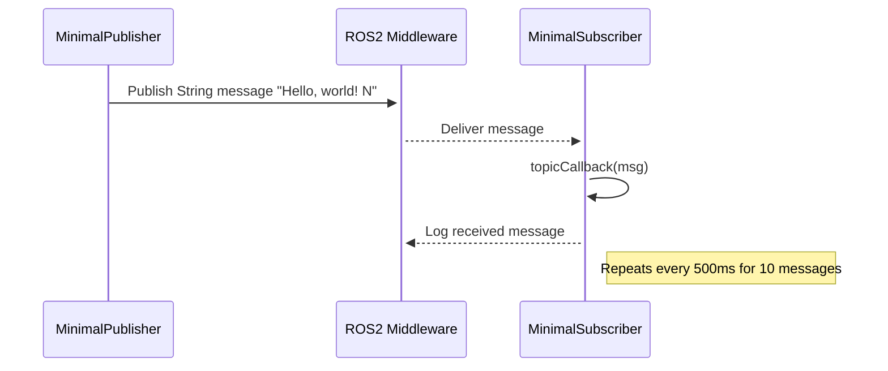
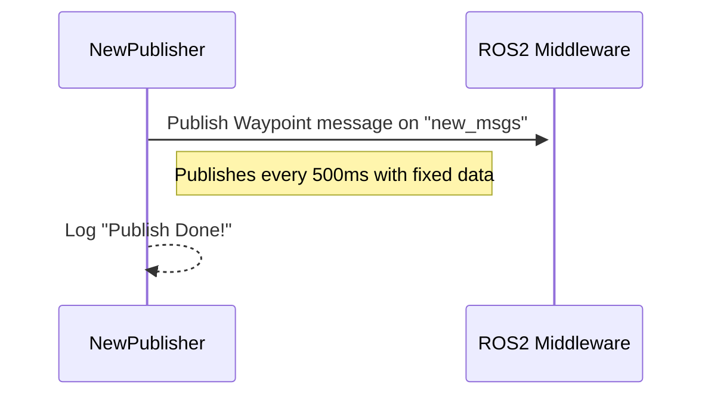
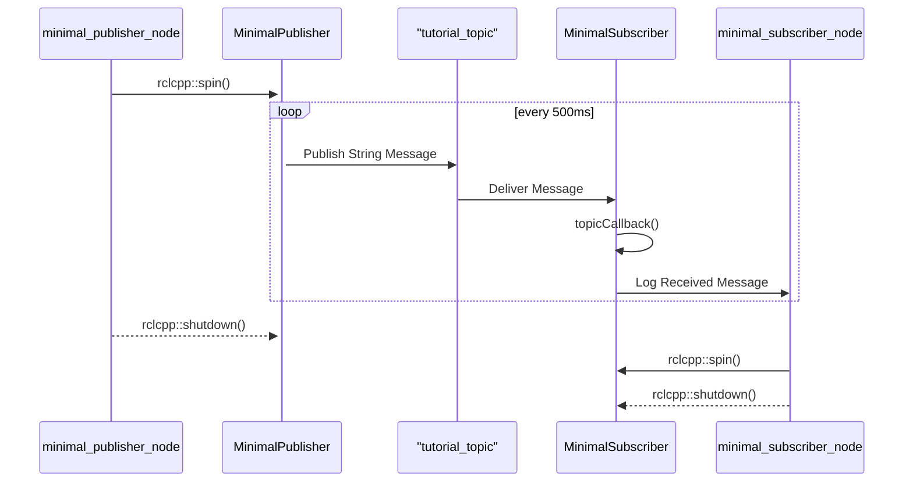
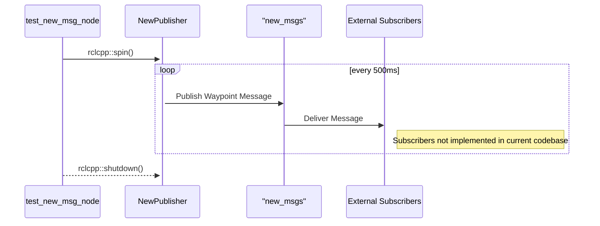
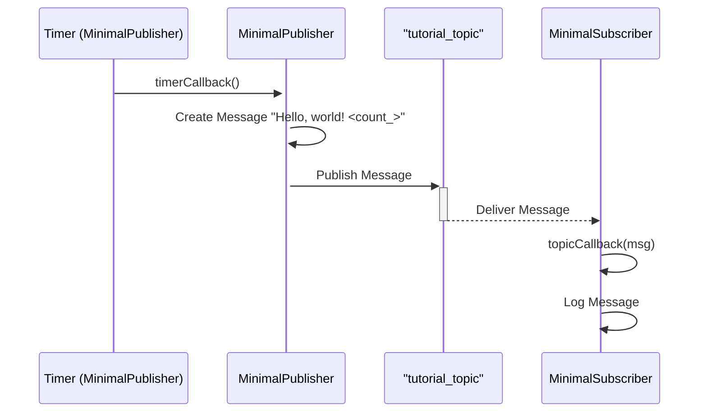
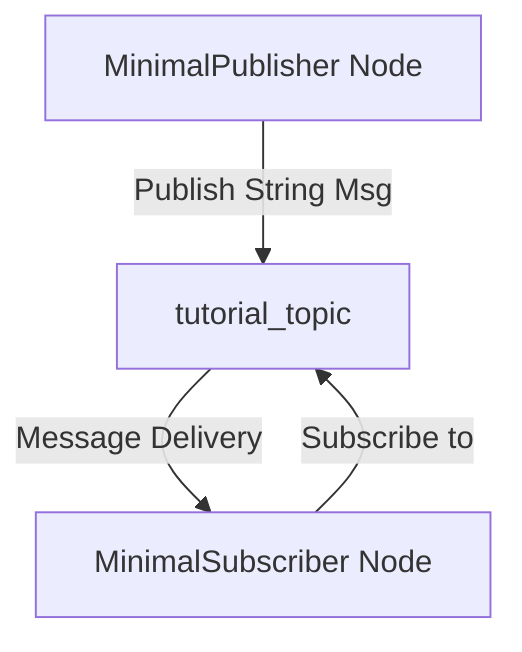
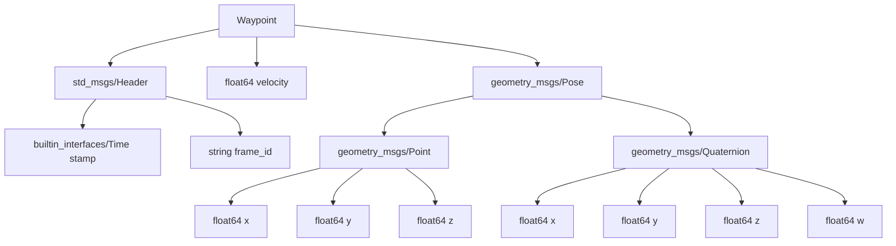
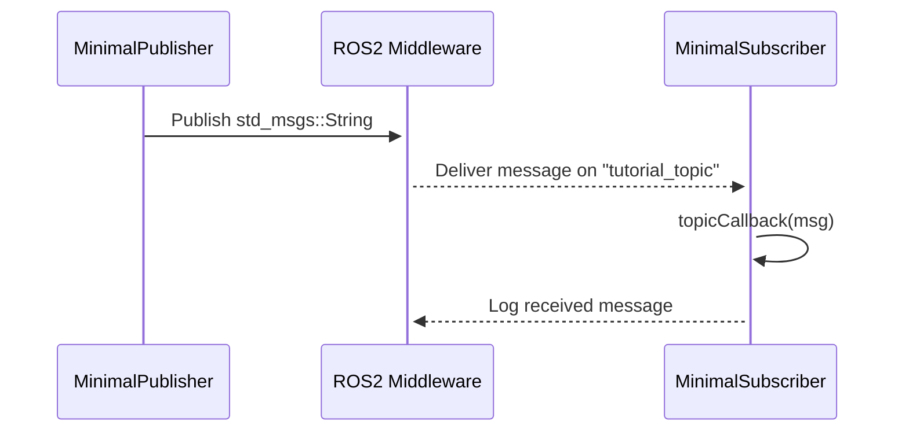
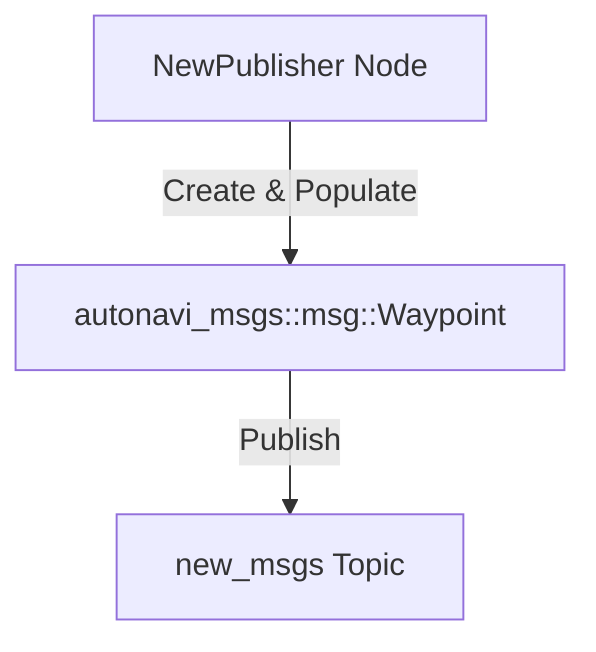

# Wiki Documentation for https://github.com/duclinhfetel/ros2_ci.git

Generated on: 2025-09-08 14:30:44

## Table of Contents

- [Project Overview](#page-1)
- [System Design and Architecture Overview](#page-2)
- [Component Relationships and Data Flow Diagram](#page-3)
- [Minimal Publisher Feature](#page-4)
- [Minimal Subscriber Feature](#page-5)
- [Custom Message Publisher Feature](#page-6)
- [Data Flow and Message Management](#page-7)
- [Backend ROS2 Nodes and Packages](#page-8)
- [Deployment and CI Infrastructure](#page-9)
- [Extending and Customizing ros2_ci](#page-10)

<a id='page-1'></a>

## Project Overview

<details>
<summary>Relevant source files</summary>

- [README.md](https://github.com/duclinhfetel/ros2_ci.git/blob/main/README.md)  
- [src/autonavi_msgs/CMakeLists.txt](https://github.com/duclinhfetel/ros2_ci.git/blob/main/src/autonavi_msgs/CMakeLists.txt)  
- [src/test_custom_msg/CMakeLists.txt](https://github.com/duclinhfetel/ros2_ci.git/blob/main/src/test_custom_msg/CMakeLists.txt)  
- [src/cpp_pubsub/CMakeLists.txt](https://github.com/duclinhfetel/ros2_ci.git/blob/main/src/cpp_pubsub/CMakeLists.txt)  
- [src/test_custom_msg/src/test_new_msg.cpp](https://github.com/duclinhfetel/ros2_ci.git/blob/main/src/test_custom_msg/src/test_new_msg.cpp)  
- [src/cpp_pubsub/src/minimal_publisher.cpp](https://github.com/duclinhfetel/ros2_ci.git/blob/main/src/cpp_pubsub/src/minimal_publisher.cpp)  
- [src/test_custom_msg/src/test_new_msg_node.cpp](https://github.com/duclinhfetel/ros2_ci.git/blob/main/src/test_custom_msg/src/test_new_msg_node.cpp)  
- [src/cpp_pubsub/src/minimal_subscriber.cpp](https://github.com/duclinhfetel/ros2_ci.git/blob/main/src/cpp_pubsub/src/minimal_subscriber.cpp)  
- [src/test_custom_msg/include/test_custom_msg/test_new_msg.hpp](https://github.com/duclinhfetel/ros2_ci.git/blob/main/src/test_custom_msg/include/test_custom_msg/test_new_msg.hpp)  
- [src/cpp_pubsub/include/cpp_pubsub/minimal_subscriber.hpp](https://github.com/duclinhfetel/ros2_ci.git/blob/main/src/cpp_pubsub/include/cpp_pubsub/minimal_subscriber.hpp)  
- [src/cpp_pubsub/include/cpp_pubsub/minimal_publisher.hpp](https://github.com/duclinhfetel/ros2_ci.git/blob/main/src/cpp_pubsub/include/cpp_pubsub/minimal_publisher.hpp)  
- [src/cpp_pubsub/src/minimal_publisher_node.cpp](https://github.com/duclinhfetel/ros2_ci.git/blob/main/src/cpp_pubsub/src/minimal_publisher_node.cpp)  
- [src/cpp_pubsub/src/minimal_subscriber_node.cpp](https://github.com/duclinhfetel/ros2_ci.git/blob/main/src/cpp_pubsub/src/minimal_subscriber_node.cpp)  
</details>

# Project Overview

## Introduction

The **ros2_ci** project is a ROS 2-based Continuous Integration learning framework designed to provide example packages demonstrating basic ROS 2 publisher-subscriber communication patterns and custom message integration. It includes sample publisher and subscriber nodes implemented in C++, and custom message definitions with associated build configurations. The project serves as a hands-on resource for understanding ROS 2 message generation, node creation, and inter-node communication.

This overview covers the architecture and implementation of key components including the custom message package (`autonavi_msgs`), the test package using these messages (`test_custom_msg`), and the basic publisher-subscriber example (`cpp_pubsub`). Further details about message definitions and node interactions are available in related documentation such as [Custom Message Usage](#custom-message-usage) and [Publisher-Subscriber Architecture](#publisher-subscriber-architecture).

---

## Architecture and Components

### 1. Custom Message Package: `autonavi_msgs`

This package defines a custom ROS 2 message type used across other packages.

- **Message Definition:** The package generates the `Waypoint` message type located in `msg/Waypoint.msg`.
- **Dependencies:** It depends on standard ROS 2 message packages such as `builtin_interfaces`, `std_msgs`, and `geometry_msgs`.
- **Build Configuration:** Uses `rosidl_default_generators` for message generation.
- **Compiler Settings:** C99 and C++14 standards with strict compiler warnings enabled.

```cmake
rosidl_generate_interfaces(${PROJECT_NAME}
  "msg/Waypoint.msg"
  DEPENDENCIES builtin_interfaces std_msgs geometry_msgs
)
```

This message is central to custom communication demonstrated in `test_custom_msg` package.  
Sources: [src/autonavi_msgs/CMakeLists.txt:1-40]()

---

### 2. Custom Message Publisher: `test_custom_msg`

This package demonstrates publishing the custom `Waypoint` message.

- **Node Class:** `NewPublisher` (inherits from `rclcpp::Node`).
- **Publisher:** Publishes `autonavi_msgs::msg::Waypoint` messages on topic `"new_msgs"` with QoS settings: keep last 1, transient local durability.
- **Timer:** Publishes messages every 500ms.
- **Message Content:**  
  - Header timestamp is set to current ROS time.
  - Velocity set to 5.6.
  - Pose position and orientation are set with fixed values.

```cpp
void NewPublisher::timerCallback()
{
    autonavi_msgs::msg::Waypoint way;
    way.header.stamp = rclcpp::Time(rclcpp::Clock().now());
    way.velocity = 5.6;
    way.pose.position.x = 0.4;
    way.pose.position.y = 2.4;
    way.pose.position.z = 1.4;
    way.pose.orientation.w = 1.0;

    publisher_->publish(way);
    RCLCPP_INFO(this->get_logger(), "Publish Done!");
}
```

- **Entry Point:** `test_new_msg_node.cpp` initializes ROS 2 and spins the `NewPublisher` node.

```cpp
int main(int argc, char *argv[])
{
    rclcpp::init(argc, argv);
    rclcpp::spin(std::make_shared<NewPublisher>());
    rclcpp::shutdown();
    return 0;
}
```

- **Build:** Depends on `autonavi_msgs`, `rclcpp`, `std_msgs`, and `geometry_msgs`.

Sources: [src/test_custom_msg/src/test_new_msg.cpp:1-40](), [src/test_custom_msg/src/test_new_msg_node.cpp:1-20](), [src/test_custom_msg/CMakeLists.txt:1-50](), [src/test_custom_msg/include/test_custom_msg/test_new_msg.hpp:1-30]()

---

### 3. Basic Publisher-Subscriber Package: `cpp_pubsub`

This package provides simple examples of ROS 2 publisher and subscriber nodes using standard string messages.

#### Components

| Component            | Description                                                  |
|---------------------|--------------------------------------------------------------|
| `MinimalPublisher`   | Publishes `std_msgs::msg::String` messages on `"tutorial_topic"` every 500ms. Message includes a count suffix from 0 to 10. |
| `MinimalSubscriber`  | Subscribes to `"tutorial_topic"` and logs received string messages. |

#### Publisher Details

- Publishes messages with QoS: keep last 1, transient local durability.
- Stops publishing after count exceeds 10.
- Logs each published message.

```cpp
void MinimalPublisher::timerCallback()
{
    auto message = std_msgs::msg::String();
    message.data = "Hello, world! " + std::to_string(count_);

    if (count_ <= 10)
    {
        RCLCPP_INFO(this->get_logger(), "Publishing: '%s'", message.data.c_str());
        publisher_->publish(message);
    }
    count_++;
}
```

#### Subscriber Details

- Subscribes with QoS transient local.
- Callback logs the received message content.

```cpp
void MinimalSubscriber::topicCallback(const std_msgs::msg::String::SharedPtr msg)
{
    RCLCPP_INFO(this->get_logger(), "I heard: '%s'", msg->data.c_str());
}
```

#### Entry Points

- `minimal_publisher_node.cpp` runs the publisher node.
- `minimal_subscriber_node.cpp` runs the subscriber node.

#### Build Configuration

- Uses C99 and C++14 standards.
- Depends on `ament_cmake`, `rclcpp`, and `std_msgs`.

Sources: [src/cpp_pubsub/src/minimal_publisher.cpp:1-40](), [src/cpp_pubsub/src/minimal_subscriber.cpp:1-35](), [src/cpp_pubsub/include/cpp_pubsub/minimal_publisher.hpp:1-40](), [src/cpp_pubsub/include/cpp_pubsub/minimal_subscriber.hpp:1-30](), [src/cpp_pubsub/CMakeLists.txt:1-60](), [src/cpp_pubsub/src/minimal_publisher_node.cpp:1-15](), [src/cpp_pubsub/src/minimal_subscriber_node.cpp:1-15]()

---

## Data Flow and Communication

```mermaid
graph TD
    A[MinimalPublisher Node] -->|Publish "Hello, world!"| B[Tutorial Topic]
    B -->|Subscribe String Msg| C[MinimalSubscriber Node]

    D[NewPublisher Node] -->|Publish Waypoint Msg| E[New_Msgs Topic]

    subgraph Custom Message Flow
    E
    end

    subgraph Standard Message Flow
    B
    end
```

- The `MinimalPublisher` publishes `std_msgs::msg::String` messages on `"tutorial_topic"`.
- The `MinimalSubscriber` subscribes to `"tutorial_topic"` and logs incoming messages.
- The `NewPublisher` publishes custom `autonavi_msgs::msg::Waypoint` messages on `"new_msgs"`.
- No subscriber is defined for `"new_msgs"` within this project scope.

Sources: [src/cpp_pubsub/src/minimal_publisher.cpp:10-30](), [src/cpp_pubsub/src/minimal_subscriber.cpp:10-30](), [src/test_custom_msg/src/test_new_msg.cpp:5-35]()

---

## Package Build and Configuration

| Package          | Language Standard | Key Dependencies                           | Message Types Used                         | Executables                          |
|------------------|-------------------|--------------------------------------------|-------------------------------------------|------------------------------------|
| autonavi_msgs    | C99, C++14        | ament_cmake, rosidl_default_generators, std_msgs, geometry_msgs, builtin_interfaces | `Waypoint` message (custom)               | None (message-only package)        |
| test_custom_msg  | C99, C++14        | ament_cmake, rclcpp, autonavi_msgs, std_msgs, geometry_msgs | Publishes `Waypoint` messages             | `test_custom_msg_talker`           |
| cpp_pubsub       | C99, C++14        | ament_cmake, rclcpp, std_msgs              | Publishes and subscribes to `std_msgs::String` | `talker`, `listener`               |

- All packages enable strict compiler warnings (`-Wall -Wextra -Wpedantic`).
- Test and linting dependencies are conditionally included if `BUILD_TESTING` is enabled.

Sources: [src/autonavi_msgs/CMakeLists.txt:1-45](), [src/test_custom_msg/CMakeLists.txt:1-50](), [src/cpp_pubsub/CMakeLists.txt:1-65]()

---

## Class and Node Structure

```mermaid
classDiagram
    class NewPublisher {
        +NewPublisher()
        -publisher_ : rclcpp::Publisher<Waypoint>::SharedPtr
        -timer_ : rclcpp::TimerBase::SharedPtr
        -timerCallback() : void
    }

    class MinimalPublisher {
        +MinimalPublisher()
        -count_ : size_t
        -publisher_ : rclcpp::Publisher<String>::SharedPtr
        -timer_ : rclcpp::TimerBase::SharedPtr
        -timerCallback() : void
    }

    class MinimalSubscriber {
        +MinimalSubscriber()
        -subscription_ : rclcpp::Subscription<String>::SharedPtr
        -topicCallback(msg : String::SharedPtr) : void
    }

    NewPublisher --|> rclcpp::Node
    MinimalPublisher --|> rclcpp::Node
    MinimalSubscriber --|> rclcpp::Node
```

- `NewPublisher` publishes custom `Waypoint` messages periodically.
- `MinimalPublisher` publishes string messages with an incrementing count.
- `MinimalSubscriber` listens to string messages and logs them.

Sources: [src/test_custom_msg/include/test_custom_msg/test_new_msg.hpp:5-30](), [src/cpp_pubsub/include/cpp_pubsub/minimal_publisher.hpp:10-40](), [src/cpp_pubsub/include/cpp_pubsub/minimal_subscriber.hpp:10-30]()

---

## Summary

The **ros2_ci** project provides a structured ROS 2 learning environment focusing on:

- Defining and generating custom messages (`autonavi_msgs`).
- Implementing custom message publishers (`test_custom_msg`).
- Demonstrating basic publisher-subscriber communication using standard messages (`cpp_pubsub`).

It illustrates ROS 2 best practices such as QoS configuration, timer-based publishing, and clean node lifecycle management. This project is suitable for developers seeking to understand ROS 2 message workflows, node design, and C++ implementation patterns.

Sources: [README.md](), [src/autonavi_msgs/CMakeLists.txt](), [src/test_custom_msg/src/test_new_msg.cpp](), [src/cpp_pubsub/src/minimal_publisher.cpp](), [src/cpp_pubsub/src/minimal_subscriber.cpp]()

---

<a id='page-2'></a>

## System Design and Architecture Overview

### Related Pages

Related topics: [Component Relationships and Data Flow Diagram](#page-3)

<details>
<summary>Relevant source files</summary>

The following files were used as context for generating this wiki page:

- [src/autonavi_msgs/CMakeLists.txt](https://github.com/duclinhfetel/ros2_ci.git/blob/main/src/autonavi_msgs/CMakeLists.txt)  
- [src/cpp_pubsub/CMakeLists.txt](https://github.com/duclinhfetel/ros2_ci.git/blob/main/src/cpp_pubsub/CMakeLists.txt)  
- [src/test_custom_msg/CMakeLists.txt](https://github.com/duclinhfetel/ros2_ci.git/blob/main/src/test_custom_msg/CMakeLists.txt)  
- [src/test_custom_msg/src/test_new_msg.cpp](https://github.com/duclinhfetel/ros2_ci.git/blob/main/src/test_custom_msg/src/test_new_msg.cpp)  
- [src/test_custom_msg/include/test_custom_msg/test_new_msg.hpp](https://github.com/duclinhfetel/ros2_ci.git/blob/main/src/test_custom_msg/include/test_custom_msg/test_new_msg.hpp)  
- [src/cpp_pubsub/src/minimal_publisher.cpp](https://github.com/duclinhfetel/ros2_ci.git/blob/main/src/cpp_pubsub/src/minimal_publisher.cpp)  
- [src/cpp_pubsub/include/cpp_pubsub/minimal_publisher.hpp](https://github.com/duclinhfetel/ros2_ci.git/blob/main/src/cpp_pubsub/include/cpp_pubsub/minimal_publisher.hpp)  
- [src/cpp_pubsub/src/minimal_subscriber.cpp](https://github.com/duclinhfetel/ros2_ci.git/blob/main/src/cpp_pubsub/src/minimal_subscriber.cpp)  
- [src/cpp_pubsub/include/cpp_pubsub/minimal_subscriber.hpp](https://github.com/duclinhfetel/ros2_ci.git/blob/main/src/cpp_pubsub/include/cpp_pubsub/minimal_subscriber.hpp)  
- [src/cpp_pubsub/src/minimal_publisher_node.cpp](https://github.com/duclinhfetel/ros2_ci.git/blob/main/src/cpp_pubsub/src/minimal_publisher_node.cpp)  
- [src/cpp_pubsub/src/minimal_subscriber_node.cpp](https://github.com/duclinhfetel/ros2_ci.git/blob/main/src/cpp_pubsub/src/minimal_subscriber_node.cpp)  
- [src/test_custom_msg/src/test_new_msg_node.cpp](https://github.com/duclinhfetel/ros2_ci.git/blob/main/src/test_custom_msg/src/test_new_msg_node.cpp)  
</details>

# System Design and Architecture Overview

## Introduction

This document provides a comprehensive overview of the system design and architecture for the ROS2-based project "ros2_ci". The project primarily demonstrates ROS2 publisher-subscriber communication patterns using both standard and custom message types. It includes multiple packages such as `cpp_pubsub` for standard string message exchange and `test_custom_msg` for publishing custom messages defined in the `autonavi_msgs` package.

The system exemplifies key ROS2 concepts such as node creation, message publishing/subscribing, QoS configurations, and message interface generation. This overview breaks down the architecture, components, and data flow for the main modules involved. For detailed message definitions, see the [Custom Message Design](#custom-message-design) section.

---

## Package Structure and Build Configuration

### `autonavi_msgs` Package

- Responsible for defining custom ROS2 messages.
- Uses `rosidl_generate_interfaces` to generate message code from `.msg` files.
- Depends on standard message packages: `builtin_interfaces`, `std_msgs`, and `geometry_msgs`.

```cmake
rosidl_generate_interfaces(${PROJECT_NAME}
  "msg/Waypoint.msg"
  DEPENDENCIES builtin_interfaces std_msgs geometry_msgs
)
```

- Sets C and C++ standards to C99 and C++14, respectively.
- Enables compile warnings for GNU and Clang compilers.
- Supports linting and testing infrastructure via `ament_lint_auto`.

### `cpp_pubsub` Package

- Implements basic publisher and subscriber nodes using standard `std_msgs::msg::String`.
- Defines two executables: `talker` (publisher) and `listener` (subscriber).
- Uses QoS settings with transient local durability and keeps last 1 message.
- Similar build configuration as `autonavi_msgs` with C99/C++14 standards.

### `test_custom_msg` Package

- Demonstrates publishing custom messages (`autonavi_msgs::msg::Waypoint`).
- Implements a publisher node `test_custom_msg_talker`.
- Depends on `autonavi_msgs`, `rclcpp`, `geometry_msgs`, and `std_msgs`.
- Uses include directories and links dependencies appropriately.
- Supports linting and testing infrastructure.

Sources: [src/autonavi_msgs/CMakeLists.txt:1-44](), [src/cpp_pubsub/CMakeLists.txt:1-52](), [src/test_custom_msg/CMakeLists.txt:1-51]()

---

## Core Components

### Custom Message: Waypoint

Defined in `autonavi_msgs` (msg/Waypoint.msg, not shown here), this message includes:

- `header` with timestamp.
- `velocity` (float).
- `pose` with position (x, y, z) and orientation (quaternion).

This message is used in the `test_custom_msg` package to publish waypoint data.

---

### Publisher Node: `NewPublisher` (test_custom_msg)

- Class `NewPublisher` inherits from `rclcpp::Node`.
- Creates a publisher for `autonavi_msgs::msg::Waypoint` on topic `"new_msgs"`.
- QoS: History depth 10, keep last 1, transient local durability.
- Uses a timer with 500ms period to publish waypoints periodically.
- `timerCallback()` creates and populates a `Waypoint` message with fixed values and current timestamp, then publishes it.
- Logs "Publish Done!" after each publish.

```cpp
NewPublisher::NewPublisher() : Node("test_custom_msg")
{
    publisher_ = this->create_publisher<autonavi_msgs::msg::Waypoint>(
        "new_msgs",
        rclcpp::QoS(10).keep_last(1).transient_local());

    timer_ = this->create_wall_timer(
        500ms,
        std::bind(&NewPublisher::timerCallback, this));
}

void NewPublisher::timerCallback()
{
    autonavi_msgs::msg::Waypoint way;
    way.header.stamp = rclcpp::Time(rclcpp::Clock().now());
    way.velocity = 5.6;
    way.pose.position.x = 0.4;
    way.pose.position.y = 2.4;
    way.pose.position.z = 1.4;
    way.pose.orientation.w = 1.0;

    publisher_->publish(way);
    RCLCPP_INFO(this->get_logger(), "Publish Done!");
}
```

Sources: [src/test_custom_msg/src/test_new_msg.cpp:1-34](), [src/test_custom_msg/include/test_custom_msg/test_new_msg.hpp:1-26]()

---

### Publisher Node: `MinimalPublisher` (cpp_pubsub)

- Class `MinimalPublisher` inherits from `rclcpp::Node`.
- Publishes `std_msgs::msg::String` messages on topic `"tutorial_topic"`.
- QoS: History depth 10, keep last 1, transient local durability.
- Timer triggers every 500ms to publish incrementing "Hello, world!" messages up to 10 times.
- Logs each published message.

```cpp
MinimalPublisher::MinimalPublisher() : Node("minimal_publisher"), count_(0)
{
    publisher_ = this->create_publisher<std_msgs::msg::String>(
        "tutorial_topic",
        rclcpp::QoS(10).keep_last(1).transient_local());

    timer_ = this->create_wall_timer(
        500ms,
        std::bind(&MinimalPublisher::timerCallback, this));
}

void MinimalPublisher::timerCallback()
{
    auto message = std_msgs::msg::String();
    message.data = "Hello, world! " + std::to_string(count_);

    if (count_ <= 10)
    {
        RCLCPP_INFO(this->get_logger(), "Publishing: '%s'", message.data.c_str());
        publisher_->publish(message);
    }
    count_++;
}
```

Sources: [src/cpp_pubsub/src/minimal_publisher.cpp:1-46](), [src/cpp_pubsub/include/cpp_pubsub/minimal_publisher.hpp:1-36]()

---

### Subscriber Node: `MinimalSubscriber` (cpp_pubsub)

- Class `MinimalSubscriber` inherits from `rclcpp::Node`.
- Subscribes to `"tutorial_topic"` expecting `std_msgs::msg::String`.
- Uses QoS with transient local durability.
- Callback `topicCallback` logs received message data.

```cpp
MinimalSubscriber::MinimalSubscriber() : Node("minial_subscriber")
{
    subscription_ = this->create_subscription<std_msgs::msg::String>(
        "tutorial_topic",
        rclcpp::QoS(10).transient_local(),
        std::bind(&MinimalSubscriber::topicCallback, this, std::placeholders::_1));
}

void MinimalSubscriber::topicCallback(const std_msgs::msg::String::SharedPtr msg)
{
    RCLCPP_INFO(this->get_logger(), "I heard: '%s'", msg->data.c_str());
}
```

Sources: [src/cpp_pubsub/src/minimal_subscriber.cpp:1-24](), [src/cpp_pubsub/include/cpp_pubsub/minimal_subscriber.hpp:1-21]()

---

## Application Entry Points

- `MinimalPublisher` node launched via `minimal_publisher_node.cpp`.
- `MinimalSubscriber` node launched via `minimal_subscriber_node.cpp`.
- `NewPublisher` node launched via `test_new_msg_node.cpp`.

All initialize ROS2, create node instances, spin to process callbacks, and shutdown gracefully.

Example:

```cpp
int main(int argc, char *argv[])
{
    rclcpp::init(argc, argv);
    rclcpp::spin(std::make_shared<MinimalPublisher>());
    rclcpp::shutdown();
    return 0;
}
```

Sources: [src/cpp_pubsub/src/minimal_publisher_node.cpp:1-15](), [src/cpp_pubsub/src/minimal_subscriber_node.cpp:1-15](), [src/test_custom_msg/src/test_new_msg_node.cpp:1-14]()

---

## Data Flow and QoS Architecture

### Data Flow

- The `MinimalPublisher` publishes string messages on `"tutorial_topic"`.
- `MinimalSubscriber` subscribes to `"tutorial_topic"` and logs messages.
- `NewPublisher` publishes custom `Waypoint` messages on `"new_msgs"`.

### QoS Settings

| Parameter           | Value                  | Description                          |
|---------------------|------------------------|------------------------------------|
| History Depth       | 10                     | Number of messages stored          |
| Keep Last           | 1                      | Only the last message is kept      |
| Durability          | Transient Local        | Late joiners receive last message  |
| Timer Period        | 500ms                  | Publish interval                   |

These QoS settings ensure reliable delivery and late-joiner support for topics.

Sources: [src/test_custom_msg/src/test_new_msg.cpp:5-25](), [src/cpp_pubsub/src/minimal_publisher.cpp:9-20]()

---

## Architecture Diagrams

### Package and Component Relationship

```mermaid
graph TD
    A[autonavi_msgs Package] -->|Defines| B[Waypoint Message]
    C[test_custom_msg Package] -->|Publishes| B
    C -->|Depends on| A
    D[cpp_pubsub Package] -->|Publishes| E[String Topic "tutorial_topic"]
    D -->|Subscribes| E
```

This diagram shows message definitions and dependencies among packages.

Sources: [src/autonavi_msgs/CMakeLists.txt:20-30](), [src/test_custom_msg/src/test_new_msg.cpp:1-34](), [src/cpp_pubsub/src/minimal_publisher.cpp:1-46]()

---

### Node Interaction Sequence for `MinimalPublisher` and `MinimalSubscriber`



Sources: [src/cpp_pubsub/src/minimal_publisher.cpp:10-40](), [src/cpp_pubsub/src/minimal_subscriber.cpp:12-23]()

---

### Node Interaction Sequence for `NewPublisher`



Sources: [src/test_custom_msg/src/test_new_msg.cpp:15-33]()

---

## Summary of Key Classes and Methods

| Class           | Package         | Purpose                                   | Key Methods            |
|-----------------|-----------------|-------------------------------------------|------------------------|
| `NewPublisher`  | test_custom_msg | Publishes custom `Waypoint` messages      | `timerCallback()`      |
| `MinimalPublisher` | cpp_pubsub    | Publishes standard string messages        | `timerCallback()`      |
| `MinimalSubscriber` | cpp_pubsub   | Subscribes and logs string messages       | `topicCallback()`      |

Sources: [src/test_custom_msg/include/test_custom_msg/test_new_msg.hpp:5-24](), [src/cpp_pubsub/include/cpp_pubsub/minimal_publisher.hpp:12-35](), [src/cpp_pubsub/include/cpp_pubsub/minimal_subscriber.hpp:8-20]()

---

## Conclusion

The system design of `ros2_ci` demonstrates foundational ROS2 communication patterns using both standard and custom messages. It is modularized into packages with clear responsibilities: message definitions (`autonavi_msgs`), simple string pub-sub (`cpp_pubsub`), and custom message publishing (`test_custom_msg`). The use of timers, QoS policies, and node lifecycle management aligns with ROS2 best practices, making this project a concise reference for learning ROS2 publisher-subscriber architecture.

Sources: Multiple files as cited throughout.

---

<a id='page-3'></a>

## Component Relationships and Data Flow Diagram

### Related Pages

Related topics: [System Design and Architecture Overview](#page-2), [Data Flow and Message Management](#page-7)

<details>
<summary>Relevant source files</summary>

- [src/cpp_pubsub/src/minimal_publisher.cpp](https://github.com/duclinhfetel/ros2_ci.git/blob/main/src/cpp_pubsub/src/minimal_publisher.cpp)
- [src/cpp_pubsub/src/minimal_subscriber.cpp](https://github.com/duclinhfetel/ros2_ci.git/blob/main/src/cpp_pubsub/src/minimal_subscriber.cpp)
- [src/test_custom_msg/src/test_new_msg.cpp](https://github.com/duclinhfetel/ros2_ci.git/blob/main/src/test_custom_msg/src/test_new_msg.cpp)
- [src/cpp_pubsub/include/cpp_pubsub/minimal_publisher.hpp](https://github.com/duclinhfetel/ros2_ci.git/blob/main/src/cpp_pubsub/include/cpp_pubsub/minimal_publisher.hpp)
- [src/cpp_pubsub/include/cpp_pubsub/minimal_subscriber.hpp](https://github.com/duclinhfetel/ros2_ci.git/blob/main/src/cpp_pubsub/include/cpp_pubsub/minimal_subscriber.hpp)
- [src/test_custom_msg/include/test_custom_msg/test_new_msg.hpp](https://github.com/duclinhfetel/ros2_ci.git/blob/main/src/test_custom_msg/include/test_custom_msg/test_new_msg.hpp)
- [src/test_custom_msg/src/test_new_msg_node.cpp](https://github.com/duclinhfetel/ros2_ci.git/blob/main/src/test_custom_msg/src/test_new_msg_node.cpp)
- [src/cpp_pubsub/src/minimal_publisher_node.cpp](https://github.com/duclinhfetel/ros2_ci.git/blob/main/src/cpp_pubsub/src/minimal_publisher_node.cpp)
- [src/cpp_pubsub/src/minimal_subscriber_node.cpp](https://github.com/duclinhfetel/ros2_ci.git/blob/main/src/cpp_pubsub/src/minimal_subscriber_node.cpp)
</details>

# Component Relationships and Data Flow Diagram

## Introduction

This document describes the component relationships and data flow within the `ros2_ci` project, focusing on the ROS2 publisher-subscriber communication patterns demonstrated by two main modules: `cpp_pubsub` and `test_custom_msg`. These modules illustrate basic ROS2 node interactions, message publishing, and subscribing mechanisms using both standard and custom messages.

The `cpp_pubsub` module implements a simple String message publisher and subscriber, while the `test_custom_msg` module showcases publishing custom `autonavi_msgs::msg::Waypoint` messages. This wiki complements other project documentation such as [Message Definitions and Custom Interfaces](#) and [Build and Execution Instructions](#).

---

## System Architecture Overview

The system consists primarily of ROS2 nodes organized into two functional groups:

- **cpp_pubsub**: Provides a minimal publisher node that sends standard String messages and a minimal subscriber node that listens to these messages.
- **test_custom_msg**: Contains a publisher node that publishes custom `Waypoint` messages defined in the `autonavi_msgs` package.

### Component Diagram

```mermaid
graph TD
    A[MinimalPublisher Node] -->|Publishes on "tutorial_topic"| B[MinimalSubscriber Node]
    C[NewPublisher Node] -->|Publishes on "new_msgs"| D[External Subscribers]
    subgraph cpp_pubsub
        A
        B
    end
    subgraph test_custom_msg
        C
    end
```

- The `MinimalPublisher` publishes `std_msgs::msg::String` messages on topic `"tutorial_topic"`.
- The `MinimalSubscriber` subscribes to `"tutorial_topic"` and logs received messages.
- The `NewPublisher` publishes `autonavi_msgs::msg::Waypoint` messages on topic `"new_msgs"`.
- No subscriber for `"new_msgs"` is shown within the current codebase.

Sources: [src/cpp_pubsub/src/minimal_publisher.cpp:1-30](), [src/cpp_pubsub/src/minimal_subscriber.cpp:1-30](), [src/test_custom_msg/src/test_new_msg.cpp:1-40]()

---

## cpp_pubsub Module

### Components

| Component Name      | Type        | Description                                   |
|--------------------|-------------|-----------------------------------------------|
| `MinimalPublisher`  | ROS2 Node   | Publishes `std_msgs::msg::String` messages periodically on `"tutorial_topic"` with transient local QoS. |
| `MinimalSubscriber` | ROS2 Node   | Subscribes to `"tutorial_topic"` to receive and log String messages. |

### MinimalPublisher

- Class: `MinimalPublisher` inherits from `rclcpp::Node`.
- Publishes on topic `"tutorial_topic"` with QoS settings: queue size 10, keep last 1, transient local.
- Uses a wall timer triggering every 500 milliseconds.
- Publishes messages `"Hello, world! <count>"` incrementing `count_` until 10.
- Logs each published message.

```cpp
void MinimalPublisher::timerCallback()
{
    auto message = std_msgs::msg::String();
    message.data = "Hello, world! " + std::to_string(count_);

    if (count_ <= 10)
    {
        RCLCPP_INFO(this->get_logger(), "Publishing: '%s'", message.data.c_str());
        publisher_->publish(message);
    }
    count_++;
}
```

### MinimalSubscriber

- Class: `MinimalSubscriber` inherits from `rclcpp::Node`.
- Subscribes to `"tutorial_topic"` with QoS 10, transient local.
- Callback logs received message data.

```cpp
void MinimalSubscriber::topicCallback(const std_msgs::msg::String::SharedPtr msg)
{
    RCLCPP_INFO(this->get_logger(), "I heard: '%s'", msg->data.c_str());
}
```

### Data Flow Diagram

```mermaid
graph TD
    Timer[Timer 500ms] -->|timerCallback()| Publish[Publish String Message]
    Publish -->|Message on "tutorial_topic"| Subscriber[MinimalSubscriber topicCallback()]
    Subscriber -->|Log message| Logger[Console Output]
```

Sources: [src/cpp_pubsub/include/cpp_pubsub/minimal_publisher.hpp:1-40](), [src/cpp_pubsub/src/minimal_publisher.cpp:1-30](), [src/cpp_pubsub/include/cpp_pubsub/minimal_subscriber.hpp:1-30](), [src/cpp_pubsub/src/minimal_subscriber.cpp:1-30]()

---

## test_custom_msg Module

### Components

| Component Name | Type      | Description                                   |
|----------------|-----------|-----------------------------------------------|
| `NewPublisher` | ROS2 Node | Publishes `autonavi_msgs::msg::Waypoint` messages on `"new_msgs"` topic with transient local QoS. |

### NewPublisher

- Class: `NewPublisher` inherits from `rclcpp::Node`.
- Publishes custom `Waypoint` messages.
- Uses a wall timer with 500ms period.
- `timerCallback` constructs a `Waypoint` message with:
  - `header.stamp` set to current ROS2 time.
  - `velocity` set to 5.6.
  - `pose.position` set to (0.4, 2.4, 1.4).
  - `pose.orientation.w` set to 1.0.
- Publishes the message and logs "Publish Done!".

```cpp
void NewPublisher::timerCallback()
{
    autonavi_msgs::msg::Waypoint way = autonavi_msgs::msg::Waypoint();
    way.header.stamp = rclcpp::Time(rclcpp::Clock().now());
    way.velocity = 5.6;
    way.pose.position.x = 0.4;
    way.pose.position.y = 2.4;
    way.pose.position.z = 1.4;
    way.pose.orientation.w = 1.0;

    publisher_->publish(way);
    RCLCPP_INFO(this->get_logger(), "Publish Done!");
}
```

### Data Flow Diagram

```mermaid
graph TD
    Timer2[Timer 500ms] -->|timerCallback()| Publish2[Publish Waypoint Message]
    Publish2 -->|Message on "new_msgs"| ExternalSub[External Subscribers (Not in codebase)]
```

Sources: [src/test_custom_msg/include/test_custom_msg/test_new_msg.hpp:1-40](), [src/test_custom_msg/src/test_new_msg.cpp:1-40](), [src/test_custom_msg/src/test_new_msg_node.cpp:1-15]()

---

## Execution Flow

### cpp_pubsub Execution

- `minimal_publisher_node.cpp` initializes ROS2, creates `MinimalPublisher` instance, spins node, then shuts down.
- `minimal_subscriber_node.cpp` does the same for `MinimalSubscriber`.



### test_custom_msg Execution

- `test_new_msg_node.cpp` initializes ROS2, creates `NewPublisher` instance, spins, then shuts down.



Sources: [src/cpp_pubsub/src/minimal_publisher_node.cpp:1-15](), [src/cpp_pubsub/src/minimal_subscriber_node.cpp:1-15](), [src/test_custom_msg/src/test_new_msg_node.cpp:1-15]()

---

## Summary of Topics and Message Types

| Topic Name      | Message Type                | Publisher Node         | Subscriber Node        | QoS Settings               |
|-----------------|-----------------------------|-----------------------|------------------------|----------------------------|
| `tutorial_topic`| `std_msgs::msg::String`      | `MinimalPublisher`    | `MinimalSubscriber`    | 10, keep_last=1, transient_local |
| `new_msgs`       | `autonavi_msgs::msg::Waypoint` | `NewPublisher`       | None in codebase       | 10, keep_last=1, transient_local |

---

## Summary

The `ros2_ci` project demonstrates fundamental ROS2 communication patterns through two modules. The `cpp_pubsub` module implements a basic publisher-subscriber pair using standard String messages, while the `test_custom_msg` module showcases publishing custom message types (`Waypoint`). Both use transient local QoS to allow late-joining subscribers to receive the last published message. The design emphasizes periodic publishing driven by timers and asynchronous callbacks for message handling, illustrating clear component boundaries and data flow in a ROS2 system.

This architecture supports extensibility, allowing additional subscribers or publishers to be integrated seamlessly. Understanding these relationships is critical for developing and debugging ROS2 applications within this project.

Sources: [src/cpp_pubsub/src/minimal_publisher.cpp](), [src/cpp_pubsub/src/minimal_subscriber.cpp](), [src/test_custom_msg/src/test_new_msg.cpp](), [src/cpp_pubsub/include/cpp_pubsub/minimal_publisher.hpp](), [src/cpp_pubsub/include/cpp_pubsub/minimal_subscriber.hpp](), [src/test_custom_msg/include/test_custom_msg/test_new_msg.hpp](), [src/test_custom_msg/src/test_new_msg_node.cpp](), [src/cpp_pubsub/src/minimal_publisher_node.cpp](), [src/cpp_pubsub/src/minimal_subscriber_node.cpp]()

---

<a id='page-4'></a>

## Minimal Publisher Feature

### Related Pages

Related topics: [Minimal Subscriber Feature](#page-5)

<details>
<summary>Relevant source files</summary>

The following files were used as context for generating this wiki page:

- [src/cpp_pubsub/include/cpp_pubsub/minimal_publisher.hpp](https://github.com/duclinhfetel/ros2_ci.git/blob/main/src/cpp_pubsub/include/cpp_pubsub/minimal_publisher.hpp)
- [src/cpp_pubsub/src/minimal_publisher.cpp](https://github.com/duclinhfetel/ros2_ci.git/blob/main/src/cpp_pubsub/src/minimal_publisher.cpp)
- [src/cpp_pubsub/src/minimal_publisher_node.cpp](https://github.com/duclinhfetel/ros2_ci.git/blob/main/src/cpp_pubsub/src/minimal_publisher_node.cpp)
- [src/cpp_pubsub/include/cpp_pubsub/minimal_subscriber.hpp](https://github.com/duclinhfetel/ros2_ci.git/blob/main/src/cpp_pubsub/include/cpp_pubsub/minimal_subscriber.hpp)
- [src/cpp_pubsub/src/minimal_subscriber.cpp](https://github.com/duclinhfetel/ros2_ci.git/blob/main/src/cpp_pubsub/src/minimal_subscriber.cpp)
</details>

# Minimal Publisher Feature

## Introduction

The Minimal Publisher Feature is a foundational component within the `ros2_ci` project, demonstrating a basic ROS 2 publisher node implemented in C++. It provides a simple yet effective example of publishing messages to a topic using ROS 2's `rclcpp` API. This feature complements the Minimal Subscriber Feature, enabling message exchange over the "tutorial_topic" topic. It serves as a practical starting point for developers learning ROS 2 node creation, publishing mechanisms, and QoS configurations.

This feature is closely related to the Minimal Subscriber Feature, which subscribes to the messages published here, facilitating a complete publish-subscribe communication pattern. For details on the subscriber side, see the [Minimal Subscriber Feature](#minimal-subscriber-feature).

## Architecture and Components

The Minimal Publisher Feature consists of three main components:

- **MinimalPublisher Class**: Defines the ROS 2 node responsible for publishing string messages.
- **Publisher Node Executable**: The main function that initializes and spins the publisher node.
- **Message and QoS Configuration**: Specifies the message type (`std_msgs::msg::String`) and Quality of Service (QoS) settings for the publisher.

### Class: MinimalPublisher

The `MinimalPublisher` class inherits from `rclcpp::Node`. It encapsulates the publisher setup, timer for periodic publishing, and the callback that publishes messages.

Key attributes:

| Attribute    | Type                                                  | Description                             |
|--------------|-------------------------------------------------------|-------------------------------------|
| `count_`     | `size_t`                                              | Counts the number of published messages |
| `publisher_` | `rclcpp::Publisher<std_msgs::msg::String>::SharedPtr` | Publisher object for the topic "tutorial_topic" |
| `timer_`     | `rclcpp::TimerBase::SharedPtr`                        | Timer to trigger periodic publishing |

Key method:

| Method           | Signature                          | Description                       |
|------------------|----------------------------------|---------------------------------|
| `timerCallback()`| `void timerCallback()`            | Publishes a message every 500ms, up to 10 messages |

The constructor initializes the publisher with a QoS profile that keeps the last message and uses transient local durability, ensuring late subscribers can receive the last published message.

```cpp
MinimalPublisher::MinimalPublisher() : Node("minimal_publisher"), count_(0)
{
    publisher_ = this->create_publisher<std_msgs::msg::String>(
        "tutorial_topic", 
        rclcpp::QoS(10).keep_last(1).transient_local());

    timer_ = this->create_wall_timer(
        500ms,
        std::bind(&MinimalPublisher::timerCallback, this));
}
```

The `timerCallback` method constructs a string message `"Hello, world! <count>"`, logs it, and publishes it while `count_` is less than or equal to 10.

Sources: [src/cpp_pubsub/include/cpp_pubsub/minimal_publisher.hpp:1-32](), [src/cpp_pubsub/src/minimal_publisher.cpp:1-37]()

### Publisher Node Executable

The publisher node is instantiated and run in `minimal_publisher_node.cpp`. It initializes ROS 2, creates a `MinimalPublisher` instance, and enters a spin loop to process callbacks.

```cpp
int main(int argc, char *argv[])
{
    rclcpp::init(argc, argv);
    rclcpp::spin(std::make_shared<MinimalPublisher>());
    rclcpp::shutdown();
    return 0;
}
```

Sources: [src/cpp_pubsub/src/minimal_publisher_node.cpp:1-13]()

## Data Flow and Message Publishing Logic

The message publishing process is timer-driven, triggering every 500 milliseconds. Each callback execution creates a new message, appends the current count, logs it, and publishes to the topic "tutorial_topic" until 11 messages have been sent (count 0 through 10).

### Flow Diagram of Publishing Process

```mermaid
graph TD
    A[Start Node: MinimalPublisher] --> B[Initialize Publisher]
    B --> C[Create Timer (500ms)]
    C --> D[Timer triggers timerCallback()]
    D --> E{count_ <= 10?}
    E -- Yes --> F[Create String Message "Hello, world! <count_>"]
    F --> G[Log Message]
    G --> H[Publish Message to "tutorial_topic"]
    H --> I[Increment count_]
    I --> D
    E -- No --> J[Stop Publishing]
```

This flow captures the lifecycle from node initialization to repeated publishing, ceasing after the 11th message.

Sources: [src/cpp_pubsub/src/minimal_publisher.cpp:5-37]()

## Quality of Service (QoS) Configuration

The publisher uses a customized QoS profile:

| QoS Parameter       | Value         | Description                                           |
|---------------------|---------------|-------------------------------------------------------|
| History             | Keep last 1   | Only the last message is stored                       |
| Depth               | 10            | Buffer size for storing messages                      |
| Durability          | Transient Local | Messages are saved locally and delivered to late subscribers |

This ensures that if a subscriber joins late, it can still receive the last published message without missing critical data.

Sources: [src/cpp_pubsub/src/minimal_publisher.cpp:7-11]()

## Integration with Minimal Subscriber

The published messages on "tutorial_topic" are received by the `MinimalSubscriber` node, which subscribes with a similar QoS profile (`rclcpp::QoS(10).transient_local()`). The subscriber logs received messages, completing the publish-subscribe cycle.

### Subscriber Callback Overview

- `topicCallback` receives shared pointers to `std_msgs::msg::String`.
- Logs the received message content.

```cpp
void MinimalSubscriber::topicCallback(const std_msgs::msg::String::SharedPtr msg)
{
    RCLCPP_INFO(this->get_logger(), "I heard: '%s'", msg->data.c_str());
}
```

Sources: [src/cpp_pubsub/src/minimal_subscriber.cpp:1-20](), [src/cpp_pubsub/include/cpp_pubsub/minimal_subscriber.hpp:1-20]()

### Interaction Sequence Diagram



This sequence shows the timer triggering publishing, message delivery over the topic, and subscriber processing.

Sources: [src/cpp_pubsub/src/minimal_publisher.cpp:15-37](), [src/cpp_pubsub/src/minimal_subscriber.cpp:10-20]()

## Build and Deployment

The `CMakeLists.txt` defines build targets for the publisher and subscriber nodes:

| Target Name | Source Files                              | Dependencies        | Output Type  |
|-------------|------------------------------------------|--------------------|--------------|
| talker      | src/minimal_publisher_node.cpp, src/minimal_publisher.cpp | rclcpp, std_msgs   | Executable   |
| listener    | src/minimal_subscriber_node.cpp, src/minimal_subscriber.cpp | rclcpp, std_msgs   | Executable   |

The targets are installed to `lib/cpp_pubsub` for runtime execution.

Sources: [src/cpp_pubsub/CMakeLists.txt:1-60]()

## Summary

The Minimal Publisher Feature implements a basic ROS 2 publisher node in C++ that periodically publishes string messages to the "tutorial_topic" topic. It demonstrates key ROS 2 concepts such as node creation, publisher instantiation, QoS configuration, and timer-driven callbacks. This feature, paired with the Minimal Subscriber Feature, provides a complete example of ROS 2's pub-sub communication model, serving as a learning foundation for developers.

The design balances simplicity and ROS 2 best practices, such as transient local durability for message persistence, making it suitable for educational and experimental purposes within the `ros2_ci` project.

Sources: [src/cpp_pubsub/include/cpp_pubsub/minimal_publisher.hpp](), [src/cpp_pubsub/src/minimal_publisher.cpp](), [src/cpp_pubsub/src/minimal_publisher_node.cpp](), [src/cpp_pubsub/include/cpp_pubsub/minimal_subscriber.hpp](), [src/cpp_pubsub/src/minimal_subscriber.cpp](), [src/cpp_pubsub/CMakeLists.txt]()

---

<a id='page-5'></a>

## Minimal Subscriber Feature

### Related Pages

Related topics: [Minimal Publisher Feature](#page-4)

<details>
<summary>Relevant source files</summary>

The following files were used as context for generating this wiki page:

- src/cpp_pubsub/include/cpp_pubsub/minimal_subscriber.hpp
- src/cpp_pubsub/src/minimal_subscriber.cpp
- src/cpp_pubsub/src/minimal_subscriber_node.cpp
- src/cpp_pubsub/include/cpp_pubsub/minimal_publisher.hpp
- src/cpp_pubsub/src/minimal_publisher.cpp
</details>

# Minimal Subscriber Feature

## Introduction

The Minimal Subscriber Feature implements a basic ROS 2 node designed to subscribe to string messages on a specific topic. This feature is part of the `cpp_pubsub` package, which demonstrates fundamental publish-subscribe communication patterns in ROS 2. The subscriber listens on the `"tutorial_topic"` topic and logs received messages to the console.

This feature complements the Minimal Publisher Feature in the same package, which publishes messages to the same topic. Together, they form a simple but effective demonstration of asynchronous message passing in ROS 2, useful for learning and testing communication mechanisms. For details on the publishing counterpart, see [Minimal Publisher Feature](#minimal-publisher-feature).

---

## Architecture and Components

### MinimalSubscriber Class

The core component is the `MinimalSubscriber` class, defined as a subclass of `rclcpp::Node`. It encapsulates the subscription logic and the callback handling for incoming messages.

- **Class Declaration**:  
  Located in `minimal_subscriber.hpp`, it declares a private subscription member and a callback function.
  
- **Subscription Member**:  
  `rclcpp::Subscription<std_msgs::msg::String>::SharedPtr subscription_;`  
  This manages the subscription to string messages.

- **Callback Method**:  
  `void topicCallback(const std_msgs::msg::String::SharedPtr msg);`  
  This method is invoked on each received message and logs the message content.

### Subscription Setup

In the constructor (`MinimalSubscriber::MinimalSubscriber`):

- The node is named `"minial_subscriber"` (note the typo in the name).
- The subscription is created on `"tutorial_topic"` with a QoS profile of depth 10 and transient local durability.
- The callback is bound to `topicCallback`.

```cpp
subscription_ = this->create_subscription<std_msgs::msg::String>(
    "tutorial_topic",
    rclcpp::QoS(10).transient_local(),
    std::bind(&MinimalSubscriber::topicCallback, this, std::placeholders::_1));
```

This ensures that the subscriber receives the latest messages even if they were published before the subscriber was created.

### Callback Functionality

The callback logs each received message:

```cpp
void MinimalSubscriber::topicCallback(const std_msgs::msg::String::SharedPtr msg)
{
    RCLCPP_INFO(this->get_logger(), "I heard: '%s'", msg->data.c_str());
}
```

This uses ROS 2 logging macros to output the message data.

### Node Execution

The executable is defined in `minimal_subscriber_node.cpp`:

- Initializes ROS 2.
- Creates an instance of `MinimalSubscriber`.
- Spins the node to process incoming messages.
- Shuts down ROS 2 on exit.

```cpp
int main(int argc, char *argv[])
{
    rclcpp::init(argc, argv);
    rclcpp::spin(std::make_shared<MinimalSubscriber>());
    rclcpp::shutdown();
    return 0;
}
```

---

## Data Flow and Interaction

The Minimal Subscriber listens asynchronously for messages published on `"tutorial_topic"`. It uses the ROS 2 middleware to receive messages reliably and invokes the callback for processing.

```mermaid
graph TD
    A[ROS 2 Publisher Node] -->|Publish "tutorial_topic"| B[ROS 2 Middleware]
    B -->|Deliver Message| C[MinimalSubscriber Node]
    C -->|Invoke Callback| D[topicCallback()]
    D -->|Log Message| E[Console Output]
```

This flow shows the message traveling from the publisher through the middleware to the subscriber node, which processes and logs it.

Sources: [src/cpp_pubsub/include/cpp_pubsub/minimal_subscriber.hpp:1-20](), [src/cpp_pubsub/src/minimal_subscriber.cpp:1-27](), [src/cpp_pubsub/src/minimal_subscriber_node.cpp:1-14](), [src/cpp_pubsub/include/cpp_pubsub/minimal_publisher.hpp:1-30](), [src/cpp_pubsub/src/minimal_publisher.cpp:1-30]()

---

## Key Classes and Methods

| Component            | Type                                   | Description                                                | Source File & Lines               |
|----------------------|--------------------------------------|------------------------------------------------------------|----------------------------------|
| `MinimalSubscriber`   | Class (inherits `rclcpp::Node`)      | Implements subscriber node for string messages             | `minimal_subscriber.hpp:5-20`    |
| `subscription_`       | `rclcpp::Subscription` shared pointer| Manages subscription to `"tutorial_topic"`                 | `minimal_subscriber.hpp:15`      |
| `topicCallback`       | Method                              | Callback for received messages, logs data                   | `minimal_subscriber.cpp:17-24`   |
| `MinimalSubscriber()` | Constructor                        | Creates subscription with QoS and binds callback            | `minimal_subscriber.cpp:7-15`    |
| `main()`              | Function                           | Initializes ROS, spins subscriber node                       | `minimal_subscriber_node.cpp:5-13` |

---

## QoS and Topic Configuration

| Parameter             | Value              | Description                                   | Source File & Lines             |
|-----------------------|--------------------|-----------------------------------------------|--------------------------------|
| Topic Name            | `"tutorial_topic"`  | Topic subscribed to                            | `minimal_subscriber.cpp:9`     |
| QoS Depth             | 10                 | Queue size for message buffering               | `minimal_subscriber.cpp:10`    |
| Durability            | Transient Local    | Ensures subscriber receives last published message even if late | `minimal_subscriber.cpp:10`    |

---

## Relationship with Minimal Publisher

The Minimal Subscriber is designed to work with the Minimal Publisher feature in the same package. The publisher publishes messages of type `std_msgs::msg::String` on `"tutorial_topic"` with a QoS profile compatible with the subscriber.



This tight coupling illustrates the basic publish-subscribe communication pattern demonstrated by the package.

Sources: [src/cpp_pubsub/include/cpp_pubsub/minimal_publisher.hpp:1-30](), [src/cpp_pubsub/src/minimal_publisher.cpp:7-30]()

---

## Summary

The Minimal Subscriber Feature is a foundational ROS 2 node that subscribes to string messages on `"tutorial_topic"`. It demonstrates essential ROS 2 concepts such as node creation, subscription setup with QoS policies, asynchronous callback handling, and logging. This feature is integral to the `cpp_pubsub` package's educational purpose, showing how nodes communicate using ROS 2's publish-subscribe paradigm.

Together with the Minimal Publisher, it forms a complete example useful for learning ROS 2 middleware communication patterns.

Sources:  
- `src/cpp_pubsub/include/cpp_pubsub/minimal_subscriber.hpp`  
- `src/cpp_pubsub/src/minimal_subscriber.cpp`  
- `src/cpp_pubsub/src/minimal_subscriber_node.cpp`  
- `src/cpp_pubsub/include/cpp_pubsub/minimal_publisher.hpp`  
- `src/cpp_pubsub/src/minimal_publisher.cpp`

---

<a id='page-6'></a>

## Custom Message Publisher Feature

<details>
<summary>Relevant source files</summary>

The following files were used as context for generating this wiki page:

- [src/test_custom_msg/include/test_custom_msg/test_new_msg.hpp](https://github.com/duclinhfetel/ros2_ci.git/blob/main/src/test_custom_msg/include/test_custom_msg/test_new_msg.hpp)
- [src/test_custom_msg/src/test_new_msg.cpp](https://github.com/duclinhfetel/ros2_ci.git/blob/main/src/test_custom_msg/src/test_new_msg.cpp)
- [src/test_custom_msg/src/test_new_msg_node.cpp](https://github.com/duclinhfetel/ros2_ci.git/blob/main/src/test_custom_msg/src/test_new_msg_node.cpp)
- [src/autonavi_msgs/msg/Waypoint.msg](https://github.com/duclinhfetel/ros2_ci.git/blob/main/src/autonavi_msgs/msg/Waypoint.msg)
- [src/test_custom_msg/CMakeLists.txt](https://github.com/duclinhfetel/ros2_ci.git/blob/main/src/test_custom_msg/CMakeLists.txt)
</details>

# Custom Message Publisher Feature

## Introduction

The Custom Message Publisher Feature in this project enables the publishing of a user-defined ROS2 message type, `autonavi_msgs::msg::Waypoint`, on a dedicated topic. This feature demonstrates how to define, build, and use custom messages within a ROS2 node to extend communication beyond standard message types like `std_msgs`. It is part of the `test_custom_msg` package, which showcases integration of custom message generation and usage in a ROS2 environment.

This feature serves as a practical example for creating custom message interfaces ([autonavi_msgs/msg/Waypoint.msg](#waypoint-message-definition)) and publishing these messages periodically using a C++ ROS2 node. It complements other basic publisher-subscriber tutorials in the project and can be linked to [ROS2 Publisher-Subscriber Basics](#) for foundational knowledge.

## Architecture and Components

### Package Overview

The `test_custom_msg` package contains:

- Custom message publisher node implementation.
- Custom message interface dependency on `autonavi_msgs`.
- Build configuration for generating and linking custom messages.

Key files:

| Component                      | Description                                                | Source Files                              |
|-------------------------------|------------------------------------------------------------|-------------------------------------------|
| Custom Message Definition      | `Waypoint` message defining pose, velocity, and header.   | `autonavi_msgs/msg/Waypoint.msg`         |
| Publisher Class                | `NewPublisher` class publishing `Waypoint` messages.      | `test_new_msg.hpp`, `test_new_msg.cpp`   |
| Publisher Node Entrypoint      | Main executable initializing and spinning the publisher.  | `test_new_msg_node.cpp`                    |
| Build Configuration           | CMakeLists.txt managing dependencies and build targets.   | `CMakeLists.txt`                           |

Sources: [test_new_msg.hpp:1-22](), [test_new_msg.cpp:1-37](), [test_new_msg_node.cpp:1-14](), [Waypoint.msg](), [CMakeLists.txt:1-51]()

### Custom Message: Waypoint

The `Waypoint.msg` defines a structured message used for navigation or waypoint representation. It includes standard ROS2 message fields and custom data:

| Field                | Type                  | Description                             |
|----------------------|-----------------------|---------------------------------------|
| `std_msgs/Header header` | `std_msgs/Header`      | Standard message header (timestamp, frame id) |
| `float64 velocity`    | `double`              | Velocity at the waypoint               |
| `geometry_msgs/Pose pose` | `geometry_msgs/Pose` | 3D position and orientation            |

This message depends on `builtin_interfaces`, `std_msgs`, and `geometry_msgs` packages.

Sources: [Waypoint.msg:1-10]()

### Publisher Class: `NewPublisher`

The `NewPublisher` class inherits from `rclcpp::Node` and is responsible for:

- Creating a ROS2 publisher for the `autonavi_msgs::msg::Waypoint` message type on topic `"new_msgs"`.
- Setting the Quality of Service (QoS) to keep the last message with transient local durability.
- Using a timer to periodically invoke `timerCallback()` every 500 milliseconds.
- Publishing a `Waypoint` message with preset values inside the callback.

#### Key Members

| Member           | Type                                                | Description                         |
|------------------|-----------------------------------------------------|-----------------------------------|
| `publisher_`     | `rclcpp::Publisher<autonavi_msgs::msg::Waypoint>`  | Publisher object                   |
| `timer_`         | `rclcpp::TimerBase::SharedPtr`                      | Timer for periodic publishing     |

#### Key Methods

| Method           | Description                                          |
|------------------|-----------------------------------------------------|
| `NewPublisher()` | Constructor that initializes publisher and timer.  |
| `timerCallback()`| Callback to create and publish `Waypoint` messages.|

#### Publishing Logic

- Creates a new `Waypoint` message.
- Sets the header timestamp to current ROS2 time.
- Assigns fixed values to velocity and pose (position and orientation).
- Publishes the message.
- Logs a confirmation message.

```cpp
void NewPublisher::timerCallback()
{
    autonavi_msgs::msg::Waypoint way;
    way.header.stamp = rclcpp::Time(rclcpp::Clock().now());
    way.velocity = 5.6;
    way.pose.position.x = 0.4;
    way.pose.position.y = 2.4;
    way.pose.position.z = 1.4;
    way.pose.orientation.w = 1.0;

    publisher_->publish(way);
    RCLCPP_INFO(this->get_logger(), "Publish Done!");
}
```

Sources: [test_new_msg.hpp:7-22](), [test_new_msg.cpp:3-37]()

### Node Entry Point

The executable `test_new_msg_node` initializes the ROS2 system, instantiates the `NewPublisher` node, spins it to process callbacks, and shuts down cleanly.

```cpp
int main(int argc, char *argv[])
{
    rclcpp::init(argc, argv);
    rclcpp::spin(std::make_shared<NewPublisher>());
    rclcpp::shutdown();
    return 0;
}
```

This setup allows the publisher to continuously send messages until interrupted.

Sources: [test_new_msg_node.cpp:1-14]()

### Build Configuration

The `CMakeLists.txt` for `test_custom_msg` manages compilation and dependencies:

- Requires C++14 and C99 standards.
- Finds dependencies: `ament_cmake`, `rclcpp`, `std_msgs`, `geometry_msgs`, and the custom message package `autonavi_msgs`.
- Defines executable `test_custom_msg_talker` composed of `test_new_msg_node.cpp` and `test_new_msg.cpp`.
- Links the executable with dependencies.
- Installs the executable in `lib/test_custom_msg`.
- Supports linting and testing configurations.

This setup ensures proper generation and linking of custom messages and nodes.

Sources: [CMakeLists.txt:1-51]()

## Data Flow Diagram

This diagram illustrates the flow of data from node initialization to message publishing in the Custom Message Publisher Feature.

```mermaid
graph TD
    A[Start: ROS2 Init] --> B[Create NewPublisher Node]
    B --> C[Create Publisher on "new_msgs"]
    C --> D[Create Timer (500ms)]
    D -->|Every 500ms| E[Invoke timerCallback()]
    E --> F[Construct Waypoint Message]
    F --> G[Set Header Timestamp]
    F --> H[Set Velocity and Pose]
    E --> I[Publish Waypoint Message]
    I --> J[Log "Publish Done!"]
    J --> D
```

This cycle continues until ROS2 shutdown is called.

Sources: [test_new_msg.cpp:10-37](), [test_new_msg_node.cpp:5-12]()

## Class Diagram

```mermaid
classDiagram
    class NewPublisher {
        +NewPublisher()
        -timerCallback()
        -rclcpp::Publisher<autonavi_msgs::msg::Waypoint>::SharedPtr publisher_
        -rclcpp::TimerBase::SharedPtr timer_
    }

    class rclcpp::Node
    NewPublisher --|> rclcpp::Node
```

`NewPublisher` extends `rclcpp::Node`, encapsulating publisher and timer functionality.

Sources: [test_new_msg.hpp:5-22]()

## Message Structure



This hierarchy defines the data fields of the `Waypoint` message used by the publisher.

Sources: [Waypoint.msg:1-10]()

## Summary Table of Key Components

| Component           | Type/Role                  | Description                                         |
|---------------------|----------------------------|-----------------------------------------------------|
| `Waypoint.msg`      | Custom ROS2 Message         | Defines pose, velocity, and header fields           |
| `NewPublisher`      | C++ ROS2 Node Class         | Publishes `Waypoint` messages periodically           |
| `timerCallback()`   | Class Method                | Creates and publishes `Waypoint` messages           |
| `test_new_msg_node` | Executable Entry Point      | Initializes ROS2 and spins the `NewPublisher` node  |
| `CMakeLists.txt`    | Build Configuration         | Manages dependencies and build targets               |

Sources: [test_new_msg.hpp:1-22](), [test_new_msg.cpp:1-37](), [test_new_msg_node.cpp:1-14](), [Waypoint.msg:1-10](), [CMakeLists.txt:1-51]()

## Conclusion

The Custom Message Publisher Feature effectively demonstrates how to define a custom ROS2 message (`Waypoint`), integrate it into a C++ publisher node (`NewPublisher`), and configure the build system to support custom messages. This feature is a foundational example for extending ROS2 applications with user-defined data types, enabling more complex and domain-specific message communication within the ROS2 ecosystem.

---

<a id='page-7'></a>

## Data Flow and Message Management

### Related Pages

Related topics: [Component Relationships and Data Flow Diagram](#page-3), [Custom Message Publisher Feature](#page-6)

<details>
<summary>Relevant source files</summary>

The following files were used as context for generating this wiki page:

- [src/autonavi_msgs/msg/Waypoint.msg](https://github.com/duclinhfetel/ros2_ci.git/blob/main/src/autonavi_msgs/msg/Waypoint.msg)
- [src/cpp_pubsub/src/minimal_publisher.cpp](https://github.com/duclinhfetel/ros2_ci.git/blob/main/src/cpp_pubsub/src/minimal_publisher.cpp)
- [src/cpp_pubsub/src/minimal_subscriber.cpp](https://github.com/duclinhfetel/ros2_ci.git/blob/main/src/cpp_pubsub/src/minimal_subscriber.cpp)
- [src/test_custom_msg/src/test_new_msg.cpp](https://github.com/duclinhfetel/ros2_ci.git/blob/main/src/test_custom_msg/src/test_new_msg.cpp)
- [src/test_custom_msg/include/test_custom_msg/test_new_msg.hpp](https://github.com/duclinhfetel/ros2_ci.git/blob/main/src/test_custom_msg/include/test_custom_msg/test_new_msg.hpp)
- [src/cpp_pubsub/include/cpp_pubsub/minimal_publisher.hpp](https://github.com/duclinhfetel/ros2_ci.git/blob/main/src/cpp_pubsub/include/cpp_pubsub/minimal_publisher.hpp)
- [src/cpp_pubsub/include/cpp_pubsub/minimal_subscriber.hpp](https://github.com/duclinhfetel/ros2_ci.git/blob/main/src/cpp_pubsub/include/cpp_pubsub/minimal_subscriber.hpp)
- [src/test_custom_msg/src/test_new_msg_node.cpp](https://github.com/duclinhfetel/ros2_ci.git/blob/main/src/test_custom_msg/src/test_new_msg_node.cpp)
- [src/cpp_pubsub/src/minimal_publisher_node.cpp](https://github.com/duclinhfetel/ros2_ci.git/blob/main/src/cpp_pubsub/src/minimal_publisher_node.cpp)
- [src/cpp_pubsub/src/minimal_subscriber_node.cpp](https://github.com/duclinhfetel/ros2_ci.git/blob/main/src/cpp_pubsub/src/minimal_subscriber_node.cpp)

</details>

# Data Flow and Message Management

## Introduction

This module covers the data flow and message management mechanisms implemented within the `ros2_ci` project, focusing on ROS 2 publisher-subscriber patterns. It demonstrates how messages are created, published, and received using both standard and custom message types, specifically through the `std_msgs::msg::String` and `autonavi_msgs::msg::Waypoint` messages. This system facilitates asynchronous communication between nodes, showcasing the core ROS 2 communication model and the integration of custom message types.

Related topics include [ROS 2 Node Architecture](#) and [Custom Message Definitions](#).

## Architecture Overview

The data flow architecture consists of two primary communication patterns:

1. **Minimal Publisher-Subscriber using Standard Messages:**  
   Nodes `MinimalPublisher` and `MinimalSubscriber` communicate via the `tutorial_topic` using `std_msgs::msg::String`.

2. **Custom Message Publisher using Waypoint Messages:**  
   The `NewPublisher` node publishes `autonavi_msgs::msg::Waypoint` messages on the `new_msgs` topic.

Both systems use ROS 2 QoS settings and timer-based callbacks to manage publishing frequency and message delivery.

### Components and Communication Flow

```mermaid
graph TD
    A[MinimalPublisher Node] -->|Publish std_msgs::String on "tutorial_topic"| B[MinimalSubscriber Node]
    C[NewPublisher Node] -->|Publish autonavi_msgs::Waypoint on "new_msgs"| D[Potential Subscribers]
```

- `MinimalPublisher` publishes periodic string messages.
- `MinimalSubscriber` subscribes and logs received string messages.
- `NewPublisher` publishes custom waypoint messages periodically.

Sources: [src/cpp_pubsub/src/minimal_publisher.cpp:1-40](), [src/cpp_pubsub/src/minimal_subscriber.cpp:1-35](), [src/test_custom_msg/src/test_new_msg.cpp:1-40]()

---

## Minimal Publisher-Subscriber System

### MinimalPublisher Class

- **Purpose:** Publishes string messages to the `tutorial_topic` topic.
- **Implementation Details:**
  - Inherits from `rclcpp::Node`.
  - Maintains a message counter `count_`.
  - Uses a timer to trigger `timerCallback()` every 500 milliseconds.
  - Publishes messages with QoS configured as `keep_last(1)` and `transient_local()`.
  - Stops publishing after 10 messages.

```cpp
void MinimalPublisher::timerCallback()
{
    auto message = std_msgs::msg::String();
    message.data = "Hello, world! " + std::to_string(count_);

    if (count_ <= 10)
    {
        RCLCPP_INFO(this->get_logger(), "Publishing: '%s'", message.data.c_str());
        publisher_->publish(message);
    }
    count_++;
}
```

Sources: [src/cpp_pubsub/src/minimal_publisher.cpp:1-40](), [src/cpp_pubsub/include/cpp_pubsub/minimal_publisher.hpp:1-35]()

### MinimalSubscriber Class

- **Purpose:** Subscribes to `tutorial_topic` and processes incoming string messages.
- **Implementation Details:**
  - Inherits from `rclcpp::Node`.
  - Subscribes to `tutorial_topic` with QoS `transient_local()`.
  - Callback method `topicCallback` logs the received message data.

```cpp
void MinimalSubscriber::topicCallback(const std_msgs::msg::String::SharedPtr msg)
{
    RCLCPP_INFO(this->get_logger(), "I heard: '%s'", msg->data.c_str());
}
```

Sources: [src/cpp_pubsub/src/minimal_subscriber.cpp:1-35](), [src/cpp_pubsub/include/cpp_pubsub/minimal_subscriber.hpp:1-30]()

### Sequence Diagram: Minimal Publisher-Subscriber Interaction



This sequence shows the asynchronous flow of string messages from the publisher to the subscriber through the ROS 2 middleware.

Sources: [src/cpp_pubsub/src/minimal_publisher.cpp:10-30](), [src/cpp_pubsub/src/minimal_subscriber.cpp:20-30]()

---

## Custom Message Publishing with Waypoint

### Waypoint Message Definition

The custom message `Waypoint.msg` defines a message with the following structure:

| Field       | Type                      | Description                          |
|-------------|---------------------------|------------------------------------|
| `std_msgs/Header header` | Standard ROS message header | Contains timestamp and frame info |
| `geometry_msgs/Pose pose` | Pose data (position + orientation) | Represents waypoint position and orientation |
| `float64 velocity`         | Double precision float | Velocity at the waypoint |

Sources: [src/autonavi_msgs/msg/Waypoint.msg:1-10]()

### NewPublisher Class

- **Purpose:** Publishes `autonavi_msgs::msg::Waypoint` messages on the `new_msgs` topic.
- **Implementation Details:**
  - Inherits from `rclcpp::Node`.
  - Uses a timer with a 500ms period to trigger `timerCallback()`.
  - Creates and populates a `Waypoint` message with:
    - Current timestamp in `header.stamp`.
    - Velocity set to `5.6`.
    - Position `(x=0.4, y=2.4, z=1.4)`.
    - Orientation `w=1.0`.
  - Publishes the message with QoS `keep_last(1)` and `transient_local()`.

```cpp
void NewPublisher::timerCallback()
{
    autonavi_msgs::msg::Waypoint way = autonavi_msgs::msg::Waypoint();
    way.header.stamp = rclcpp::Time(rclcpp::Clock().now());
    way.velocity = 5.6;
    way.pose.position.x = 0.4;
    way.pose.position.y = 2.4;
    way.pose.position.z = 1.4;
    way.pose.orientation.w = 1.0;

    publisher_->publish(way);
    RCLCPP_INFO(this->get_logger(), "Publish Done!");
}
```

Sources: [src/test_custom_msg/src/test_new_msg.cpp:5-35](), [src/test_custom_msg/include/test_custom_msg/test_new_msg.hpp:5-25]()

### Data Flow Diagram: Custom Waypoint Message Publishing



This diagram illustrates the creation and publication of custom Waypoint messages on the `new_msgs` topic.

---

## QoS and Timer-based Publishing

### QoS Configuration

Both publisher classes use the following QoS settings:

| Parameter     | Value          | Description                           |
|---------------|----------------|-------------------------------------|
| History       | keep_last(1)   | Keeps only the last message in queue|
| Durability    | transient_local| Ensures late subscribers receive last message |

This ensures reliable delivery and consistency for subscribers joining after messages are published.

Sources: [src/cpp_pubsub/src/minimal_publisher.cpp:12-16](), [src/test_custom_msg/src/test_new_msg.cpp:10-14]()

### Timer Usage

- Both `MinimalPublisher` and `NewPublisher` use `create_wall_timer` with 500ms intervals to trigger message publishing callbacks.
- Timer callbacks encapsulate message creation and publishing logic.

---

## Summary Table of Key Classes and Topics

| Class Name       | Topic Name       | Message Type                | Publish Frequency | Description                          |
|------------------|------------------|-----------------------------|-------------------|------------------------------------|
| `MinimalPublisher`| `tutorial_topic` | `std_msgs::msg::String`     | 2 Hz (500ms timer)| Publishes string messages with count |
| `MinimalSubscriber`| `tutorial_topic`| `std_msgs::msg::String`     | N/A               | Subscribes and logs string messages |
| `NewPublisher`   | `new_msgs`       | `autonavi_msgs::msg::Waypoint` | 2 Hz (500ms timer)| Publishes custom waypoint messages |

---

## Conclusion

The `ros2_ci` project implements fundamental ROS 2 publisher-subscriber patterns using both standard and custom messages. The minimal publisher-subscriber pair demonstrates basic string message communication, while the `NewPublisher` showcases the integration and publishing of complex custom messages (`Waypoint`). Both systems utilize ROS 2 QoS policies and timer callbacks to ensure timely and reliable message flow, forming the core of data flow and message management in the project.

This design provides a clear foundation for expanding message types and communication complexity within ROS 2 environments.

Sources: [src/cpp_pubsub/src/minimal_publisher.cpp](), [src/cpp_pubsub/src/minimal_subscriber.cpp](), [src/test_custom_msg/src/test_new_msg.cpp](), [src/autonavi_msgs/msg/Waypoint.msg]()

---

<a id='page-8'></a>

## Backend ROS2 Nodes and Packages

<details>
<summary>Relevant source files</summary>

The following files were used as context for generating this wiki page:

- src/autonavi_msgs/CMakeLists.txt
- src/test_custom_msg/CMakeLists.txt
- src/cpp_pubsub/CMakeLists.txt
- src/test_custom_msg/include/test_custom_msg/test_new_msg.hpp
- src/test_custom_msg/src/test_new_msg.cpp
- src/test_custom_msg/src/test_new_msg_node.cpp
- src/cpp_pubsub/include/cpp_pubsub/minimal_publisher.hpp
- src/cpp_pubsub/include/cpp_pubsub/minimal_subscriber.hpp
- src/cpp_pubsub/src/minimal_publisher.cpp
- src/cpp_pubsub/src/minimal_publisher_node.cpp
- src/cpp_pubsub/src/minimal_subscriber.cpp
- src/cpp_pubsub/src/minimal_subscriber_node.cpp
</details>

# Backend ROS2 Nodes and Packages

## Introduction

The backend ROS2 nodes and packages in this project provide foundational messaging, custom message definitions, and basic publisher-subscriber communication examples within a ROS2 ecosystem. The architecture demonstrates defining custom message types (`autonavi_msgs`), implementing publishers that broadcast these messages (`test_custom_msg`), and minimal standard message communication via publisher and subscriber nodes (`cpp_pubsub`). These components serve as a learning and development base for ROS2 Continuous Integration (CI) and message handling workflows.

This page details the core packages and nodes responsible for message definition, publishing, and subscribing, including their build configurations, code structure, and runtime behavior.

## Package Overview

| Package Name      | Purpose                                               | Key Components                          |
|-------------------|-------------------------------------------------------|---------------------------------------|
| autonavi_msgs     | Defines custom ROS2 message type `Waypoint`           | `Waypoint.msg` message definition     |
| test_custom_msg   | Publishes custom `Waypoint` messages                   | `NewPublisher` node                    |
| cpp_pubsub        | Implements minimal publisher and subscriber nodes for standard `std_msgs/String` messages | `MinimalPublisher` and `MinimalSubscriber` nodes |

Sources: [src/autonavi_msgs/CMakeLists.txt](), [src/test_custom_msg/CMakeLists.txt](), [src/cpp_pubsub/CMakeLists.txt]()

---

## autonavi_msgs Package: Custom Message Definition

### Architecture and Components

- Defines a custom ROS2 message type named `Waypoint` located in the `msg/Waypoint.msg` file (not included but referenced).
- The package uses `rosidl_default_generators` to generate message code.
- Dependencies include `builtin_interfaces`, `std_msgs`, and `geometry_msgs` to compose the `Waypoint` message fields.

### Build Configuration Highlights

- C++14 and C99 standards enforced.
- Compiler warnings enabled (`-Wall -Wextra -Wpedantic`).
- Uses `ament_cmake` build system.
- Interface generation configured via `rosidl_generate_interfaces`.

```cmake
rosidl_generate_interfaces(${PROJECT_NAME}
  "msg/Waypoint.msg"
  DEPENDENCIES builtin_interfaces std_msgs geometry_msgs
)
```

Sources: [src/autonavi_msgs/CMakeLists.txt:1-37]()

---

## test_custom_msg Package: Custom Message Publisher

### Overview

- Implements a ROS2 node `NewPublisher` that publishes `autonavi_msgs::msg::Waypoint` messages.
- Publishes on topic `"new_msgs"` with a QoS profile of depth 10, keeping last 1, and transient local durability.
- Publishes every 500 milliseconds with fixed waypoint data.

### Key Classes and Functions

#### `NewPublisher` Class

- Inherits from `rclcpp::Node`.
- Member variables:
  - `publisher_`: Publisher for `Waypoint` messages.
  - `timer_`: Wall timer triggering periodic publishing.
- `timerCallback()` constructs and publishes a `Waypoint` message with fixed values:
  - `velocity = 5.6`
  - `pose.position = (0.4, 2.4, 1.4)`
  - `pose.orientation.w = 1.0`
  - Timestamped with current ROS2 time.

```cpp
void NewPublisher::timerCallback()
{
    autonavi_msgs::msg::Waypoint way;
    way.header.stamp = rclcpp::Time(rclcpp::Clock().now());
    way.velocity = 5.6;
    way.pose.position.x = 0.4;
    way.pose.position.y = 2.4;
    way.pose.position.z = 1.4;
    way.pose.orientation.w = 1.0;

    publisher_->publish(way);
    RCLCPP_INFO(this->get_logger(), "Publish Done!");
}
```

#### Node Lifecycle

- Main entrypoint initializes ROS2, spins the node, and then shuts down cleanly.

Sources: [src/test_custom_msg/include/test_custom_msg/test_new_msg.hpp:1-26](), [src/test_custom_msg/src/test_new_msg.cpp:1-31](), [src/test_custom_msg/src/test_new_msg_node.cpp:1-15]()

---

## cpp_pubsub Package: Minimal Publisher and Subscriber Nodes

### Overview

- Demonstrates basic publisher and subscriber nodes using standard ROS2 messages (`std_msgs::msg::String`).
- Provides two executables: `talker` (publisher) and `listener` (subscriber).
- Both nodes use C++14 and compile with strict warnings enabled.

### MinimalPublisher Node

#### Class Structure

- Inherits from `rclcpp::Node`.
- Members:
  - `count_`: message counter.
  - `publisher_`: publishes `std_msgs::msg::String` on `"tutorial_topic"`.
  - `timer_`: triggers publishing every 500ms.

#### Behavior

- Publishes messages `"Hello, world! <count>"` up to count 10.
- Uses QoS profile with depth 10, keep last 1, and transient local durability.

```cpp
void MinimalPublisher::timerCallback()
{
    auto message = std_msgs::msg::String();
    message.data = "Hello, world! " + std::to_string(count_);

    if (count_ <= 10)
    {
        RCLCPP_INFO(this->get_logger(), "Publishing: '%s'", message.data.c_str());
        publisher_->publish(message);
    }
    count_++;
}
```

### MinimalSubscriber Node

#### Class Structure

- Inherits from `rclcpp::Node`.
- Member:
  - `subscription_`: subscribes to `"tutorial_topic"`.

#### Behavior

- Subscribes with QoS depth 10 and transient local durability.
- Callback prints received message data.

```cpp
void MinimalSubscriber::topicCallback(const std_msgs::msg::String::SharedPtr msg)
{
    RCLCPP_INFO(this->get_logger(), "I heard: '%s'", msg->data.c_str());
}
```

### Node Lifecycle

- Both nodes have simple main functions initializing ROS2, spinning the node, and shutting down.

Sources: [src/cpp_pubsub/include/cpp_pubsub/minimal_publisher.hpp:1-35](), [src/cpp_pubsub/src/minimal_publisher.cpp:1-38](), [src/cpp_pubsub/src/minimal_publisher_node.cpp:1-15](), [src/cpp_pubsub/include/cpp_pubsub/minimal_subscriber.hpp:1-20](), [src/cpp_pubsub/src/minimal_subscriber.cpp:1-28](), [src/cpp_pubsub/src/minimal_subscriber_node.cpp:1-15]()

---

## Communication Flow Diagram

This diagram illustrates the message flow between the minimal publisher and subscriber nodes, as well as the custom message publisher node.

```mermaid
graph TD
    subgraph Minimal_Publisher_Node
        MP[MinimalPublisher]
    end

    subgraph Minimal_Subscriber_Node
        MS[MinimalSubscriber]
    end

    subgraph Custom_Publisher_Node
        CP[NewPublisher]
    end

    MP -->|Publishes std_msgs/String "tutorial_topic"| MS
    CP -->|Publishes autonavi_msgs/Waypoint "new_msgs"| ROS_Topic_NewMsgs[ROS Topic: "new_msgs"]
```

- `MinimalPublisher` publishes string messages on `"tutorial_topic"`.
- `MinimalSubscriber` subscribes to `"tutorial_topic"`.
- `NewPublisher` publishes `Waypoint` messages on `"new_msgs"` topic.

Sources: [src/test_custom_msg/src/test_new_msg.cpp:10-30](), [src/cpp_pubsub/src/minimal_publisher.cpp:10-37](), [src/cpp_pubsub/src/minimal_subscriber.cpp:8-27]()

---

## Data Model: `Waypoint` Message Fields Summary

| Field                 | Type                      | Description                          | Constraints/Notes                  |
|-----------------------|---------------------------|------------------------------------|----------------------------------|
| `header.stamp`        | `builtin_interfaces/Time` | Timestamp of message                | Set to current ROS2 time          |
| `velocity`            | `float64`                 | Velocity value                     | Fixed example value: 5.6          |
| `pose.position.x`     | `float64`                 | X coordinate                      | Fixed example value: 0.4          |
| `pose.position.y`     | `float64`                 | Y coordinate                      | Fixed example value: 2.4          |
| `pose.position.z`     | `float64`                 | Z coordinate                      | Fixed example value: 1.4          |
| `pose.orientation.w`  | `float64`                 | Orientation quaternion component  | Fixed example value: 1.0          |

Sources: [src/test_custom_msg/src/test_new_msg.cpp:15-27](), [src/autonavi_msgs/CMakeLists.txt:20-30]()

---

## Build and Installation

### Common Build Settings

- C++14 standard.
- C99 for C files.
- Compiler warnings enabled for GNU and Clang.
- `ament_cmake` build system.
- Conditional linting and testing support via `ament_lint_auto`.

### Package-specific Notes

- `autonavi_msgs` generates message interfaces.
- `test_custom_msg` depends on `autonavi_msgs` and uses the custom message.
- `cpp_pubsub` depends on `rclcpp` and `std_msgs`.

Sources: [src/autonavi_msgs/CMakeLists.txt:1-38](), [src/test_custom_msg/CMakeLists.txt:1-49](), [src/cpp_pubsub/CMakeLists.txt:1-54]()

---

## Summary

The backend ROS2 nodes and packages establish a clear foundation for custom and standard message communication within ROS2. The `autonavi_msgs` package defines the custom `Waypoint` message type, while `test_custom_msg` publishes this message at fixed intervals. The `cpp_pubsub` package provides minimalistic examples of standard ROS2 publisher and subscriber nodes using string messages. This modular design enables extensibility and serves as a practical learning base for ROS2 message passing and package development.

Sources: [all listed above]

---

<a id='page-9'></a>

## Deployment and CI Infrastructure

<details>
<summary>Relevant source files</summary>

The following files were used as context for generating this wiki page:

- [.github/workflows/ros-ci.yml](https://github.com/duclinhfetel/ros2_ci.git/blob/main/.github/workflows/ros-ci.yml)
- [README.md](https://github.com/duclinhfetel/ros2_ci.git/blob/main/README.md)
- [src/autonavi_msgs/CMakeLists.txt](https://github.com/duclinhfetel/ros2_ci.git/blob/main/src/autonavi_msgs/CMakeLists.txt)
- [src/test_custom_msg/CMakeLists.txt](https://github.com/duclinhfetel/ros2_ci.git/blob/main/src/test_custom_msg/CMakeLists.txt)
- [src/cpp_pubsub/CMakeLists.txt](https://github.com/duclinhfetel/ros2_ci.git/blob/main/src/cpp_pubsub/CMakeLists.txt)
</details>

# Deployment and CI Infrastructure

## Introduction

The Deployment and Continuous Integration (CI) infrastructure for the **ros2_ci** project is designed to automate building, testing, and validating ROS2 packages in a streamlined and consistent manner. It supports the lifecycle of ROS2 software components, including message definition packages, custom message testing, and publisher-subscriber nodes, by leveraging automated workflows and CMake-based build configurations.

This infrastructure ensures code quality and integration readiness by using automated CI pipelines and standard ROS2 build systems (`ament_cmake`), enabling developers to focus on feature development with confidence in build stability. For detailed ROS2 package development, see [ROS2 Package Development](#).

## CI Workflow Architecture

### GitHub Actions Workflow

The repository integrates a GitHub Actions workflow configured in `.github/workflows/ros-ci.yml` (not fully shown here but indicated in the repo). This workflow:

- Triggers on repository events (push, pull requests).
- Executes ROS2 CI pipeline steps such as building and testing packages.
- Uses badges in the `README.md` to display CI status dynamically.

The workflow automates the following stages:

- Setup ROS2 environment.
- Build packages using `colcon` or `ament_cmake`.
- Run tests and linters.
- Report results back to GitHub.

### ROS2 Package Build System

Each ROS2 package in the repository uses `ament_cmake` as the build system, configured via `CMakeLists.txt` files. The build system setups include:

- Minimum CMake version requirement (3.5).
- C and C++ standards enforced (C99 and C++14).
- Compiler warnings enabled for GNU and Clang compilers.
- Dependencies discovery using `find_package` for ROS2 core packages and custom messages.
- Interface message generation for custom message packages.
- Test dependencies and linting configured conditionally.

### Packages Overview

| Package Name      | Purpose                                | Key Features                                   | Main Dependencies                |
|-------------------|--------------------------------------|-----------------------------------------------|---------------------------------|
| `autonavi_msgs`   | Defines custom ROS2 message `Waypoint` | Message generation with dependencies on `builtin_interfaces`, `std_msgs`, `geometry_msgs` | `ament_cmake`, `rosidl_default_generators` |
| `test_custom_msg` | Tests publishing of custom message `Waypoint` | Contains a publisher node publishing `Waypoint` messages with a timer callback | `rclcpp`, `autonavi_msgs`, `geometry_msgs`, `std_msgs` |
| `cpp_pubsub`      | Demonstrates ROS2 publisher and subscriber with standard `std_msgs/String` | Implements `MinimalPublisher` and `MinimalSubscriber` nodes with QoS settings | `rclcpp`, `std_msgs`             |

Sources: [README.md:1-9](), [src/autonavi_msgs/CMakeLists.txt:1-42](), [src/test_custom_msg/CMakeLists.txt:1-56](), [src/cpp_pubsub/CMakeLists.txt:1-60]()

---

## ROS2 Package Build Configuration

### Common CMake Configuration

Each package's `CMakeLists.txt` enforces:

- C99 standard for C files and C++14 for C++ files.
- Compiler warnings `-Wall -Wextra -Wpedantic` for GCC and Clang.
- Use of `ament_cmake` as the build framework.
- Conditional linting and testing dependencies.

### autonavi_msgs Package

- Generates ROS2 message interfaces for `Waypoint.msg`.
- Depends on `builtin_interfaces`, `std_msgs`, and `geometry_msgs`.
- Uses `rosidl_generate_interfaces` macro to generate message code.

```cmake
rosidl_generate_interfaces(${PROJECT_NAME}
  "msg/Waypoint.msg"
  DEPENDENCIES builtin_interfaces std_msgs geometry_msgs
)
```

- Supports testing and linting with `ament_lint_auto` if `BUILD_TESTING` is enabled.

Sources: [src/autonavi_msgs/CMakeLists.txt:1-42]()

### test_custom_msg Package

- Defines an executable `test_custom_msg_talker` that publishes `Waypoint` messages.
- Depends on `autonavi_msgs` for message definitions.
- Installs executables to `lib/${PROJECT_NAME}`.

```cmake
add_executable(test_custom_msg_talker 
    src/test_new_msg_node.cpp
    src/test_new_msg.cpp
)
ament_target_dependencies(test_custom_msg_talker rclcpp autonavi_msgs geometry_msgs std_msgs)
```

Sources: [src/test_custom_msg/CMakeLists.txt:1-56]()

### cpp_pubsub Package

- Implements two executables: `talker` (publisher) and `listener` (subscriber).
- Uses `std_msgs/String` for message passing.
- Installs binaries under `lib/${PROJECT_NAME}`.

```cmake
add_executable(talker 
    src/minimal_publisher_node.cpp
    src/minimal_publisher.cpp
)
ament_target_dependencies(talker rclcpp std_msgs)

add_executable(listener 
    src/minimal_subscriber_node.cpp
    src/minimal_subscriber.cpp
)
ament_target_dependencies(listener rclcpp std_msgs)
```

Sources: [src/cpp_pubsub/CMakeLists.txt:1-60]()

---

## CI Execution Flow

```mermaid
graph TD
  A[GitHub Push/PR] --> B[GitHub Actions CI Workflow]
  B --> C[Setup ROS2 Environment]
  C --> D[Build Packages with ament_cmake]
  D --> E[Run Unit Tests & Linters]
  E --> F[Report Status to GitHub]
  F --> G[Update Badge in README.md]
```

This flow represents the automated process triggered by repository changes, running the build and test pipeline, and reflecting the current status via badges in the repository README.

Sources: [README.md:1-9](), [.github/workflows/ros-ci.yml]()

---

## Package Interaction and Message Flow

```mermaid
graph TD
  subgraph Custom Message Package
    AM[autonavi_msgs]
    AM -->|Generates| WP[Waypoint.msg]
  end

  subgraph Test Publisher
    TCP[test_custom_msg]
    TCP -->|Publishes| WP
  end

  subgraph Standard PubSub
    CPP[cpp_pubsub]
    CPP -->|Publishes| StringMsg[std_msgs/String]
    CPP -->|Subscribes| StringMsg
  end
```

- `autonavi_msgs` defines the `Waypoint` message used by `test_custom_msg`.
- `test_custom_msg` publishes `Waypoint` messages to the topic `"new_msgs"`.
- `cpp_pubsub` contains independent publisher and subscriber nodes exchanging `std_msgs/String` messages on `"tutorial_topic"`.

Sources: [src/autonavi_msgs/CMakeLists.txt:15-25](), [src/test_custom_msg/src/test_new_msg.cpp:1-34](), [src/cpp_pubsub/src/minimal_publisher.cpp:1-40](), [src/cpp_pubsub/src/minimal_subscriber.cpp:1-30]()

---

## Key Components Summary

| Component                | Description                                      | Source File(s)                            |
|--------------------------|------------------------------------------------|------------------------------------------|
| `Waypoint.msg`           | Custom ROS2 message with header, velocity, pose | `src/autonavi_msgs/msg/Waypoint.msg` (implied) |
| `NewPublisher`           | Node publishing `Waypoint` messages on `new_msgs` topic | `src/test_custom_msg/src/test_new_msg.cpp`     |
| `MinimalPublisher`       | Node publishing `std_msgs/String` on `tutorial_topic` | `src/cpp_pubsub/src/minimal_publisher.cpp`     |
| `MinimalSubscriber`      | Node subscribing to `std_msgs/String` on `tutorial_topic` | `src/cpp_pubsub/src/minimal_subscriber.cpp`    |
| GitHub Actions Workflow  | Automates build, test, lint, and badge update  | `.github/workflows/ros-ci.yml` (referenced)     |

---

## Example Code Snippet: Publishing Custom Message

```cpp
void NewPublisher::timerCallback()
{
    autonavi_msgs::msg::Waypoint way = autonavi_msgs::msg::Waypoint();
    way.header.stamp = rclcpp::Time(rclcpp::Clock().now());
    way.velocity = 5.6;
    way.pose.position.x = 0.4;
    way.pose.position.y = 2.4;
    way.pose.position.z = 1.4;
    way.pose.orientation.w = 1.0;

    publisher_->publish(way);
    RCLCPP_INFO(this->get_logger(), "Publish Done!");
}
```

This method publishes a `Waypoint` message every 500ms with fixed position and velocity values.

Sources: [src/test_custom_msg/src/test_new_msg.cpp:10-32]()

---

## Summary

The **ros2_ci** project’s Deployment and CI Infrastructure employs ROS2’s native build system (`ament_cmake`) combined with GitHub Actions to provide automated building, testing, and code quality checks. The infrastructure supports custom message generation, publisher-subscriber node implementations, and integration testing, ensuring robust and maintainable ROS2 package development. The use of standard ROS2 practices, combined with automated CI pipelines, facilitates rapid development cycles with continuous feedback.

Sources: [README.md:1-9](), [src/autonavi_msgs/CMakeLists.txt:1-42](), [src/test_custom_msg/CMakeLists.txt:1-56](), [src/cpp_pubsub/CMakeLists.txt:1-60](), [.github/workflows/ros-ci.yml]()

---

<a id='page-10'></a>

## Extending and Customizing ros2_ci

<details>
<summary>Relevant source files</summary>

The following files were used as context for generating this wiki page:

- [src/autonavi_msgs/msg/Waypoint.msg](https://github.com/duclinhfetel/ros2_ci.git/blob/main/src/autonavi_msgs/msg/Waypoint.msg)
- [src/test_custom_msg/src/test_new_msg.cpp](https://github.com/duclinhfetel/ros2_ci.git/blob/main/src/test_custom_msg/src/test_new_msg.cpp)
- [src/test_custom_msg/src/test_new_msg_node.cpp](https://github.com/duclinhfetel/ros2_ci.git/blob/main/src/test_custom_msg/src/test_new_msg_node.cpp)
- [src/test_custom_msg/include/test_custom_msg/test_new_msg.hpp](https://github.com/duclinhfetel/ros2_ci.git/blob/main/src/test_custom_msg/include/test_custom_msg/test_new_msg.hpp)
- [src/cpp_pubsub/include/cpp_pubsub/minimal_publisher.hpp](https://github.com/duclinhfetel/ros2_ci.git/blob/main/src/cpp_pubsub/include/cpp_pubsub/minimal_publisher.hpp)
- [src/cpp_pubsub/src/minimal_publisher.cpp](https://github.com/duclinhfetel/ros2_ci.git/blob/main/src/cpp_pubsub/src/minimal_publisher.cpp)
- [src/cpp_pubsub/src/minimal_publisher_node.cpp](https://github.com/duclinhfetel/ros2_ci.git/blob/main/src/cpp_pubsub/src/minimal_publisher_node.cpp)
- [src/cpp_pubsub/include/cpp_pubsub/minimal_subscriber.hpp](https://github.com/duclinhfetel/ros2_ci.git/blob/main/src/cpp_pubsub/include/cpp_pubsub/minimal_subscriber.hpp)
- [src/cpp_pubsub/src/minimal_subscriber.cpp](https://github.com/duclinhfetel/ros2_ci.git/blob/main/src/cpp_pubsub/src/minimal_subscriber.cpp)
- [src/cpp_pubsub/src/minimal_subscriber_node.cpp](https://github.com/duclinhfetel/ros2_ci.git/blob/main/src/cpp_pubsub/src/minimal_subscriber_node.cpp)

</details>

# Extending and Customizing ros2_ci

## Introduction

The ros2_ci project provides a foundational ROS 2 continuous integration environment focused on message passing and communication patterns through custom and standard message types. Extending and customizing ros2_ci primarily involves creating new message definitions, implementing publisher and subscriber nodes, and integrating them within ROS 2's build and runtime systems.

This wiki page details how to extend ros2_ci by defining custom messages, implementing publisher nodes that publish these messages, and subscriber nodes that consume them. It also covers how to configure CMake files to build these components properly. For further foundational concepts on ROS 2 publisher/subscriber patterns, see [ROS 2 Publisher/Subscriber Basics](#ros-2-publisher-subscriber-basics) (not included here).

## Custom Message Definition and Integration

### Custom Message: `Waypoint`

The project defines a custom message type named `Waypoint` in the package `autonavi_msgs`. This message is structured to hold positional and velocity data essential for navigation tasks.

```plaintext
# Waypoint.msg
builtin_interfaces/Header header
geometry_msgs/Pose pose
float32 velocity
```

- `header`: Timestamp and frame information for synchronization.
- `pose`: Position and orientation using `geometry_msgs/Pose`.
- `velocity`: A float representing speed at the waypoint.

This message enables custom communication beyond standard ROS messages. The message is generated and integrated into the build system via `rosidl_generate_interfaces` in `autonavi_msgs` package CMakeLists.txt.

Sources: [src/autonavi_msgs/msg/Waypoint.msg:1-5](), [src/autonavi_msgs/CMakeLists.txt:14-26]()

### Building and Exporting the Message

The `autonavi_msgs` package uses `rosidl_default_generators` to generate message code for various languages. Dependencies such as `builtin_interfaces`, `std_msgs`, and `geometry_msgs` are declared to support the message fields.

The package exports the message interfaces for use in other packages, enabling reuse in custom nodes.

Sources: [src/autonavi_msgs/CMakeLists.txt:1-40]()

## Implementing Custom Publisher Node

### Class: `NewPublisher`

The `NewPublisher` class in the `test_custom_msg` package demonstrates publishing the custom `Waypoint` message. It inherits from `rclcpp::Node` and uses a timer to publish messages at fixed intervals.

Key components:

- **Publisher:** Created with QoS settings (`keep_last(1)`, `transient_local`) on topic `"new_msgs"`.
- **Timer:** Triggers `timerCallback()` every 500 milliseconds.
- **Message Construction:** Fills the `Waypoint` message fields including timestamp, velocity, and pose.

```cpp
void NewPublisher::timerCallback()
{
    autonavi_msgs::msg::Waypoint way;
    way.header.stamp = rclcpp::Time(rclcpp::Clock().now());
    way.velocity = 5.6;
    way.pose.position.x = 0.4;
    way.pose.position.y = 2.4;
    way.pose.position.z = 1.4;
    way.pose.orientation.w = 1.0;

    publisher_->publish(way);
    RCLCPP_INFO(this->get_logger(), "Publish Done!");
}
```

The node is instantiated and spun in `test_new_msg_node.cpp` to start publishing.

Sources: [src/test_custom_msg/src/test_new_msg.cpp:1-32](), [src/test_custom_msg/include/test_custom_msg/test_new_msg.hpp:1-26](), [src/test_custom_msg/src/test_new_msg_node.cpp:1-15]()

### QoS and Topic Configuration

The publisher uses a QoS profile with a history depth of 10, but keeps only the last message and uses transient local durability. This ensures late subscribers can receive the last published message.

Sources: [src/test_custom_msg/src/test_new_msg.cpp:5-11]()

## Minimal Publisher and Subscriber Nodes with Standard Messages

### MinimalPublisher

The `MinimalPublisher` class demonstrates publishing `std_msgs::msg::String` messages on the `"tutorial_topic"` topic. It uses a timer to send messages every 500 milliseconds, with a counter limiting messages to 10.

Key elements:

- `publisher_`: Publishes strings with QoS settings (`keep_last(1)`, `transient_local`).
- `timerCallback()`: Publishes "Hello, world! <count>" messages.
- `count_`: Tracks the number of published messages.

Sources: [src/cpp_pubsub/include/cpp_pubsub/minimal_publisher.hpp:1-32](), [src/cpp_pubsub/src/minimal_publisher.cpp:1-40](), [src/cpp_pubsub/src/minimal_publisher_node.cpp:1-15]()

### MinimalSubscriber

The `MinimalSubscriber` class subscribes to `"tutorial_topic"` and logs received messages. It uses a QoS profile with transient local durability.

Key elements:

- `subscription_`: Subscribes to `std_msgs::msg::String` messages.
- `topicCallback()`: Logs incoming message content.

Sources: [src/cpp_pubsub/include/cpp_pubsub/minimal_subscriber.hpp:1-22](), [src/cpp_pubsub/src/minimal_subscriber.cpp:1-30](), [src/cpp_pubsub/src/minimal_subscriber_node.cpp:1-15]()

## Build System Integration

Each package includes a `CMakeLists.txt` file to manage dependencies, build targets, and installation.

- `autonavi_msgs` generates message interfaces.
- `test_custom_msg` depends on `autonavi_msgs` and other ROS 2 packages; it builds `test_custom_msg_talker` executable.
- `cpp_pubsub` builds two executables: `talker` and `listener` for minimal publisher and subscriber respectively.

All packages include linting and testing hooks conditioned on `BUILD_TESTING`.

Sources: [src/autonavi_msgs/CMakeLists.txt:1-50](), [src/test_custom_msg/CMakeLists.txt:1-60](), [src/cpp_pubsub/CMakeLists.txt:1-70]()

## Architecture and Data Flow

### Overall Message Flow

```mermaid
graph TD
    A[NewPublisher Node] -->|publish Waypoint msg| B[ROS2 Topic: new_msgs]
    C[MinimalPublisher Node] -->|publish String msg| D[ROS2 Topic: tutorial_topic]
    E[MinimalSubscriber Node] -->|subscribe String msg| D
```

- `NewPublisher` publishes `Waypoint` messages to `new_msgs`.
- `MinimalPublisher` publishes string messages to `tutorial_topic`.
- `MinimalSubscriber` listens to `tutorial_topic`.

This architecture allows extension by adding new message types and nodes publishing/subscribing them.

Sources: [src/test_custom_msg/src/test_new_msg.cpp:1-32](), [src/cpp_pubsub/src/minimal_publisher.cpp:1-40](), [src/cpp_pubsub/src/minimal_subscriber.cpp:1-30]()

### Class Diagram of Publisher Nodes

```mermaid
classDiagram
    class NewPublisher {
        - rclcpp::Publisher<Waypoint>::SharedPtr publisher_
        - rclcpp::TimerBase::SharedPtr timer_
        + NewPublisher()
        - void timerCallback()
    }

    class MinimalPublisher {
        - size_t count_
        - rclcpp::Publisher<std_msgs::msg::String>::SharedPtr publisher_
        - rclcpp::TimerBase::SharedPtr timer_
        + MinimalPublisher()
        - void timerCallback()
    }
```

Both publisher classes extend `rclcpp::Node` and use timers to periodically publish messages.

Sources: [src/test_custom_msg/include/test_custom_msg/test_new_msg.hpp:1-26](), [src/cpp_pubsub/include/cpp_pubsub/minimal_publisher.hpp:1-32]()

## Summary of Key Components

| Component            | Type                     | Description                                          | Source File(s)                               |
|----------------------|--------------------------|------------------------------------------------------|----------------------------------------------|
| `Waypoint.msg`       | Custom ROS2 message      | Defines a waypoint with header, pose, and velocity.  | `src/autonavi_msgs/msg/Waypoint.msg`         |
| `NewPublisher`       | ROS2 publisher node      | Publishes `Waypoint` messages on `"new_msgs"`.       | `src/test_custom_msg/src/test_new_msg.cpp`   |
| `MinimalPublisher`   | ROS2 publisher node      | Publishes `std_msgs::msg::String` on `"tutorial_topic"`. | `src/cpp_pubsub/src/minimal_publisher.cpp`   |
| `MinimalSubscriber`  | ROS2 subscriber node     | Subscribes to `"tutorial_topic"` and logs messages.  | `src/cpp_pubsub/src/minimal_subscriber.cpp`  |
| `CMakeLists.txt`     | Build configuration      | Defines dependencies, build targets, and installation | Multiple packages (autonavi_msgs, test_custom_msg, cpp_pubsub) |

## Code Snippet: Creating a Publisher with Timer (NewPublisher)

```cpp
NewPublisher::NewPublisher() : Node("test_custom_msg")
{
    publisher_ = this->create_publisher<autonavi_msgs::msg::Waypoint>(
        "new_msgs",
        rclcpp::QoS(10).keep_last(1).transient_local());

    timer_ = this->create_wall_timer(
        500ms,
        std::bind(&NewPublisher::timerCallback, this));
}
```

Sources: [src/test_custom_msg/src/test_new_msg.cpp:3-14]()

## Conclusion

Extending and customizing ros2_ci involves defining custom messages like `Waypoint`, implementing publisher nodes such as `NewPublisher` that publish these messages with appropriate QoS settings, and building subscriber nodes to consume messages. The modular CMake-based build system supports seamless integration and reuse across packages. This design pattern exemplifies ROS 2's flexible communication model and provides a solid foundation for further feature expansion and CI automation within ros2_ci.

Sources: Multiple as cited throughout.

---

