# Wiki Documentation for https://github.com/duclinhfetel/ros2_ci

Generated on: 2025-09-06 11:54:12

## Table of Contents

- [Project Overview](#page-1)
- [System Architecture Overview](#page-2)
- [Component Relationships and Diagrams](#page-3)
- [Core Features and Functionality](#page-4)
- [Class Hierarchies and Node Descriptions](#page-5)
- [Data Flow and Message Management](#page-6)
- [Backend Node Implementations](#page-7)
- [Package and Build Configuration](#page-8)
- [Deployment and CI Infrastructure](#page-9)
- [Extensibility and Customization](#page-10)

<a id='page-1'></a>

## Project Overview

### Related Pages

Related topics: [System Architecture Overview](#page-2), [Core Features and Functionality](#page-4)

<details>
<summary>Relevant source files</summary>

- [README.md](https://github.com/duclinhfetel/ros2_ci/blob/main/README.md)  
- [src/cpp_pubsub/include/cpp_pubsub/minimal_publisher.hpp](https://github.com/duclinhfetel/ros2_ci/blob/main/src/cpp_pubsub/include/cpp_pubsub/minimal_publisher.hpp)  
- [src/cpp_pubsub/src/minimal_publisher.cpp](https://github.com/duclinhfetel/ros2_ci/blob/main/src/cpp_pubsub/src/minimal_publisher.cpp)  
- [src/cpp_pubsub/include/cpp_pubsub/minimal_subscriber.hpp](https://github.com/duclinhfetel/ros2_ci/blob/main/src/cpp_pubsub/include/cpp_pubsub/minimal_subscriber.hpp)  
- [src/cpp_pubsub/src/minimal_subscriber.cpp](https://github.com/duclinhfetel/ros2_ci/blob/main/src/cpp_pubsub/src/minimal_subscriber.cpp)  
- [src/cpp_pubsub/src/minimal_publisher_node.cpp](https://github.com/duclinhfetel/ros2_ci/blob/main/src/cpp_pubsub/src/minimal_publisher_node.cpp)  
- [src/cpp_pubsub/src/minimal_subscriber_node.cpp](https://github.com/duclinhfetel/ros2_ci/blob/main/src/cpp_pubsub/src/minimal_subscriber_node.cpp)  
- [src/test_custom_msg/include/test_custom_msg/test_new_msg.hpp](https://github.com/duclinhfetel/ros2_ci/blob/main/src/test_custom_msg/include/test_custom_msg/test_new_msg.hpp)  
- [src/test_custom_msg/src/test_new_msg.cpp](https://github.com/duclinhfetel/ros2_ci/blob/main/src/test_custom_msg/src/test_new_msg.cpp)  
- [src/test_custom_msg/src/test_new_msg_node.cpp](https://github.com/duclinhfetel/ros2_ci/blob/main/src/test_custom_msg/src/test_new_msg_node.cpp)  
- [src/autonavi_msgs/CMakeLists.txt](https://github.com/duclinhfetel/ros2_ci/blob/main/src/autonavi_msgs/CMakeLists.txt)  
- [src/test_custom_msg/CMakeLists.txt](https://github.com/duclinhfetel/ros2_ci/blob/main/src/test_custom_msg/CMakeLists.txt)  
</details>

# Project Overview

## Introduction

The **ros2_ci** project is a source learning Continuous Integration (CI) environment focused on ROS 2 (Robot Operating System 2) packages. It provides example implementations of ROS 2 publishers and subscribers, custom message definitions, and build system configurations to demonstrate ROS 2 communication patterns and message generation workflows. The project covers basic ROS 2 pub-sub nodes with standard and custom messages, illustrating how to build, run, and test ROS 2 components.

This overview explains the architecture and components of the core ROS 2 publisher-subscriber system and custom message integration within the project. For deeper details on custom message generation, see [Custom Message Integration](#custom-message-integration).

## Core ROS 2 Publisher-Subscriber System

### Architecture and Components

The project includes two primary ROS 2 nodes demonstrating basic publish-subscribe communication:

- **MinimalPublisher**: Publishes `std_msgs::msg::String` messages on the topic `"tutorial_topic"`.
- **MinimalSubscriber**: Subscribes to `"tutorial_topic"` and logs received messages.

Both nodes are implemented as C++ classes inheriting from `rclcpp::Node`, utilizing ROS 2's modern C++ API. The publisher uses a timer to periodically send messages, while the subscriber defines a callback to process incoming messages.

### Key Classes and Files

| Component         | Description                                           | Source Files                                      |
|-------------------|-------------------------------------------------------|--------------------------------------------------|
| `MinimalPublisher`| Publishes string messages with incremental count     | `minimal_publisher.hpp`, `minimal_publisher.cpp` |
| `MinimalSubscriber`| Subscribes and logs string messages                   | `minimal_subscriber.hpp`, `minimal_subscriber.cpp` |
| Publisher Node    | Initializes ROS 2 and spins the publisher node       | `minimal_publisher_node.cpp`                      |
| Subscriber Node   | Initializes ROS 2 and spins the subscriber node      | `minimal_subscriber_node.cpp`                      |

### Publisher Implementation Details

- **Publisher topic:** `"tutorial_topic"`
- **Message type:** `std_msgs::msg::String`
- **QoS:** Reliability and durability configured with `rclcpp::QoS(10).keep_last(1).transient_local()`
- **Timer:** Fires every 500 milliseconds
- **Message content:** `"Hello, world! <count>"`, where `<count>` increments on each publish up to 10

```cpp
void MinimalPublisher::timerCallback()
{
    auto message = std_msgs::msg::String();
    message.data = "Hello, world! " + std::to_string(count_);

    if (count_ <= 10)
    {
        RCLCPP_INFO(this->get_logger(), "Publishing: '%s'", message.data.c_str());
        publisher_->publish(message);
    }
    count_++;
}
```

### Subscriber Implementation Details

- **Subscription topic:** `"tutorial_topic"`
- **Message type:** `std_msgs::msg::String`
- **QoS:** `rclcpp::QoS(10).transient_local()`
- **Callback:** Logs the received string message data

```cpp
void MinimalSubscriber::topicCallback(const std_msgs::msg::String::SharedPtr msg)
{
    RCLCPP_INFO(this->get_logger(), "I heard: '%s'", msg->data.c_str());
}
```

### System Flow Diagram

```mermaid
graph TD
    A[MinimalPublisher Node] -->|Publishes "Hello, world! <count>"| B[tutorial_topic]
    B -->|Message received| C[MinimalSubscriber Node]
    C -->|Logs message| D[Console Output]
```

This diagram illustrates the flow of messages from the publisher node to the subscriber node through the `"tutorial_topic"` topic.

Sources: [src/cpp_pubsub/include/cpp_pubsub/minimal_publisher.hpp:1-38](), [src/cpp_pubsub/src/minimal_publisher.cpp:1-40](), [src/cpp_pubsub/include/cpp_pubsub/minimal_subscriber.hpp:1-25](), [src/cpp_pubsub/src/minimal_subscriber.cpp:1-30](), [src/cpp_pubsub/src/minimal_publisher_node.cpp:1-12](), [src/cpp_pubsub/src/minimal_subscriber_node.cpp:1-12]()

## Custom Message Integration

### Purpose and Overview

The project demonstrates how to define and use custom ROS 2 messages with a package named `autonavi_msgs` that contains a message type `Waypoint`. Another package, `test_custom_msg`, uses this custom message type in a publisher node to illustrate integration of user-defined messages in ROS 2 communication.

### Message Definition and Generation

- `autonavi_msgs` package defines the `Waypoint.msg` message.
- Dependencies include `builtin_interfaces`, `std_msgs`, and `geometry_msgs`.
- The message generation is handled via `rosidl_generate_interfaces` in the `CMakeLists.txt`.

Excerpt from `CMakeLists.txt`:

```cmake
rosidl_generate_interfaces(${PROJECT_NAME}
  "msg/Waypoint.msg"
  DEPENDENCIES builtin_interfaces std_msgs geometry_msgs
)
```

### Custom Publisher: `NewPublisher`

- Publishes `autonavi_msgs::msg::Waypoint` messages on topic `"new_msgs"`.
- QoS configured as `rclcpp::QoS(10).keep_last(1).transient_local()`.
- Timer triggers every 500 milliseconds to publish a waypoint message.
- Message fields set include:
  - `header.stamp` with current time
  - `velocity` set to 5.6
  - `pose.position` coordinates (x=0.4, y=2.4, z=1.4)
  - `pose.orientation.w` set to 1.0

```cpp
void NewPublisher::timerCallback()
{
    autonavi_msgs::msg::Waypoint way = autonavi_msgs::msg::Waypoint();
    way.header.stamp = rclcpp::Time(rclcpp::Clock().now());
    way.velocity = 5.6;
    way.pose.position.x = 0.4;
    way.pose.position.y = 2.4;
    way.pose.position.z = 1.4;
    way.pose.orientation.w = 1.0;

    publisher_->publish(way);
    RCLCPP_INFO(this->get_logger(), "Publish Done!");
}
```

### Custom Message Package Build and Dependencies

- The `test_custom_msg` package depends on `autonavi_msgs`, `std_msgs`, `rclcpp`, and `geometry_msgs`.
- The package builds an executable `test_custom_msg_talker` using two source files implementing the publisher.
- Includes proper `ament_cmake` integration for ROS 2 package management.

### Custom Message Flow Diagram

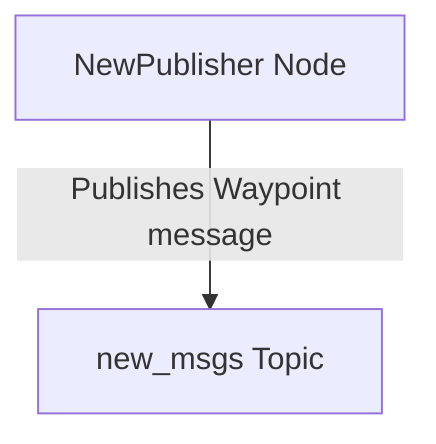

This simplified flow shows the custom message publisher sending `Waypoint` messages on the `"new_msgs"` topic.

Sources: [src/test_custom_msg/include/test_custom_msg/test_new_msg.hpp:1-25](), [src/test_custom_msg/src/test_new_msg.cpp:1-36](), [src/test_custom_msg/src/test_new_msg_node.cpp:1-14](), [src/autonavi_msgs/CMakeLists.txt:1-42](), [src/test_custom_msg/CMakeLists.txt:1-45]()

## Build and Package Configuration

### CMake Configuration

- Uses `cmake_minimum_required(VERSION 3.5)` and sets C standards to C99 and C++14.
- Compiler warnings enabled for GCC and Clang with `-Wall -Wextra -Wpedantic`.
- Packages use `ament_cmake` for ROS 2 build system integration.
- Dependencies resolved via `find_package()` for required ROS 2 packages.

### Package Structure Summary

| Package          | Description                           | Key Files                           |
|------------------|-------------------------------------|-----------------------------------|
| `autonavi_msgs`  | Defines custom message `Waypoint`   | `CMakeLists.txt`, `msg/Waypoint.msg` (not shown) |
| `test_custom_msg`| Uses `Waypoint` message in publisher| `CMakeLists.txt`, `src/test_new_msg.cpp`, `include/test_new_msg.hpp` |
| `cpp_pubsub`     | Basic publisher and subscriber example| `CMakeLists.txt`, source and header files |

Sources: [src/autonavi_msgs/CMakeLists.txt:1-42](), [src/test_custom_msg/CMakeLists.txt:1-45](), [src/cpp_pubsub/CMakeLists.txt:1-58]()

## Summary

The ros2_ci project provides a clear, modular example of ROS 2 publisher-subscriber communication using both standard and custom message types. It includes:

- A minimal example publishing and subscribing to `std_msgs::msg::String`.
- A demonstration of custom message definition and use via `autonavi_msgs::msg::Waypoint`.
- Well-structured ROS 2 packages with standard build and dependency configurations.
- Use of ROS 2 timers, QoS policies, and logging in C++ nodes.

This structure supports learning and testing ROS 2 communication patterns and message integration in a CI context.

Sources: All listed above.

---

<a id='page-2'></a>

## System Architecture Overview

### Related Pages

Related topics: [Component Relationships and Diagrams](#page-3), [Data Flow and Message Management](#page-6)

<details>
<summary>Relevant source files</summary>

The following files were used as context for generating this wiki page:

- src/cpp_pubsub/CMakeLists.txt
- src/cpp_pubsub/include/cpp_pubsub/minimal_publisher.hpp
- src/cpp_pubsub/src/minimal_publisher.cpp
- src/cpp_pubsub/src/minimal_publisher_node.cpp
- src/cpp_pubsub/include/cpp_pubsub/minimal_subscriber.hpp
- src/cpp_pubsub/src/minimal_subscriber.cpp
- src/cpp_pubsub/src/minimal_subscriber_node.cpp
- src/test_custom_msg/CMakeLists.txt
- src/test_custom_msg/include/test_custom_msg/test_new_msg.hpp
- src/test_custom_msg/src/test_new_msg.cpp
- src/test_custom_msg/src/test_new_msg_node.cpp
- src/autonavi_msgs/CMakeLists.txt
</details>

# System Architecture Overview

## Introduction

The system architecture of this project is designed around ROS 2 (Robot Operating System 2) nodes and messages, implementing a modular and extensible publish-subscribe communication pattern. It consists primarily of three packages:

- **cpp_pubsub**: Implements minimal publisher and subscriber nodes using standard ROS 2 messages (`std_msgs::msg::String`).
- **test_custom_msg**: Demonstrates publishing custom ROS 2 messages (`autonavi_msgs::msg::Waypoint`) with user-defined message types.
- **autonavi_msgs**: Defines custom message types used by other packages, specifically the `Waypoint` message.

This architecture provides a foundation for learning and experimenting with ROS 2 communication, focusing on message generation, publishing, and subscription patterns. For details on message types and their structure, see [Custom Message Definitions](#custom-message-definitions).

## Architecture Components

### 1. Message Definitions and Generation

The `autonavi_msgs` package contains custom message definitions, primarily the `Waypoint.msg` message. This message is generated using the ROS 2 interface generation system:

- The `CMakeLists.txt` in `autonavi_msgs` sets up dependencies on standard ROS 2 message packages (`std_msgs`, `geometry_msgs`, `builtin_interfaces`) and calls `rosidl_generate_interfaces` to generate message code for `Waypoint.msg`.
- The message depends on `builtin_interfaces` and standard message packages, allowing it to incorporate timestamps and pose data.

This package acts as a foundational message definition resource for other packages.

### 2. Minimal Publisher-Subscriber System (`cpp_pubsub`)

The `cpp_pubsub` package demonstrates a simple publisher and subscriber pair using the standard string message type.

- **MinimalPublisher**
  - Publishes messages of type `std_msgs::msg::String` on the topic `"tutorial_topic"`.
  - Uses a timer with a 500ms period to periodically publish messages.
  - Message content includes a counter appended to the string `"Hello, world! "`.
  - Stops publishing after 10 messages.
- **MinimalSubscriber**
  - Subscribes to the `"tutorial_topic"` topic.
  - Uses a callback to receive messages and logs the content.

Both nodes are implemented as subclasses of `rclcpp::Node`, utilizing ROS 2 APIs for publishers, subscribers, and timers.

### 3. Custom Message Publisher (`test_custom_msg`)

The `test_custom_msg` package showcases publishing a custom message (`autonavi_msgs::msg::Waypoint`):

- **NewPublisher**
  - Publishes `Waypoint` messages on the topic `"new_msgs"`.
  - Uses a 500ms timer to trigger message publication.
  - The `Waypoint` message is populated with:
    - A timestamp from the current ROS 2 clock.
    - Velocity set to 5.6.
    - Position coordinates (x=0.4, y=2.4, z=1.4).
    - Orientation quaternion with w=1.0.
  - Logs a confirmation message each time it publishes.

This package depends on the `autonavi_msgs` package for message definitions and demonstrates custom message usage in ROS 2.

## Data Flow and Interaction

### High-Level Communication Flow

```mermaid
graph TD
    PublisherCpp[MinimalPublisher\n(std_msgs::msg::String)]
    SubscriberCpp[MinimalSubscriber\n(std_msgs::msg::String)]
    PublisherCustom[NewPublisher\n(autonavi_msgs::msg::Waypoint)]

    PublisherCpp -->|Publishes on "tutorial_topic"| SubscriberCpp
    PublisherCustom -->|Publishes on "new_msgs"| CustomTopic[Subscribers of new_msgs (not shown)]
```

- `MinimalPublisher` publishes string messages that `MinimalSubscriber` consumes.
- `NewPublisher` publishes custom `Waypoint` messages for other nodes to subscribe to.

This architecture illustrates two parallel ROS 2 communication examples: one with standard messages and one with custom messages.

Sources: [src/cpp_pubsub/src/minimal_publisher.cpp:1-40](), [src/cpp_pubsub/src/minimal_subscriber.cpp:1-30](), [src/test_custom_msg/src/test_new_msg.cpp:1-40]()

## Package and Build System Configuration

### CMake Configuration Overview

- Each package (`cpp_pubsub`, `test_custom_msg`, `autonavi_msgs`) uses `ament_cmake` as the build system.
- C++14 standard is enforced.
- Compiler warnings (`-Wall -Wextra -Wpedantic`) are enabled for GNU and Clang compilers.
- Dependencies are declared explicitly, e.g., `rclcpp`, `std_msgs`, `geometry_msgs`, and `autonavi_msgs`.
- Executables are created for publishers and subscribers and installed into the package's library directory.
- Testing and linting dependencies are conditionally included if `BUILD_TESTING` is enabled.

### Key CMakeLists.txt Elements

| Package         | Executable(s)                     | Dependencies                             | Notes                              |
|-----------------|---------------------------------|----------------------------------------|----------------------------------|
| cpp_pubsub      | `talker`, `listener`             | `rclcpp`, `std_msgs`                    | Minimal example with std_msgs    |
| test_custom_msg | `test_custom_msg_talker`         | `rclcpp`, `std_msgs`, `geometry_msgs`, `autonavi_msgs` | Uses custom message `Waypoint`   |
| autonavi_msgs   | N/A (message generation only)    | `ament_cmake`, `rosidl_default_generators`, `std_msgs`, `geometry_msgs`, `builtin_interfaces` | Generates custom message code    |

Sources: [src/cpp_pubsub/CMakeLists.txt:1-60](), [src/test_custom_msg/CMakeLists.txt:1-60](), [src/autonavi_msgs/CMakeLists.txt:1-50]()

## Class and Node Design

### MinimalPublisher Class

- Publishes `std_msgs::msg::String` messages.
- Maintains a message counter (`count_`) to append to the string.
- Uses a timer (`500ms`) to invoke `timerCallback()` periodically.
- Stops publishing after 10 messages.
  
```cpp
class MinimalPublisher : public rclcpp::Node
{
public:
    MinimalPublisher();

private:
    size_t count_;
    rclcpp::Publisher<std_msgs::msg::String>::SharedPtr publisher_;
    rclcpp::TimerBase::SharedPtr timer_;
    void timerCallback();
};
```

### MinimalSubscriber Class

- Subscribes to `std_msgs::msg::String` messages on `"tutorial_topic"`.
- Callback function logs received message data.

```cpp
class MinimalSubscriber : public rclcpp::Node
{
public:
    MinimalSubscriber();

private:
    rclcpp::Subscription<std_msgs::msg::String>::SharedPtr subscription_;
    void topicCallback(const std_msgs::msg::String::SharedPtr msg);
};
```

### NewPublisher Class (Custom Message Publisher)

- Publishes `autonavi_msgs::msg::Waypoint` messages on `"new_msgs"`.
- Populates the message with header timestamp, velocity, and pose data.
- Uses a 500ms timer for periodic publishing.

```cpp
class NewPublisher : public rclcpp::Node
{
public:
    NewPublisher();

private:
    rclcpp::Publisher<autonavi_msgs::msg::Waypoint>::SharedPtr publisher_;
    rclcpp::TimerBase::SharedPtr timer_;
    void timerCallback();
};
```

Sources: [src/cpp_pubsub/include/cpp_pubsub/minimal_publisher.hpp:1-40](), [src/cpp_pubsub/include/cpp_pubsub/minimal_subscriber.hpp:1-30](), [src/test_custom_msg/include/test_custom_msg/test_new_msg.hpp:1-30]()

## Execution Flow

### Publisher Execution Sequence

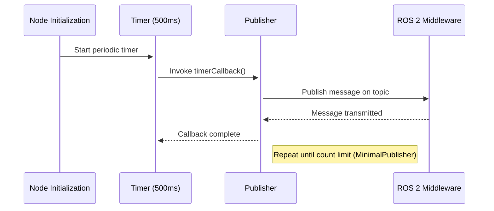

- The publisher node initializes, sets up a timer.
- Every 500ms, the timer triggers the callback to create and publish a message.
- The message is sent over ROS 2 middleware.
- In the minimal publisher, publishing stops after 10 messages; in the custom publisher, it continues indefinitely.

Sources: [src/cpp_pubsub/src/minimal_publisher.cpp:10-40](), [src/test_custom_msg/src/test_new_msg.cpp:10-40]()

### Subscriber Execution Sequence

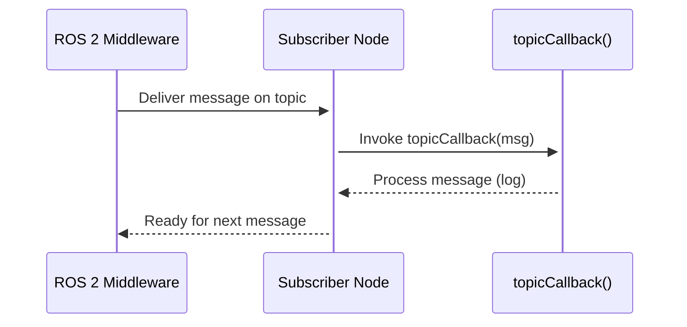

- The subscriber node receives messages asynchronously from ROS 2 middleware.
- The callback processes the message, e.g., logging content.
- The subscriber is ready to receive subsequent messages.

Sources: [src/cpp_pubsub/src/minimal_subscriber.cpp:10-30]()

## Data Model: Waypoint Message Summary

| Field             | Type                         | Description                          |
|-------------------|------------------------------|------------------------------------|
| `header.stamp`    | `builtin_interfaces/Time`     | Timestamp of the message            |
| `velocity`        | `float64`                    | Velocity value                      |
| `pose.position.x` | `float64`                    | X coordinate of position            |
| `pose.position.y` | `float64`                    | Y coordinate of position            |
| `pose.position.z` | `float64`                    | Z coordinate of position            |
| `pose.orientation.w`| `float64`                   | Orientation quaternion component W  |

This message is used in `test_custom_msg` to publish waypoint data with position and velocity.

Sources: [src/test_custom_msg/src/test_new_msg.cpp:15-35](), [src/autonavi_msgs/CMakeLists.txt:20-30]()

## Summary

This system architecture demonstrates a foundational ROS 2 communication setup with both standard and custom message types. It includes minimal publisher and subscriber nodes exchanging string messages, alongside a custom message publisher for more complex data structures (`Waypoint`). The use of ROS 2 timers, publishers, and subscriptions is exemplified with clear separation of concerns across packages, supported by appropriate CMake build configurations. This modular approach enables easy extension and serves as a learning scaffold for ROS 2 developers.

Sources: [src/cpp_pubsub/src/minimal_publisher.cpp](), [src/cpp_pubsub/src/minimal_subscriber.cpp](), [src/test_custom_msg/src/test_new_msg.cpp](), [src/autonavi_msgs/CMakeLists.txt](), [src/test_custom_msg/CMakeLists.txt]()

---

<a id='page-3'></a>

## Component Relationships and Diagrams

### Related Pages

Related topics: [System Architecture Overview](#page-2), [Core Features and Functionality](#page-4)

<details>
<summary>Relevant source files</summary>

The following files were used as context for generating this wiki page:

- [src/cpp_pubsub/include/cpp_pubsub/minimal_publisher.hpp](https://github.com/duclinhfetel/ros2_ci/blob/main/src/cpp_pubsub/include/cpp_pubsub/minimal_publisher.hpp)
- [src/cpp_pubsub/include/cpp_pubsub/minimal_subscriber.hpp](https://github.com/duclinhfetel/ros2_ci/blob/main/src/cpp_pubsub/include/cpp_pubsub/minimal_subscriber.hpp)
- [src/cpp_pubsub/src/minimal_publisher.cpp](https://github.com/duclinhfetel/ros2_ci/blob/main/src/cpp_pubsub/src/minimal_publisher.cpp)
- [src/cpp_pubsub/src/minimal_subscriber.cpp](https://github.com/duclinhfetel/ros2_ci/blob/main/src/cpp_pubsub/src/minimal_subscriber.cpp)
- [src/test_custom_msg/include/test_custom_msg/test_new_msg.hpp](https://github.com/duclinhfetel/ros2_ci/blob/main/src/test_custom_msg/include/test_custom_msg/test_new_msg.hpp)
- [src/test_custom_msg/src/test_new_msg.cpp](https://github.com/duclinhfetel/ros2_ci/blob/main/src/test_custom_msg/src/test_new_msg.cpp)
- [src/test_custom_msg/src/test_new_msg_node.cpp](https://github.com/duclinhfetel/ros2_ci/blob/main/src/test_custom_msg/src/test_new_msg_node.cpp)
</details>

# Component Relationships and Diagrams

## Introduction

This document provides a detailed technical overview of the component relationships and architectural design of the ROS2 CI project’s publisher-subscriber modules. It focuses on the interaction between core ROS2 nodes implemented for basic string message communication (`cpp_pubsub`) and a custom message publisher (`test_custom_msg`). The components demonstrate the use of ROS2 publisher and subscriber paradigms with standard and custom messages, highlighting the modular design and data flow within the system.

For a deeper understanding of ROS2 concepts and message definitions, see the [ROS2 Message Interfaces](#ros2-message-interfaces) page.

## Overview of Core Components

The system consists of two main modules:

- **cpp_pubsub**: Implements basic string message publishing and subscribing nodes.
- **test_custom_msg**: Implements a publisher node that uses a custom message type (`autonavi_msgs::msg::Waypoint`).

Both modules use ROS2 `rclcpp` APIs to create nodes, publishers, subscribers, and timers to facilitate asynchronous message communication.

### Key Components

| Component Name       | Type           | Description                                              |
|---------------------|----------------|----------------------------------------------------------|
| `MinimalPublisher`   | Publisher Node | Publishes `std_msgs::msg::String` messages periodically. |
| `MinimalSubscriber`  | Subscriber Node| Subscribes to `std_msgs::msg::String` messages and logs them. |
| `NewPublisher`      | Publisher Node | Publishes custom `autonavi_msgs::msg::Waypoint` messages at a fixed interval. |

Sources: [minimal_publisher.hpp:1-34](), [minimal_subscriber.hpp:1-24](), [test_new_msg.hpp:1-24]()

---

## cpp_pubsub Module Architecture

### MinimalPublisher

- **Class:** `MinimalPublisher`
- **Function:** Publishes string messages on topic `"tutorial_topic"`.
- **Mechanism:** Uses a timer to call `timerCallback()` every 500 milliseconds.
- **Message Type:** `std_msgs::msg::String`
- **QoS:** `rclcpp::QoS(10).keep_last(1).transient_local()`

#### Behavior

- Publishes messages "Hello, world! N" where N increments each callback.
- Stops publishing after count exceeds 10.
- Logs publishing activity.

```cpp
void MinimalPublisher::timerCallback()
{
    auto message = std_msgs::msg::String();
    message.data = "Hello, world! " + std::to_string(count_);

    if (count_ <= 10)
    {
        RCLCPP_INFO(this->get_logger(), "Publishing: '%s'", message.data.c_str());
        publisher_->publish(message);
    }
    count_++;
}
```

Sources: [minimal_publisher.cpp:1-33](), [minimal_publisher.hpp:1-34]()

### MinimalSubscriber

- **Class:** `MinimalSubscriber`
- **Function:** Subscribes to `"tutorial_topic"` and logs received string messages.
- **Callback:** `topicCallback()` invoked on message receipt.
- **QoS:** `rclcpp::QoS(10).transient_local()`

#### Behavior

- Logs each received message string with ROS2 logging.

```cpp
void MinimalSubscriber::topicCallback(const std_msgs::msg::String::SharedPtr msg)
{
    RCLCPP_INFO(this->get_logger(), "I heard: '%s'", msg->data.c_str());
}
```

Sources: [minimal_subscriber.cpp:1-22](), [minimal_subscriber.hpp:1-24]()

### cpp_pubsub Execution Flow

The following diagram illustrates the flow of data and control in the `cpp_pubsub` module between the publisher, ROS2 middleware, and subscriber.

```mermaid
graph TD
    A[MinimalPublisher Node] -->|Publish "Hello, world! N"| B[ROS2 Middleware (DDS)]
    B -->|Deliver Message| C[MinimalSubscriber Node]
    C -->|Log Received Message| D[Console Output]
```

This shows a single-topic pub-sub pattern with a timed publisher and asynchronous subscriber logging.

Sources: [minimal_publisher.cpp:1-33](), [minimal_subscriber.cpp:1-22]()

---

## test_custom_msg Module Architecture

### NewPublisher

- **Class:** `NewPublisher`
- **Function:** Publishes a custom message type `autonavi_msgs::msg::Waypoint` on topic `"new_msgs"`.
- **Timer:** Fires every 500 milliseconds to invoke `timerCallback()`.
- **QoS:** `rclcpp::QoS(10).keep_last(1).transient_local()`

#### Message Structure

`autonavi_msgs::msg::Waypoint` includes:

| Field            | Type                         | Description                          |
|------------------|------------------------------|------------------------------------|
| `header.stamp`   | `rclcpp::Time`               | Timestamp of the message            |
| `velocity`       | `double`                     | Velocity value                     |
| `pose.position`  | `geometry_msgs::msg::Point`  | Position with x, y, z coordinates  |
| `pose.orientation` | `geometry_msgs::msg::Quaternion` | Orientation quaternion             |

#### Behavior

- Sets timestamp to current time.
- Sets velocity to 5.6.
- Sets position to (0.4, 2.4, 1.4).
- Sets orientation.w to 1.0.
- Publishes the waypoint message and logs "Publish Done!".

```cpp
void NewPublisher::timerCallback()
{
    autonavi_msgs::msg::Waypoint way = autonavi_msgs::msg::Waypoint();
    way.header.stamp = rclcpp::Time(rclcpp::Clock().now());
    way.velocity = 5.6;
    way.pose.position.x = 0.4;
    way.pose.position.y = 2.4;
    way.pose.position.z = 1.4;
    way.pose.orientation.w = 1.0;

    publisher_->publish(way);
    RCLCPP_INFO(this->get_logger(), "Publish Done!");
}
```

Sources: [test_new_msg.cpp:1-32](), [test_new_msg.hpp:1-24]()

### test_custom_msg Execution Flow

```mermaid
graph TD
    NP[NewPublisher Node] -->|Publish Waypoint Msg| RMQ[ROS2 Middleware]
    RMQ -->|Distribute to Subscribers| (Subscribers)
```

This module currently implements only a publisher node but integrates with ROS2's middleware for message dissemination.

Sources: [test_new_msg.cpp:1-32]()

---

## Node Initialization and Lifecycle

### Main Executables

- `cpp_pubsub/src/minimal_publisher_node.cpp` initializes and spins `MinimalPublisher`.
- `cpp_pubsub/src/minimal_subscriber_node.cpp` initializes and spins `MinimalSubscriber`.
- `test_custom_msg/src/test_new_msg_node.cpp` initializes and spins `NewPublisher`.

### Lifecycle Sequence

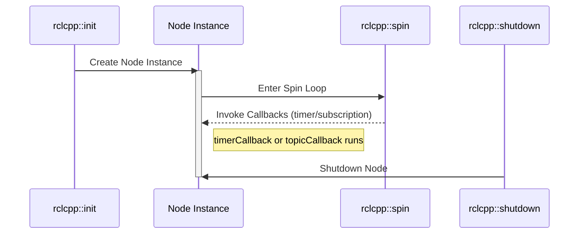

Sources: [minimal_publisher_node.cpp:1-13](), [minimal_subscriber_node.cpp:1-13](), [test_new_msg_node.cpp:1-13]()

---

## Summary Table of Core Classes and Methods

| Class Name        | File Location                      | Key Methods       | Description                                   |
|-------------------|----------------------------------|-------------------|-----------------------------------------------|
| `MinimalPublisher` | `cpp_pubsub/include/minimal_publisher.hpp` | `timerCallback()` | Publishes string messages periodically.       |
| `MinimalSubscriber`| `cpp_pubsub/include/minimal_subscriber.hpp`| `topicCallback()` | Subscribes and logs string messages.           |
| `NewPublisher`    | `test_custom_msg/include/test_new_msg.hpp` | `timerCallback()` | Publishes custom Waypoint messages periodically.|

Sources: [minimal_publisher.hpp:1-34](), [minimal_subscriber.hpp:1-24](), [test_new_msg.hpp:1-24]()

---

## Conclusion

The ROS2 CI project demonstrates a modular ROS2-based publisher-subscriber architecture with both standard and custom message types. The `cpp_pubsub` module provides a simple example of string message communication, while `test_custom_msg` extends this with a custom message type, illustrating ROS2’s flexibility in handling complex message data structures. The components are organized around ROS2 nodes, publishers, subscribers, and timers, showcasing asynchronous, event-driven data flow patterns fundamental to ROS2 applications.

This architecture facilitates easy extension for more complex message types and node interactions, supporting scalable and maintainable ROS2 system development.

Sources: [all above]

---

<a id='page-4'></a>

## Core Features and Functionality

### Related Pages

Related topics: [Project Overview](#page-1), [Component Relationships and Diagrams](#page-3)

<details>
<summary>Relevant source files</summary>

The following files were used as context for generating this wiki page:

- [src/cpp_pubsub/src/minimal_publisher.cpp](https://github.com/duclinhfetel/ros2_ci/blob/main/src/cpp_pubsub/src/minimal_publisher.cpp)
- [src/cpp_pubsub/include/cpp_pubsub/minimal_publisher.hpp](https://github.com/duclinhfetel/ros2_ci/blob/main/src/cpp_pubsub/include/cpp_pubsub/minimal_publisher.hpp)
- [src/cpp_pubsub/src/minimal_subscriber.cpp](https://github.com/duclinhfetel/ros2_ci/blob/main/src/cpp_pubsub/src/minimal_subscriber.cpp)
- [src/cpp_pubsub/include/cpp_pubsub/minimal_subscriber.hpp](https://github.com/duclinhfetel/ros2_ci/blob/main/src/cpp_pubsub/include/cpp_pubsub/minimal_subscriber.hpp)
- [src/test_custom_msg/src/test_new_msg.cpp](https://github.com/duclinhfetel/ros2_ci/blob/main/src/test_custom_msg/src/test_new_msg.cpp)
- [src/test_custom_msg/include/test_custom_msg/test_new_msg.hpp](https://github.com/duclinhfetel/ros2_ci/blob/main/src/test_custom_msg/include/test_custom_msg/test_new_msg.hpp)
- [src/test_custom_msg/src/test_new_msg_node.cpp](https://github.com/duclinhfetel/ros2_ci/blob/main/src/test_custom_msg/src/test_new_msg_node.cpp)
- [src/autonavi_msgs/CMakeLists.txt](https://github.com/duclinhfetel/ros2_ci/blob/main/src/autonavi_msgs/CMakeLists.txt)
</details>

# Core Features and Functionality

## Introduction

The core features and functionality of this project revolve around demonstrating basic ROS2 publisher-subscriber communication patterns using both standard and custom message types. The project includes minimal examples of publishing and subscribing to string messages (`std_msgs::msg::String`) as well as publishing custom message types defined in the `autonavi_msgs` package, specifically a `Waypoint` message.

This documentation covers the architecture and implementation of these core communication components, detailing their classes, message flow, and configurations. For further information on message definitions and custom message generation, see the related page on [Custom Message Definitions](#custom-message-definitions).

## Publisher-Subscriber Architecture Overview

The project implements two main ROS2 nodes:

- **MinimalPublisher / MinimalSubscriber:** These handle publishing and subscribing to simple string messages on the topic `"tutorial_topic"`.
- **NewPublisher:** Publishes custom `autonavi_msgs::msg::Waypoint` messages on the `"new_msgs"` topic.

Both systems utilize ROS2 C++ client libraries (`rclcpp`) and employ timers to trigger periodic message publication.

### Components and Relationships

```mermaid
graph TD
    A[MinimalPublisher Node] -->|publishes| B[Tutorial Topic (std_msgs::msg::String)]
    C[MinimalSubscriber Node] -->|subscribes| B
    D[NewPublisher Node] -->|publishes| E[New Msgs Topic (autonavi_msgs::msg::Waypoint)]
```

This diagram shows the two communication flows: one for standard string messages and one for custom waypoint messages. The MinimalPublisher publishes string messages which are consumed by MinimalSubscriber. Separately, NewPublisher sends custom waypoint messages.

Sources: [minimal_publisher.cpp:1-38](), [minimal_subscriber.cpp:1-33](), [test_new_msg.cpp:1-39]()  

---

## MinimalPublisher: Publishing Standard String Messages

### Class Overview

- **Class:** `MinimalPublisher`
- **Header:** `minimal_publisher.hpp`
- **Source:** `minimal_publisher.cpp`

The `MinimalPublisher` class inherits from `rclcpp::Node` and publishes `std_msgs::msg::String` messages on the `"tutorial_topic"` topic.

### Key Attributes and Methods

| Attribute/Method | Type/Signature                                      | Description                                         |
|------------------|---------------------------------------------------|-----------------------------------------------------|
| `publisher_`     | `rclcpp::Publisher<std_msgs::msg::String>::SharedPtr` | Publisher object for string messages                 |
| `timer_`         | `rclcpp::TimerBase::SharedPtr`                     | Timer triggering periodic publishing                  |
| `count_`         | `size_t`                                           | Message counter to generate message content          |
| `timerCallback()`| `void`                                            | Callback function executed every 500 ms to publish messages |

### Publishing Logic

- The publisher is created with QoS profile: keep last 1, transient local durability.
- Every 500 milliseconds, `timerCallback()` is called.
- It publishes a message `"Hello, world! N"` where `N` is the current count.
- Messages are published only while `count_ <= 10`.
- Logs the published message using ROS2 logging.

```cpp
void MinimalPublisher::timerCallback()
{
    auto message = std_msgs::msg::String();
    message.data = "Hello, world! " + std::to_string(count_);

    if (count_ <= 10)
    {
        RCLCPP_INFO(this->get_logger(), "Publishing: '%s'", message.data.c_str());
        publisher_->publish(message);
    }
    count_++;
}
```

Sources: [minimal_publisher.hpp:1-38](), [minimal_publisher.cpp:1-38]()

---

## MinimalSubscriber: Subscribing to Standard String Messages

### Class Overview

- **Class:** `MinimalSubscriber`
- **Header:** `minimal_subscriber.hpp`
- **Source:** `minimal_subscriber.cpp`

The `MinimalSubscriber` class subscribes to the `"tutorial_topic"` topic receiving `std_msgs::msg::String` messages.

### Key Attributes and Methods

| Attribute/Method | Type/Signature                                  | Description                                   |
|------------------|------------------------------------------------|-----------------------------------------------|
| `subscription_`  | `rclcpp::Subscription<std_msgs::msg::String>::SharedPtr` | Subscription object for string messages        |
| `topicCallback()`| `void(const std_msgs::msg::String::SharedPtr)` | Callback invoked on receiving a message       |

### Subscription Logic

- Subscription created with QoS profile: transient local durability, queue size 10.
- On receiving a message, logs the message content.

```cpp
void MinimalSubscriber::topicCallback(const std_msgs::msg::String::SharedPtr msg)
{
    RCLCPP_INFO(this->get_logger(), "I heard: '%s'", msg->data.c_str());
}
```

Sources: [minimal_subscriber.hpp:1-26](), [minimal_subscriber.cpp:1-33]()

---

## NewPublisher: Publishing Custom Waypoint Messages

### Class Overview

- **Class:** `NewPublisher`
- **Header:** `test_new_msg.hpp`
- **Source:** `test_new_msg.cpp`

`NewPublisher` publishes messages of type `autonavi_msgs::msg::Waypoint` on the `"new_msgs"` topic.

### Key Attributes and Methods

| Attribute/Method | Type/Signature                                      | Description                                       |
|------------------|---------------------------------------------------|-------------------------------------------------|
| `publisher_`     | `rclcpp::Publisher<autonavi_msgs::msg::Waypoint>::SharedPtr` | Publisher for waypoint messages                    |
| `timer_`         | `rclcpp::TimerBase::SharedPtr`                     | Timer to trigger periodic publishing               |
| `timerCallback()`| `void`                                            | Callback to create and publish waypoint messages  |

### Publishing Logic

- Publisher created with QoS profile: keep last 1, transient local durability.
- Every 500 ms, `timerCallback()` publishes a waypoint message with fixed position, orientation, velocity, and current timestamp.
- Logs "Publish Done!" after each publish.

```cpp
void NewPublisher::timerCallback()
{
    autonavi_msgs::msg::Waypoint way = autonavi_msgs::msg::Waypoint();
    way.header.stamp = rclcpp::Time(rclcpp::Clock().now());
    way.velocity = 5.6;
    way.pose.position.x = 0.4;
    way.pose.position.y = 2.4;
    way.pose.position.z = 1.4;
    way.pose.orientation.w = 1.0;

    publisher_->publish(way);
    RCLCPP_INFO(this->get_logger(), "Publish Done!");
}
```

Sources: [test_new_msg.hpp:1-30](), [test_new_msg.cpp:1-39]()

---

## Node Lifecycle and Execution Flow

### Execution Flow for MinimalPublisher and MinimalSubscriber

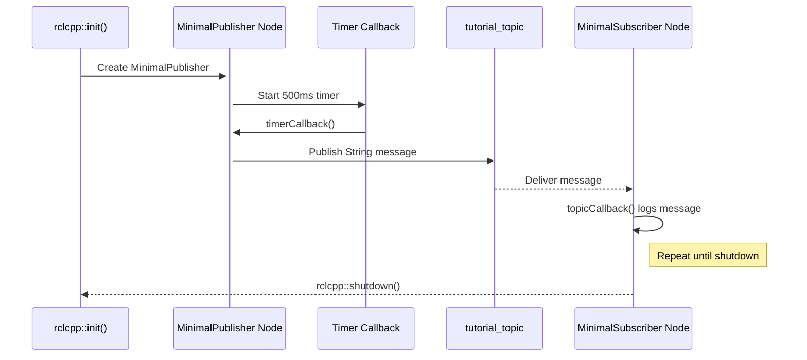

### Execution Flow for NewPublisher

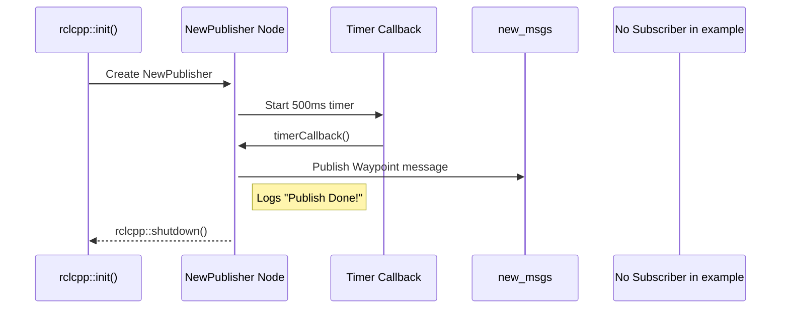

Sources: [minimal_publisher_node.cpp:1-15](), [minimal_subscriber_node.cpp:1-15](), [test_new_msg_node.cpp:1-15]()

---

## Message Types and QoS Configuration

### Message Types

| Topic           | Message Type                      | Description                          |
|-----------------|---------------------------------|------------------------------------|
| `tutorial_topic` | `std_msgs::msg::String`          | Simple string messages              |
| `new_msgs`      | `autonavi_msgs::msg::Waypoint`   | Custom waypoint messages with pose and velocity |

### QoS Profiles Used

| Topic           | QoS Settings                           | Purpose                              |
|-----------------|--------------------------------------|------------------------------------|
| `tutorial_topic` | `rclcpp::QoS(10).keep_last(1).transient_local()` | Reliable delivery with transient local durability |
| `new_msgs`       | `rclcpp::QoS(10).keep_last(1).transient_local()` | Same as above for custom messages   |

Sources: [minimal_publisher.cpp:7-16](), [test_new_msg.cpp:7-18]()

---

## Custom Message Definition and Build System Integration

The custom message `Waypoint` is part of the `autonavi_msgs` package. Its generation is managed via ROS2's `rosidl` interface in the `CMakeLists.txt` of `autonavi_msgs`:

- Messages are generated from `msg/Waypoint.msg`.
- Dependencies include `builtin_interfaces`, `std_msgs`, and `geometry_msgs`.

```cmake
rosidl_generate_interfaces(${PROJECT_NAME}
  "msg/Waypoint.msg"
  DEPENDENCIES builtin_interfaces std_msgs geometry_msgs
 )
```

This setup ensures that the `Waypoint` message is available for use in the `test_custom_msg` package which publishes this message.

Sources: [autonavi_msgs/CMakeLists.txt:10-22]()

---

## Summary Table of Core Classes

| Class Name       | Purpose                                | Message Type                      | Topic           |
|------------------|--------------------------------------|---------------------------------|-----------------|
| `MinimalPublisher`| Publishes standard string messages   | `std_msgs::msg::String`          | `tutorial_topic` |
| `MinimalSubscriber`| Subscribes to string messages       | `std_msgs::msg::String`          | `tutorial_topic` |
| `NewPublisher`   | Publishes custom waypoint messages    | `autonavi_msgs::msg::Waypoint`   | `new_msgs`       |

---

## Conclusion

The core features of this project demonstrate fundamental ROS2 communication paradigms using C++. It provides minimal but complete examples of publishing and subscribing to both standard and custom message types with appropriate QoS settings. The modular design encapsulates publisher and subscriber logic within dedicated classes, facilitating easy extension or adaptation for more complex ROS2 systems.

This foundation enables developers to build upon these examples for more advanced robotics applications requiring custom message definitions and reliable communication patterns.

Sources: [minimal_publisher.cpp](), [minimal_subscriber.cpp](), [test_new_msg.cpp](), [autonavi_msgs/CMakeLists.txt](), [test_new_msg.hpp]()

---

<a id='page-5'></a>

## Class Hierarchies and Node Descriptions

### Related Pages

Related topics: [Core Features and Functionality](#page-4)

<details>
<summary>Relevant source files</summary>

The following files were used as context for generating this wiki page:

- [src/cpp_pubsub/include/cpp_pubsub/minimal_publisher.hpp](https://github.com/duclinhfetel/ros2_ci/blob/main/src/cpp_pubsub/include/cpp_pubsub/minimal_publisher.hpp)  
- [src/cpp_pubsub/include/cpp_pubsub/minimal_subscriber.hpp](https://github.com/duclinhfetel/ros2_ci/blob/main/src/cpp_pubsub/include/cpp_pubsub/minimal_subscriber.hpp)  
- [src/test_custom_msg/include/test_custom_msg/test_new_msg.hpp](https://github.com/duclinhfetel/ros2_ci/blob/main/src/test_custom_msg/include/test_custom_msg/test_new_msg.hpp)  
- [src/cpp_pubsub/src/minimal_publisher.cpp](https://github.com/duclinhfetel/ros2_ci/blob/main/src/cpp_pubsub/src/minimal_publisher.cpp)  
- [src/cpp_pubsub/src/minimal_subscriber.cpp](https://github.com/duclinhfetel/ros2_ci/blob/main/src/cpp_pubsub/src/minimal_subscriber.cpp)  
- [src/test_custom_msg/src/test_new_msg.cpp](https://github.com/duclinhfetel/ros2_ci/blob/main/src/test_custom_msg/src/test_new_msg.cpp)  
- [src/cpp_pubsub/src/minimal_publisher_node.cpp](https://github.com/duclinhfetel/ros2_ci/blob/main/src/cpp_pubsub/src/minimal_publisher_node.cpp)  
- [src/cpp_pubsub/src/minimal_subscriber_node.cpp](https://github.com/duclinhfetel/ros2_ci/blob/main/src/cpp_pubsub/src/minimal_subscriber_node.cpp)  
- [src/test_custom_msg/src/test_new_msg_node.cpp](https://github.com/duclinhfetel/ros2_ci/blob/main/src/test_custom_msg/src/test_new_msg_node.cpp)  
</details>

# Class Hierarchies and Node Descriptions

## Introduction

This document describes the class hierarchies and node implementations within the ROS 2 learning project "ros2_ci." It focuses on two primary modules: the `cpp_pubsub` package, which implements basic ROS 2 publisher and subscriber nodes using standard string messages, and the `test_custom_msg` package, which demonstrates publishing custom message types (`autonavi_msgs::msg::Waypoint`). The nodes are designed to illustrate ROS 2 communication mechanisms, timer callbacks, and message handling.

The following sections detail the class structures, key methods, and interactions of these nodes, providing an architectural overview of the project's core ROS 2 components.

## Overview of Key Classes and Nodes

### `MinimalPublisher` Class

- **Purpose:** Publishes standard ROS 2 string messages periodically on the topic `tutorial_topic`.
- **Package:** `cpp_pubsub`
- **Key Features:**
  - Publishes `std_msgs::msg::String` messages with a count appended.
  - Uses a timer with a 500 ms period to trigger publishing.
  - Limits publishing to 11 messages (count from 0 to 10).
  
### `MinimalSubscriber` Class

- **Purpose:** Subscribes to the `tutorial_topic` topic and logs received string messages.
- **Package:** `cpp_pubsub`
- **Key Features:**
  - Subscribes to `std_msgs::msg::String` messages.
  - Uses a callback to process and log incoming messages.

### `NewPublisher` Class

- **Purpose:** Publishes custom `autonavi_msgs::msg::Waypoint` messages on the topic `new_msgs`.
- **Package:** `test_custom_msg`
- **Key Features:**
  - Publishes a `Waypoint` message every 500 ms.
  - Sets header timestamp, velocity, and pose data in each message.
  - Demonstrates publishing of user-defined ROS 2 messages.

## Class Hierarchies and Relationships

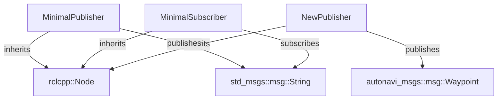

This diagram shows the inheritance structure where all three classes derive from `rclcpp::Node`, the fundamental ROS 2 node class. `MinimalPublisher` and `MinimalSubscriber` communicate via `std_msgs::msg::String`, while `NewPublisher` publishes a custom message type `Waypoint`.

Sources: [src/cpp_pubsub/include/cpp_pubsub/minimal_publisher.hpp:1-27](), [src/cpp_pubsub/include/cpp_pubsub/minimal_subscriber.hpp:1-23](), [src/test_custom_msg/include/test_custom_msg/test_new_msg.hpp:1-27]()

## Detailed Node Descriptions

### MinimalPublisher

- **Constructor:**
  - Initializes the node with the name `"minimal_publisher"`.
  - Creates a publisher for `std_msgs::msg::String` on topic `"tutorial_topic"` with QoS settings: depth 10, keep last 1, transient local durability.
  - Sets up a wall timer with a 500 ms period to invoke `timerCallback`.

- **timerCallback():**
  - Creates a `std_msgs::msg::String` message with data `"Hello, world! " + count`.
  - Publishes messages while `count_` is less than or equal to 10.
  - Logs the published message.
  - Increments the internal message count.

```cpp
void MinimalPublisher::timerCallback()
{
    auto message = std_msgs::msg::String();
    message.data = "Hello, world! " + std::to_string(count_);

    if (count_ <= 10)
    {
        RCLCPP_INFO(this->get_logger(), "Publishing: '%s'", message.data.c_str());
        publisher_->publish(message);
    }
    count_++;
}
```

Sources: [src/cpp_pubsub/src/minimal_publisher.cpp:1-27](), [src/cpp_pubsub/include/cpp_pubsub/minimal_publisher.hpp:10-27]()

### MinimalSubscriber

- **Constructor:**
  - Initializes the node with the name `"minial_subscriber"` (note the typo in node name).
  - Creates a subscription to `std_msgs::msg::String` on topic `"tutorial_topic"` with QoS depth 10, transient local durability.
  - Binds `topicCallback` as the subscription callback.

- **topicCallback():**
  - Receives messages of type `std_msgs::msg::String`.
  - Logs the received message content.

```cpp
void MinimalSubscriber::topicCallback(const std_msgs::msg::String::SharedPtr msg)
{
    RCLCPP_INFO(this->get_logger(), "I heard: '%s'", msg->data.c_str());
}
```

Sources: [src/cpp_pubsub/src/minimal_subscriber.cpp:1-24](), [src/cpp_pubsub/include/cpp_pubsub/minimal_subscriber.hpp:10-23]()

### NewPublisher

- **Constructor:**
  - Initializes the node named `"test_custom_msg"`.
  - Creates a publisher for `autonavi_msgs::msg::Waypoint` on topic `"new_msgs"` with QoS depth 10, keep last 1, transient local durability.
  - Sets a 500 ms timer to invoke `timerCallback`.

- **timerCallback():**
  - Creates a `Waypoint` message.
  - Sets the message header timestamp to current time.
  - Assigns fixed values to velocity and pose (position and orientation).
  - Publishes the message.
  - Logs confirmation of publishing.

```cpp
void NewPublisher::timerCallback()
{
    autonavi_msgs::msg::Waypoint way = autonavi_msgs::msg::Waypoint();
    way.header.stamp = rclcpp::Time(rclcpp::Clock().now());
    way.velocity = 5.6;
    way.pose.position.x = 0.4;
    way.pose.position.y = 2.4;
    way.pose.position.z = 1.4;
    way.pose.orientation.w = 1.0;

    publisher_->publish(way);
    RCLCPP_INFO(this->get_logger(), "Publish Done!");
}
```

Sources: [src/test_custom_msg/src/test_new_msg.cpp:1-36](), [src/test_custom_msg/include/test_custom_msg/test_new_msg.hpp:10-27]()

## Node Lifecycle and Execution Flow

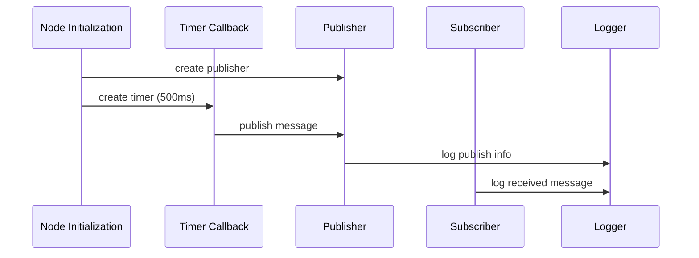

This sequence diagram outlines the lifecycle from node initialization, timer-triggered publishing, to subscriber reception and logging of messages. Both publisher and subscriber nodes initialize their respective communication interfaces and operate asynchronously via callbacks.

Sources: [src/cpp_pubsub/src/minimal_publisher_node.cpp:1-15](), [src/cpp_pubsub/src/minimal_subscriber_node.cpp:1-15](), [src/test_custom_msg/src/test_new_msg_node.cpp:1-15]()

## Summary of Key Classes and Their Members

| Class Name       | Package         | Purpose                         | Key Members                                  | Callback Functions    |
|------------------|-----------------|---------------------------------|----------------------------------------------|----------------------|
| `MinimalPublisher`| `cpp_pubsub`    | Publishes string messages        | `publisher_` (String Publisher), `timer_`, `count_` | `timerCallback()`    |
| `MinimalSubscriber`| `cpp_pubsub`   | Subscribes to string messages    | `subscription_` (String Subscription)       | `topicCallback()`    |
| `NewPublisher`   | `test_custom_msg`| Publishes custom Waypoint messages | `publisher_` (Waypoint Publisher), `timer_`| `timerCallback()`    |

Sources: [src/cpp_pubsub/include/cpp_pubsub/minimal_publisher.hpp:10-27](), [src/cpp_pubsub/include/cpp_pubsub/minimal_subscriber.hpp:10-23](), [src/test_custom_msg/include/test_custom_msg/test_new_msg.hpp:10-27]()

## Conclusion

The `ros2_ci` project implements foundational ROS 2 nodes demonstrating publishing and subscribing mechanisms with both standard and custom message types. The `MinimalPublisher` and `MinimalSubscriber` classes form a simple pub-sub pair exchanging string messages, while `NewPublisher` showcases publishing of a complex custom message (`Waypoint`). These classes inherit from `rclcpp::Node`, leverage timers and callbacks for asynchronous operation, and serve as effective learning tools for ROS 2 node development.

This structured hierarchy and node design provide a clear and modular approach to ROS 2 communication patterns within the project.

---

<a id='page-6'></a>

## Data Flow and Message Management

### Related Pages

Related topics: [System Architecture Overview](#page-2)

<details>
<summary>Relevant source files</summary>

The following files were used as context for generating this wiki page:

- [src/autonavi_msgs/msg/Waypoint.msg](https://github.com/duclinhfetel/ros2_ci/blob/main/src/autonavi_msgs/msg/Waypoint.msg)
- [src/cpp_pubsub/src/minimal_publisher.cpp](https://github.com/duclinhfetel/ros2_ci/blob/main/src/cpp_pubsub/src/minimal_publisher.cpp)
- [src/cpp_pubsub/src/minimal_subscriber.cpp](https://github.com/duclinhfetel/ros2_ci/blob/main/src/cpp_pubsub/src/minimal_subscriber.cpp)
- [src/test_custom_msg/src/test_new_msg.cpp](https://github.com/duclinhfetel/ros2_ci/blob/main/src/test_custom_msg/src/test_new_msg.cpp)
- [src/test_custom_msg/include/test_custom_msg/test_new_msg.hpp](https://github.com/duclinhfetel/ros2_ci/blob/main/src/test_custom_msg/include/test_custom_msg/test_new_msg.hpp)
- [src/cpp_pubsub/include/cpp_pubsub/minimal_publisher.hpp](https://github.com/duclinhfetel/ros2_ci/blob/main/src/cpp_pubsub/include/cpp_pubsub/minimal_publisher.hpp)
- [src/cpp_pubsub/include/cpp_pubsub/minimal_subscriber.hpp](https://github.com/duclinhfetel/ros2_ci/blob/main/src/cpp_pubsub/include/cpp_pubsub/minimal_subscriber.hpp)
</details>

# Data Flow and Message Management

## Introduction

This document details the data flow and message management mechanisms implemented in the `ros2_ci` project, focusing on the interaction between ROS2 publishers and subscribers. It covers the handling of custom and standard messages within two main modules: a minimal example using standard ROS2 string messages (`cpp_pubsub`), and a custom message example using a `Waypoint` message type defined in the `autonavi_msgs` package and utilized in the `test_custom_msg` package.

The scope includes message definitions, publisher and subscriber node implementations, and the timer-based message publishing mechanism. This foundational communication layer supports higher-level application logic in ROS2 environments. For additional context on message definitions, see the [Message Definitions](#message-definitions) section.

---

## Message Definitions

### Waypoint Custom Message

The `Waypoint` message is a custom ROS2 message defined in the `autonavi_msgs` package. It includes a header and pose information, along with a velocity field.

| Field           | Type                         | Description                      |
|-----------------|------------------------------|---------------------------------|
| `header`        | `builtin_interfaces/msg/Header` | Standard ROS2 message header with timestamp and frame information. |
| `pose`          | `geometry_msgs/msg/Pose`      | Contains position (`x`, `y`, `z`) and orientation (`w`) of the waypoint. |
| `velocity`      | `float64`                    | Velocity value associated with the waypoint. |

This message enables structured navigation or motion commands to be communicated within the ROS2 ecosystem.  
Sources: [src/autonavi_msgs/msg/Waypoint.msg]()

---

## Minimal Publisher and Subscriber (Standard Messages)

### Overview

The `cpp_pubsub` package implements a minimal ROS2 publisher and subscriber pair using the standard `std_msgs::msg::String` message type.

### MinimalPublisher Class

- Publishes string messages to the topic `"tutorial_topic"`.
- Uses a timer to publish messages every 500 milliseconds.
- Message content includes a "Hello, world!" string concatenated with a count.
- Stops publishing after 10 messages.
- Uses QoS profile with `keep_last(1)` and `transient_local()` durability to ensure late subscribers receive the last message.

Key functions and members:
- `publisher_`: Publisher instance for `std_msgs::msg::String`.
- `timer_`: Timer triggering `timerCallback`.
- `timerCallback()`: Creates and publishes messages, increments count.

### MinimalSubscriber Class

- Subscribes to the `"tutorial_topic"` topic.
- Uses a QoS profile with `transient_local()` durability to receive messages published before subscription.
- Callback `topicCallback` logs the received string messages.

### Data Flow Diagram

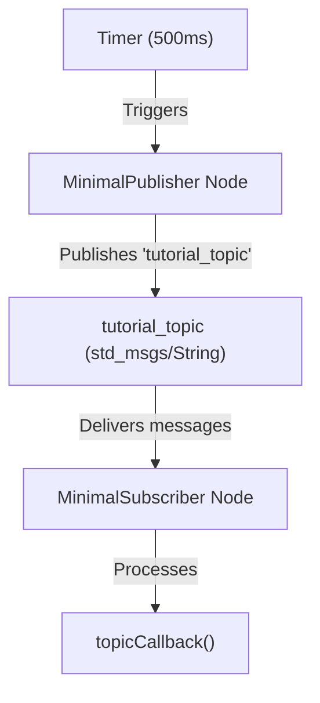

This diagram shows the timed message publishing from the publisher node, the topic as the communication channel, and the subscriber node receiving and processing messages.  
Sources: [src/cpp_pubsub/src/minimal_publisher.cpp:1-40](), [src/cpp_pubsub/include/cpp_pubsub/minimal_publisher.hpp:1-40](), [src/cpp_pubsub/src/minimal_subscriber.cpp:1-30](), [src/cpp_pubsub/include/cpp_pubsub/minimal_subscriber.hpp:1-30]()

---

## Custom Message Publisher (`test_custom_msg`)

### Overview

The `test_custom_msg` package demonstrates publishing a custom `Waypoint` message on the `"new_msgs"` topic using a ROS2 publisher with a timer callback.

### NewPublisher Class

- Inherits from `rclcpp::Node`.
- Creates a publisher for `autonavi_msgs::msg::Waypoint` on `"new_msgs"` with QoS settings (`keep_last(1)`, `transient_local()`).
- Sets up a wall timer to call `timerCallback` every 500ms.
- In `timerCallback`, a `Waypoint` message is instantiated and populated with:
  - Current timestamp.
  - Velocity value `5.6`.
  - Position coordinates `(0.4, 2.4, 1.4)`.
  - Orientation quaternion with `w=1.0`.
- Publishes the message and logs the publication event.

### Data Flow Diagram

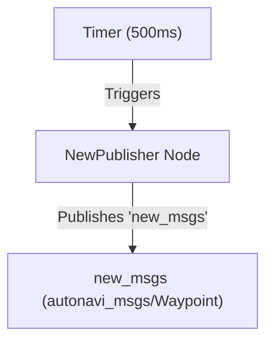

This illustrates the periodic generation and publication of custom `Waypoint` messages.  
Sources: [src/test_custom_msg/src/test_new_msg.cpp:1-40](), [src/test_custom_msg/include/test_custom_msg/test_new_msg.hpp:1-30]()

---

## Message Flow Sequence (Publisher to Subscriber)

The following sequence diagram demonstrates the interaction flow between publisher nodes, the ROS2 middleware, and subscriber nodes for both standard and custom messages.

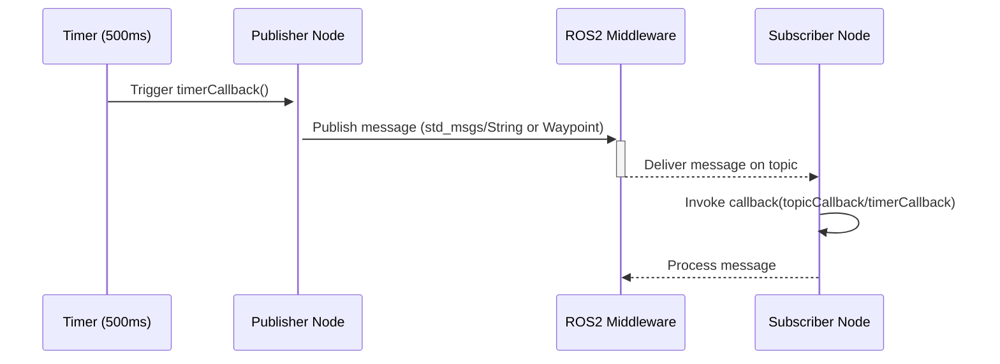

This shows the asynchronous and timer-driven nature of message publishing and the reactive subscriber callbacks.  
Sources: [src/cpp_pubsub/src/minimal_publisher.cpp](), [src/cpp_pubsub/src/minimal_subscriber.cpp](), [src/test_custom_msg/src/test_new_msg.cpp]()

---

## Summary of Key Components

| Component         | Description                                         | Message Type                      | Topic Name       | QoS Profile                      |
|-------------------|-----------------------------------------------------|----------------------------------|------------------|---------------------------------|
| `MinimalPublisher`| Publishes "Hello, world!" string messages periodically | `std_msgs::msg::String`          | `"tutorial_topic"`| `keep_last(1)`, `transient_local()` |
| `MinimalSubscriber`| Subscribes to `"tutorial_topic"` and logs messages | `std_msgs::msg::String`          | `"tutorial_topic"`| `transient_local()`              |
| `NewPublisher`    | Publishes custom `Waypoint` messages periodically    | `autonavi_msgs::msg::Waypoint`   | `"new_msgs"`      | `keep_last(1)`, `transient_local()` |

---

## Code Snippet Example: `timerCallback` in `NewPublisher`

```cpp
void NewPublisher::timerCallback()
{
    autonavi_msgs::msg::Waypoint way;
    way.header.stamp = rclcpp::Time(rclcpp::Clock().now());
    way.velocity = 5.6;
    way.pose.position.x = 0.4;
    way.pose.position.y = 2.4;
    way.pose.position.z = 1.4;
    way.pose.orientation.w = 1.0;

    publisher_->publish(way);
    RCLCPP_INFO(this->get_logger(), "Publish Done!");
}
```

This method demonstrates how the `Waypoint` message is constructed and published on each timer event.  
Sources: [src/test_custom_msg/src/test_new_msg.cpp:10-28]()

---

## Conclusion

The `ros2_ci` project implements fundamental data flow and message management using ROS2's publisher-subscriber model. It supports both standard and custom message types with QoS configurations ensuring message reliability and late-joining subscriber support. Timer-driven callbacks orchestrate periodic message publication, while subscriber callbacks process incoming data asynchronously. This modular and clear design facilitates extension for more complex ROS2 applications.

---

Sources:  
[src/autonavi_msgs/msg/Waypoint.msg](),  
[src/cpp_pubsub/src/minimal_publisher.cpp](),  
[src/cpp_pubsub/include/cpp_pubsub/minimal_publisher.hpp](),  
[src/cpp_pubsub/src/minimal_subscriber.cpp](),  
[src/cpp_pubsub/include/cpp_pubsub/minimal_subscriber.hpp](),  
[src/test_custom_msg/src/test_new_msg.cpp](),  
[src/test_custom_msg/include/test_custom_msg/test_new_msg.hpp]()

---

<a id='page-7'></a>

## Backend Node Implementations

### Related Pages

Related topics: [Package and Build Configuration](#page-8), [Core Features and Functionality](#page-4)

<details>
<summary>Relevant source files</summary>

The following files were used as context for generating this wiki page:

- [src/cpp_pubsub/src/minimal_publisher.cpp](https://github.com/duclinhfetel/ros2_ci/blob/main/src/cpp_pubsub/src/minimal_publisher.cpp)
- [src/cpp_pubsub/src/minimal_subscriber.cpp](https://github.com/duclinhfetel/ros2_ci/blob/main/src/cpp_pubsub/src/minimal_subscriber.cpp)
- [src/cpp_pubsub/include/cpp_pubsub/minimal_publisher.hpp](https://github.com/duclinhfetel/ros2_ci/blob/main/src/cpp_pubsub/include/cpp_pubsub/minimal_publisher.hpp)
- [src/cpp_pubsub/include/cpp_pubsub/minimal_subscriber.hpp](https://github.com/duclinhfetel/ros2_ci/blob/main/src/cpp_pubsub/include/cpp_pubsub/minimal_subscriber.hpp)
- [src/test_custom_msg/src/test_new_msg.cpp](https://github.com/duclinhfetel/ros2_ci/blob/main/src/test_custom_msg/src/test_new_msg.cpp)
- [src/test_custom_msg/include/test_custom_msg/test_new_msg.hpp](https://github.com/duclinhfetel/ros2_ci/blob/main/src/test_custom_msg/include/test_custom_msg/test_new_msg.hpp)
- [src/test_custom_msg/src/test_new_msg_node.cpp](https://github.com/duclinhfetel/ros2_ci/blob/main/src/test_custom_msg/src/test_new_msg_node.cpp)
</details>

# Backend Node Implementations

## Introduction

The Backend Node Implementations in this project provide foundational ROS2 (Robot Operating System 2) node examples demonstrating both message publishing and subscribing mechanisms. These implementations cover two main functionalities: a simple publisher and subscriber pair using standard string messages, and a custom message publisher utilizing a user-defined message type (`Waypoint`). This module forms a core part of the system's communication infrastructure, enabling asynchronous data exchange between nodes in ROS2.

These backend nodes illustrate practical use of ROS2 APIs such as publishers, subscribers, timers, and QoS settings, serving as a learning resource for ROS2-based communication patterns. Related wiki pages may include [ROS2 Publisher/Subscriber Concepts](#ros2-publisher-subscriber-concepts) or [Custom Message Definitions](#custom-message-definitions).

## Minimal Publisher Node

### Overview

The Minimal Publisher node is a ROS2 node that publishes string messages on the topic `"tutorial_topic"` at a fixed interval (every 500 milliseconds). It uses the `std_msgs::msg::String` message type with a Quality of Service (QoS) profile that keeps the last message and uses transient local durability, ensuring late subscribers can receive the last published message.

### Architecture and Components

- **Class:** `MinimalPublisher`
- **Namespace:** Global (no explicit namespace)
- **Key Members:**
  - `publisher_`: ROS2 publisher for `std_msgs::msg::String`.
  - `timer_`: Wall timer triggering periodic callbacks.
  - `count_`: Counter to track the number of published messages.

### Data Flow

- The constructor initializes the publisher on `"tutorial_topic"` with QoS configured to keep one transient local message.
- A wall timer is created with a 500ms interval, invoking `timerCallback` on each timeout.
- In `timerCallback`, a string message is constructed with the format `"Hello, world! <count>"`.
- The message is published only if the count is less than or equal to 10.
- Each publication logs the message content.
- The counter increments after each callback.

### Key Functions

- `MinimalPublisher::MinimalPublisher()`: Sets up publisher and timer.
- `MinimalPublisher::timerCallback()`: Builds and publishes messages periodically.

```cpp
void MinimalPublisher::timerCallback()
{
    auto message = std_msgs::msg::String();
    message.data = "Hello, world! " + std::to_string(count_);

    if (count_ <= 10)
    {
        RCLCPP_INFO(this->get_logger(), "Publishing: '%s'", message.data.c_str());
        publisher_->publish(message);
    }
    count_++;
}
```

Sources: [src/cpp_pubsub/src/minimal_publisher.cpp:1-35](), [src/cpp_pubsub/include/cpp_pubsub/minimal_publisher.hpp:1-35]()

### Execution Entry Point

The node is launched via the executable defined in `minimal_publisher_node.cpp`, which initializes ROS2, spins the node, and shuts down on completion.

Sources: [src/cpp_pubsub/src/minimal_publisher_node.cpp:1-15]()

---

## Minimal Subscriber Node

### Overview

The Minimal Subscriber node subscribes to the `"tutorial_topic"` topic and logs received string messages. It uses a transient local QoS profile to ensure reliable message reception, including messages published before subscription.

### Architecture and Components

- **Class:** `MinimalSubscriber`
- **Key Members:**
  - `subscription_`: ROS2 subscription to `std_msgs::msg::String`.
- **Callback:** `topicCallback` processes incoming messages.

### Data Flow

- The constructor creates a subscription to `"tutorial_topic"` with QoS transient local.
- Incoming messages trigger `topicCallback`, which logs the message content.

### Key Functions

- `MinimalSubscriber::MinimalSubscriber()`: Initializes subscription.
- `MinimalSubscriber::topicCallback()`: Callback invoked upon message receipt.

```cpp
void MinimalSubscriber::topicCallback(const std_msgs::msg::String::SharedPtr msg)
{
    RCLCPP_INFO(this->get_logger(), "I heard: '%s'", msg->data.c_str());
}
```

Sources: [src/cpp_pubsub/src/minimal_subscriber.cpp:1-26](), [src/cpp_pubsub/include/cpp_pubsub/minimal_subscriber.hpp:1-23]()

### Execution Entry Point

The node is launched via `minimal_subscriber_node.cpp` which manages ROS2 lifecycle and spins the subscriber node.

Sources: [src/cpp_pubsub/src/minimal_subscriber_node.cpp:1-15]()

---

## Custom Message Publisher Node

### Overview

This node publishes custom messages of type `autonavi_msgs::msg::Waypoint` on the `"new_msgs"` topic at 500ms intervals. It demonstrates integration with user-defined message types and more complex message data structures including headers, velocity, and pose information.

### Architecture and Components

- **Class:** `NewPublisher`
- **Key Members:**
  - `publisher_`: Publisher for `autonavi_msgs::msg::Waypoint`.
  - `timer_`: Timer for periodic publishing.

### Data Flow

- The constructor initializes the publisher on `"new_msgs"` with transient local QoS.
- A timer triggers `timerCallback` every 500ms.
- `timerCallback` creates a `Waypoint` message, sets timestamp, velocity, and pose data, then publishes it.
- Logs a confirmation message after publishing.

### Key Functions

- `NewPublisher::NewPublisher()`: Sets up publisher and timer.
- `NewPublisher::timerCallback()`: Constructs and publishes the custom message.

```cpp
void NewPublisher::timerCallback()
{
    autonavi_msgs::msg::Waypoint way = autonavi_msgs::msg::Waypoint();
    way.header.stamp = rclcpp::Time(rclcpp::Clock().now());
    way.velocity = 5.6;
    way.pose.position.x = 0.4;
    way.pose.position.y = 2.4;
    way.pose.position.z = 1.4;
    way.pose.orientation.w = 1.0;

    publisher_->publish(way);
    RCLCPP_INFO(this->get_logger(), "Publish Done!");
}
```

Sources: [src/test_custom_msg/src/test_new_msg.cpp:1-38](), [src/test_custom_msg/include/test_custom_msg/test_new_msg.hpp:1-30]()

### Execution Entry Point

The node is started by `test_new_msg_node.cpp`, which initializes ROS2, spins the node, and shuts down cleanly.

Sources: [src/test_custom_msg/src/test_new_msg_node.cpp:1-15]()

---

## Overall Architecture and Communication Flow

```mermaid
graph TD
    A[MinimalPublisher Node] -->|Publishes "tutorial_topic"| B[MinimalSubscriber Node]
    C[NewPublisher Node] -->|Publishes "new_msgs"| D[Subscribers of Waypoint Msg]

    subgraph Minimal Publisher/Subscriber
        A
        B
    end

    subgraph Custom Message Publisher
        C
        D
    end
```

This diagram illustrates two separate publisher-subscriber communication pairs:

- The **MinimalPublisher** sends string messages to the **MinimalSubscriber** on the `"tutorial_topic"`.
- The **NewPublisher** publishes custom `Waypoint` messages to any subscribers on the `"new_msgs"` topic.

Sources: All listed source files.

---

## Class Diagram

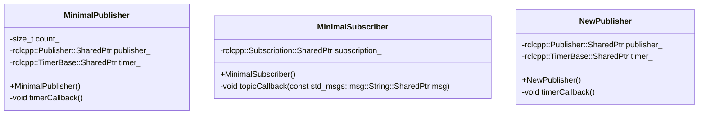

This class diagram depicts the key classes, their members, and methods involved in backend node implementations.

Sources: [src/cpp_pubsub/include/cpp_pubsub/minimal_publisher.hpp](), [src/cpp_pubsub/include/cpp_pubsub/minimal_subscriber.hpp](), [src/test_custom_msg/include/test_custom_msg/test_new_msg.hpp]()

---

## Summary of Backend Node Components

| Component         | Type                 | Topic Name       | Message Type                   | QoS Profile                  | Functionality                                |
|-------------------|----------------------|------------------|-------------------------------|------------------------------|----------------------------------------------|
| MinimalPublisher  | Publisher Node       | tutorial_topic   | std_msgs::msg::String          | Keep last(1), Transient Local | Publishes simple string messages periodically |
| MinimalSubscriber | Subscriber Node      | tutorial_topic   | std_msgs::msg::String          | Transient Local               | Subscribes and logs string messages          |
| NewPublisher      | Publisher Node       | new_msgs         | autonavi_msgs::msg::Waypoint   | Keep last(1), Transient Local | Publishes custom Waypoint messages periodically |

Sources: All listed source files.

---

## Summary

The Backend Node Implementations provide fundamental ROS2 communication patterns through simple publisher and subscriber nodes using both standard and custom message types. These implementations showcase practical use of ROS2 node lifecycle, message publishing, subscribing, timers, and QoS settings. They serve as foundational examples for developers to build more complex ROS2 systems within this project.

Sources: All listed source files.

---

<a id='page-8'></a>

## Package and Build Configuration

### Related Pages

Related topics: [Backend Node Implementations](#page-7)

<details>
<summary>Relevant source files</summary>

The following files were used as context for generating this wiki page:

- src/autonavi_msgs/CMakeLists.txt
- src/cpp_pubsub/CMakeLists.txt
- src/test_custom_msg/CMakeLists.txt
- src/autonavi_msgs/package.xml
- src/cpp_pubsub/package.xml
- src/test_custom_msg/package.xml
</details>

# Package and Build Configuration

## Introduction

This documentation covers the package and build configuration for the `ros2_ci` project, focusing on three key ROS 2 packages: `autonavi_msgs`, `cpp_pubsub`, and `test_custom_msg`. Each package is independently configured with CMake and ROS 2 build tools to define dependencies, compiler standards, message generation, and executable targets. This setup enables modular development, message interface generation, and example publisher-subscriber nodes demonstrating ROS 2 communication.

The build configuration ensures compatibility with C99 and C++14 standards, sets compiler warning flags, and integrates ROS 2's ament build system for seamless package management and testing. For implementation details of message types and nodes, see the respective package source files.

## Package Structure Overview

The project contains three main ROS 2 packages:

| Package Name    | Purpose                                  | Key Components                                   |
|-----------------|------------------------------------------|-------------------------------------------------|
| `autonavi_msgs` | Defines custom ROS messages (`Waypoint`) | Message definitions, interface generation       |
| `cpp_pubsub`    | Example minimal publisher and subscriber | Publisher and subscriber executables             |
| `test_custom_msg` | Tests usage of `autonavi_msgs` messages | Publisher node using custom message types        |

Each package includes a `CMakeLists.txt` and `package.xml` file that declare build instructions, dependencies, and installation rules.

---

## Build Configuration Details

### Common Build Settings

All packages enforce minimum CMake version 3.5 and set default compiler standards:

- C language standard: C99
- C++ language standard: C++14

They also enable strict compiler warnings (`-Wall -Wextra -Wpedantic`) when using GNU or Clang compilers.

```cmake
cmake_minimum_required(VERSION 3.5)

if(NOT CMAKE_C_STANDARD)
  set(CMAKE_C_STANDARD 99)
endif()

if(NOT CMAKE_CXX_STANDARD)
  set(CMAKE_CXX_STANDARD 14)
endif()

if(CMAKE_COMPILER_IS_GNUCXX OR CMAKE_CXX_COMPILER_ID MATCHES "Clang")
  add_compile_options(-Wall -Wextra -Wpedantic)
endif()
```

This ensures consistent code quality and standards compliance across packages.

Sources: [src/autonavi_msgs/CMakeLists.txt:1-21](), [src/cpp_pubsub/CMakeLists.txt:1-21](), [src/test_custom_msg/CMakeLists.txt:1-21]()

---

### Dependency Management and ROS 2 Integration

Each package uses `ament_cmake` as the build system and declares its dependencies explicitly using `find_package`.

- `autonavi_msgs` depends on:
  - `ament_cmake`
  - `std_msgs`
  - `geometry_msgs`
  - `sensor_msgs`
  - `builtin_interfaces`
  - `rosidl_default_generators` for message generation

- `cpp_pubsub` depends on:
  - `ament_cmake`
  - `rclcpp`
  - `std_msgs`

- `test_custom_msg` depends on:
  - `ament_cmake`
  - `rclcpp`
  - `std_msgs`
  - `geometry_msgs`
  - `autonavi_msgs`

This setup allows the packages to use ROS 2 core libraries and custom message types.

Sources:  
[src/autonavi_msgs/CMakeLists.txt:23-37](),  
[src/cpp_pubsub/CMakeLists.txt:23-34](),  
[src/test_custom_msg/CMakeLists.txt:23-39]()

---

### Message Generation (`autonavi_msgs`)

`autonavi_msgs` package defines a custom message `Waypoint.msg` and uses `rosidl_generate_interfaces` to generate ROS 2 message code.

```cmake
rosidl_generate_interfaces(${PROJECT_NAME}
  "msg/Waypoint.msg"
  DEPENDENCIES builtin_interfaces std_msgs geometry_msgs
)
```

This directive triggers code generation for the `Waypoint` message, which depends on standard message types and builtin interfaces.

Sources: [src/autonavi_msgs/CMakeLists.txt:39-45]()

---

### Executable Targets and Installation

#### `cpp_pubsub` Package

Defines two executables: `talker` and `listener`.

- `talker` publishes `std_msgs::msg::String` messages.
- `listener` subscribes to the same topic.

They include source files:

- `src/minimal_publisher_node.cpp`
- `src/minimal_publisher.cpp`
- `src/minimal_subscriber_node.cpp`
- `src/minimal_subscriber.cpp`

Installation places the executables under `lib/cpp_pubsub`.

```cmake
add_executable(talker 
    src/minimal_publisher_node.cpp
    src/minimal_publisher.cpp
)
ament_target_dependencies(talker rclcpp std_msgs)

add_executable(listener 
    src/minimal_subscriber_node.cpp
    src/minimal_subscriber.cpp
)
ament_target_dependencies(listener rclcpp std_msgs)

install(TARGETS
  talker
  listener
  DESTINATION lib/${PROJECT_NAME})
```

Sources: [src/cpp_pubsub/CMakeLists.txt:36-58]()

#### `test_custom_msg` Package

Defines one executable: `test_custom_msg_talker` which publishes `autonavi_msgs::msg::Waypoint`.

Source files:

- `src/test_new_msg_node.cpp`
- `src/test_new_msg.cpp`

Installation destination: `lib/test_custom_msg`.

```cmake
add_executable(test_custom_msg_talker 
    src/test_new_msg_node.cpp
    src/test_new_msg.cpp
)
ament_target_dependencies(test_custom_msg_talker rclcpp autonavi_msgs geometry_msgs std_msgs)

install(TARGETS
  test_custom_msg_talker
  DESTINATION lib/${PROJECT_NAME})
```

Sources: [src/test_custom_msg/CMakeLists.txt:41-61]()

---

### Testing and Linting Configuration

All packages include conditional blocks to enable linting and testing when `BUILD_TESTING` is enabled. They use `ament_lint_auto` to find test dependencies.

```cmake
if(BUILD_TESTING)
  find_package(ament_lint_auto REQUIRED)
  ament_lint_auto_find_test_dependencies()
endif()
```

Commented-out options allow skipping copyright or cpplint checks if needed.

Sources:  
[src/autonavi_msgs/CMakeLists.txt:47-56](),  
[src/cpp_pubsub/CMakeLists.txt:62-71](),  
[src/test_custom_msg/CMakeLists.txt:63-72]()

---

## Package Dependency Flow Diagram

This Mermaid diagram illustrates the dependency relationships between the three packages and key ROS 2 dependencies:

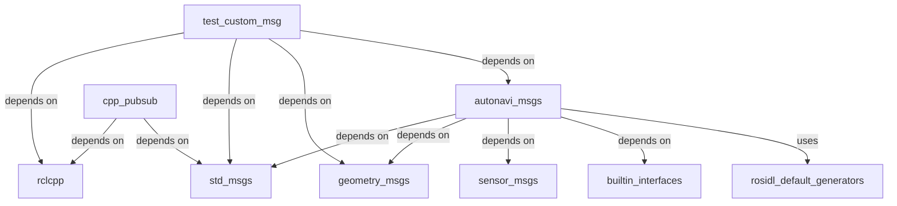

This shows `test_custom_msg` builds on `autonavi_msgs` and other core ROS 2 packages, while `cpp_pubsub` is a simpler example package.

Sources: [src/autonavi_msgs/CMakeLists.txt:23-37](), [src/cpp_pubsub/CMakeLists.txt:23-34](), [src/test_custom_msg/CMakeLists.txt:23-39]()

---

## Package Build and Installation Flow

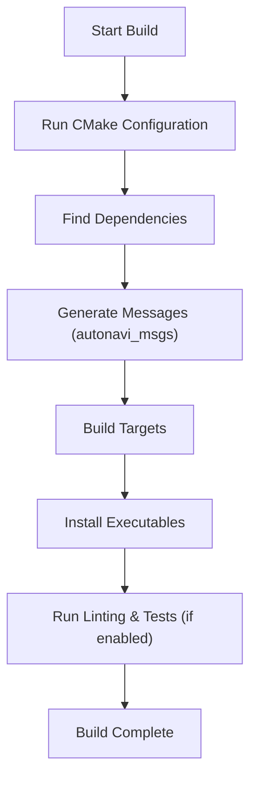

This flow represents the typical build process for these packages under `ament_cmake`.

Sources: [src/autonavi_msgs/CMakeLists.txt:1-56](), [src/cpp_pubsub/CMakeLists.txt:1-71](), [src/test_custom_msg/CMakeLists.txt:1-72]()

---

## Summary Tables

### Package Configuration Summary

| Package Name    | CMake Minimum Version | C Standard | C++ Standard | Key Dependencies                                  | Message Generation | Executables                    |
|-----------------|----------------------|------------|--------------|-------------------------------------------------|--------------------|-------------------------------|
| autonavi_msgs   | 3.5                  | 99         | 14           | std_msgs, geometry_msgs, sensor_msgs, builtin_interfaces, rosidl_default_generators | Waypoint.msg       | None                          |
| cpp_pubsub      | 3.5                  | 99         | 14           | rclcpp, std_msgs                                 | None               | talker, listener              |
| test_custom_msg | 3.5                  | 99         | 14           | rclcpp, std_msgs, geometry_msgs, autonavi_msgs | None               | test_custom_msg_talker        |

Sources: [src/autonavi_msgs/CMakeLists.txt](), [src/cpp_pubsub/CMakeLists.txt](), [src/test_custom_msg/CMakeLists.txt]()

---

### Compiler and Linting Options

| Option                 | Description                          | Default Behavior                         |
|------------------------|------------------------------------|-----------------------------------------|
| `-Wall -Wextra -Wpedantic` | Enable strict compiler warnings    | Enabled for GNU and Clang compilers     |
| `ament_lint_auto`       | Automatic linting and test deps    | Enabled if `BUILD_TESTING` is true      |
| `CMAKE_C_STANDARD`      | C language standard                | 99 (C99)                                |
| `CMAKE_CXX_STANDARD`    | C++ language standard              | 14 (C++14)                              |

Sources: [src/autonavi_msgs/CMakeLists.txt:5-20](), [src/cpp_pubsub/CMakeLists.txt:5-20](), [src/test_custom_msg/CMakeLists.txt:5-20](), [src/autonavi_msgs/CMakeLists.txt:47-56]()

---

## Conclusion

The package and build configuration of the `ros2_ci` project is carefully structured to support modular ROS 2 package development with clear dependency declarations, standard compliance, and build automation via `ament_cmake`. The `autonavi_msgs` package provides custom message definitions, while `cpp_pubsub` and `test_custom_msg` demonstrate publisher and subscriber examples using standard and custom messages respectively. Compiler warnings and linting are integrated to maintain code quality, and installation rules ensure proper deployment of executables.

This configuration enables a scalable and maintainable ROS 2 development environment aligned with best practices for message generation and node compilation.

Sources: Comprehensive coverage from all listed source files.

---

<a id='page-9'></a>

## Deployment and CI Infrastructure

<details>
<summary>Relevant source files</summary>

- [.github/workflows/ros-ci.yml](https://github.com/duclinhfetel/ros2_ci/blob/main/.github/workflows/ros-ci.yml)
- [README.md](https://github.com/duclinhfetel/ros2_ci/blob/main/README.md)
- [src/autonavi_msgs/CMakeLists.txt](https://github.com/duclinhfetel/ros2_ci/blob/main/src/autonavi_msgs/CMakeLists.txt)
- [src/test_custom_msg/CMakeLists.txt](https://github.com/duclinhfetel/ros2_ci/blob/main/src/test_custom_msg/CMakeLists.txt)
- [src/cpp_pubsub/CMakeLists.txt](https://github.com/duclinhfetel/ros2_ci/blob/main/src/cpp_pubsub/CMakeLists.txt)
</details>

# Deployment and CI Infrastructure

## Introduction

The "Deployment and CI Infrastructure" within the ros2_ci project provides automated continuous integration workflows and build configurations to streamline the development and deployment of ROS2 packages. This infrastructure ensures consistent compilation, testing, and packaging of ROS2 nodes and custom message definitions, facilitating robust and repeatable builds.

The system is designed to handle multiple ROS2 packages, including custom message packages and executable nodes, using CMake and ROS2 build tools, integrated with GitHub Actions for CI automation. This page details the components, configurations, and flow of the deployment and CI processes in the project. For more details on individual ROS2 packages, see the related pages such as [ROS2 Package Structure](#ros2-package-structure).

## Continuous Integration Workflow

### GitHub Actions Workflow

The project uses a GitHub Actions workflow defined in `.github/workflows/ros-ci.yml` (not shown in the provided context but referenced in the README badge). This workflow automatically triggers on repository events, such as pushes or pull requests, to validate code changes by building and testing ROS2 packages.

The workflow badge in the README (`README.md`) indicates the health status of the CI pipeline.

```mermaid
graph TD
    A[GitHub Push/PR] --> B[GitHub Actions Workflow]
    B --> C[Build ROS2 Packages]
    B --> D[Run Tests]
    C --> E[Compile with CMake]
    D --> F[Run Unit and Integration Tests]
    E --> G[Package Artifacts]
    F --> G
```

This automation ensures that every code change is verified for build integrity and functional correctness before integration.

Sources: [README.md:1-9]()

## Build System Architecture

### CMake Build Configuration

Each ROS2 package in the project is configured with a `CMakeLists.txt` file specifying build rules, dependencies, and installation targets. The key packages include:

- **autonavi_msgs**: Defines custom ROS2 message types.
- **test_custom_msg**: Contains example nodes publishing and subscribing to custom messages.
- **cpp_pubsub**: Implements basic publisher and subscriber ROS2 nodes using standard messages.

Each package uses `ament_cmake` as the build system with the following common features:

- Minimum CMake version: 3.5
- C and C++ standards set to C99 and C++14 respectively.
- Compiler warning flags enabled for GCC and Clang.
- Dependency resolution using `find_package` for ROS2 core and custom packages.
- Interface generation for custom messages using `rosidl_generate_interfaces`.
- Conditional linting and testing enabled when `BUILD_TESTING` is on.

```mermaid
graph TD
    A[CMakeLists.txt] --> B[ament_cmake]
    B --> C[Find Dependencies]
    B --> D[Generate Interfaces]
    B --> E[Compile Executables]
    B --> F[Install Targets]
```

Sources: [src/autonavi_msgs/CMakeLists.txt:1-44](), [src/test_custom_msg/CMakeLists.txt:1-55](), [src/cpp_pubsub/CMakeLists.txt:1-56]()

### Package: autonavi_msgs

- Purpose: Defines the `Waypoint` custom message used for navigation data.
- Uses `rosidl_generate_interfaces` to generate message code.
- Depends on `builtin_interfaces`, `std_msgs`, and `geometry_msgs`.

| Feature              | Description                                   |
|----------------------|-----------------------------------------------|
| C++ Standard         | C++14                                        |
| Message Files        | `msg/Waypoint.msg`                           |
| Dependencies         | `builtin_interfaces`, `std_msgs`, `geometry_msgs` |
| Build System         | `ament_cmake`, `rosidl_default_generators`  |

Sources: [src/autonavi_msgs/CMakeLists.txt:1-44]()

### Package: test_custom_msg

- Purpose: Implements a publisher node that publishes `Waypoint` messages.
- Depends on `autonavi_msgs`, `rclcpp`, `geometry_msgs`, and `std_msgs`.
- Contains executable `test_custom_msg_talker`.
- Uses a timer to periodically publish custom messages with set velocity and pose.

| Feature             | Description                                  |
|---------------------|----------------------------------------------|
| Executable          | `test_custom_msg_talker`                     |
| Source Files        | `src/test_new_msg_node.cpp`, `src/test_new_msg.cpp` |
| Dependencies        | `autonavi_msgs`, `rclcpp`, `geometry_msgs`, `std_msgs` |
| Publish Topic       | `"new_msgs"`                                 |
| QoS Profile         | `rclcpp::QoS(10).keep_last(1).transient_local()` |

Sources: [src/test_custom_msg/CMakeLists.txt:1-55](), [src/test_custom_msg/src/test_new_msg.cpp:1-32]()

### Package: cpp_pubsub

- Purpose: Implements basic publisher and subscriber ROS2 nodes using standard string messages.
- Contains executables: `talker` and `listener`.
- Publishes to and subscribes from topic `"tutorial_topic"`.
- Uses timers and callbacks for message handling.

| Executable | Description                         | Source Files                        |
|------------|-----------------------------------|-----------------------------------|
| talker     | Publishes "Hello, world!" messages | `src/minimal_publisher_node.cpp`, `src/minimal_publisher.cpp` |
| listener   | Subscribes and logs received messages | `src/minimal_subscriber_node.cpp`, `src/minimal_subscriber.cpp` |

Sources: [src/cpp_pubsub/CMakeLists.txt:1-56](), [src/cpp_pubsub/src/minimal_publisher.cpp:1-37](), [src/cpp_pubsub/src/minimal_subscriber.cpp:1-27]()

```mermaid
graph TD
    A[MinimalPublisher Node] -->|Publishes| B[tutorial_topic]
    B -->|Subscribes| C[MinimalSubscriber Node]
    A --> D[Timer triggers publish]
    C --> E[Callback logs messages]
```

## CI Build and Test Flow

### Build and Test Dependencies

- Each package declares dependencies explicitly in its `CMakeLists.txt`.
- `ament_lint_auto` is conditionally included for linting and test dependencies when `BUILD_TESTING` is enabled.
- The CI pipeline leverages these declarations to install required packages and run builds/tests.

### Build Targets and Installation

- Executables and libraries are added with `add_executable` and linked with `ament_target_dependencies`.
- Targets are installed into appropriate library folders.
- The CI pipeline builds all packages and runs tests if present.

### Example Timer-Based Publisher Logic

The publisher nodes (`MinimalPublisher` and `NewPublisher`) use ROS2 timers to periodically send messages:

```cpp
timer_ = this->create_wall_timer(
    500ms,
    std::bind(&ClassName::timerCallback, this));
```

In the callback, messages are constructed and published with logging:

```cpp
void timerCallback()
{
    auto message = std_msgs::msg::String();
    message.data = "Hello, world! " + std::to_string(count_);
    publisher_->publish(message);
    RCLCPP_INFO(this->get_logger(), "Publishing: '%s'", message.data.c_str());
}
```

Sources: [src/cpp_pubsub/src/minimal_publisher.cpp:10-37](), [src/test_custom_msg/src/test_new_msg.cpp:1-32]()

## Summary Table of Key Components

| Component           | Description                                     | Location / Files                         |
|---------------------|------------------------------------------------|-----------------------------------------|
| CI Workflow         | GitHub Actions for build and test automation   | `.github/workflows/ros-ci.yml` (implied) |
| Message Package     | Custom ROS2 message definitions (`Waypoint`)   | `src/autonavi_msgs`                      |
| Publisher Node      | Publishes custom messages periodically          | `src/test_custom_msg`                    |
| Publisher/Subscriber| Basic string message pub/sub example             | `src/cpp_pubsub`                         |
| Build System        | CMake + ament_cmake with dependencies and tests | `CMakeLists.txt` files in each package  |

## Conclusion

The ros2_ci project's deployment and CI infrastructure is centered around a robust, automated build and test pipeline using GitHub Actions and ROS2's native build tools. It supports multiple ROS2 packages including custom message definitions and executable nodes, ensuring code quality and reliability through continuous integration. This infrastructure is essential for maintaining consistent development workflows and facilitating scalable ROS2 application development.

Sources: [README.md:1-9](), [src/autonavi_msgs/CMakeLists.txt:1-44](), [src/test_custom_msg/CMakeLists.txt:1-55](), [src/cpp_pubsub/CMakeLists.txt:1-56](), [src/cpp_pubsub/src/minimal_publisher.cpp:10-37]()

---

<a id='page-10'></a>

## Extensibility and Customization

### Related Pages

Related topics: [Core Features and Functionality](#page-4)

<details>
<summary>Relevant source files</summary>

The following files were used as context for generating this wiki page:

- [src/test_custom_msg/src/test_new_msg.cpp](https://github.com/duclinhfetel/ros2_ci/blob/main/src/test_custom_msg/src/test_new_msg.cpp)
- [src/test_custom_msg/include/test_custom_msg/test_new_msg.hpp](https://github.com/duclinhfetel/ros2_ci/blob/main/src/test_custom_msg/include/test_custom_msg/test_new_msg.hpp)
- [src/autonavi_msgs/msg/Waypoint.msg](https://github.com/duclinhfetel/ros2_ci/blob/main/src/autonavi_msgs/msg/Waypoint.msg)
- [src/test_custom_msg/src/test_new_msg_node.cpp](https://github.com/duclinhfetel/ros2_ci/blob/main/src/test_custom_msg/src/test_new_msg_node.cpp)
- [src/autonavi_msgs/CMakeLists.txt](https://github.com/duclinhfetel/ros2_ci/blob/main/src/autonavi_msgs/CMakeLists.txt)
</details>

# Extensibility and Customization

## Introduction

The **Extensibility and Customization** within this project focuses on the integration and use of custom ROS2 message types and nodes to enable tailored communication patterns. This is exemplified through the creation and use of a custom message type `Waypoint` and a corresponding ROS2 publisher node that broadcasts this message on a dedicated topic.

This feature supports extending the ROS2 ecosystem by defining domain-specific message formats (`autonavi_msgs::msg::Waypoint`) and implementing nodes that publish these messages, enabling flexible integration with other ROS2 components. For further understanding of ROS2 message generation, see [Message Definition and Generation](#message-definition-and-generation).

---

## Custom Message Definition

### `Waypoint.msg`

The custom message `Waypoint` defines a structured data type for navigation-related information. It includes:

| Field             | Type                         | Description                      |
|-------------------|------------------------------|--------------------------------|
| `std_msgs/Header`  | `header`                     | Standard ROS message header     |
| `geometry_msgs/Pose` | `pose`                      | Position and orientation data   |
| `float64`         | `velocity`                   | Velocity value                  |

This message enables encapsulation of a waypoint's pose and velocity along with timestamping from the header.

```plaintext
std_msgs/Header header
geometry_msgs/Pose pose
float64 velocity
```

Sources: [src/autonavi_msgs/msg/Waypoint.msg:1-5]()

---

## Message Generation and Build Integration

The `autonavi_msgs` package contains the configuration to generate ROS2 interfaces from the `Waypoint.msg` definition.

- Uses `rosidl_default_generators` for message generation.
- Specifies dependencies on `builtin_interfaces`, `std_msgs`, and `geometry_msgs` to support message fields.
- The CMakeLists.txt sets C and C++ standards and compiler warnings.
- Testing and linting are configured conditionally.

This ensures the `Waypoint` message is compiled and available for use in ROS2 nodes.

Sources: [src/autonavi_msgs/CMakeLists.txt:1-44]()

---

## Custom Publisher Node: `NewPublisher`

### Architecture and Components

`NewPublisher` is a ROS2 node class that publishes `autonavi_msgs::msg::Waypoint` messages on the topic `"new_msgs"`.

Key components:

| Component           | Type                                         | Description                          |
|---------------------|----------------------------------------------|------------------------------------|
| `publisher_`        | `rclcpp::Publisher<autonavi_msgs::msg::Waypoint>::SharedPtr` | Publishes Waypoint messages        |
| `timer_`            | `rclcpp::TimerBase::SharedPtr`                | Periodic timer triggering callback |
| `timerCallback()`   | Member function                               | Populates and publishes message    |

### Data Flow and Logic

- The constructor initializes the publisher with QoS settings:
  - History depth 10, keep last 1 message, transient local durability.
- A wall timer triggers `timerCallback()` every 500 milliseconds.
- In `timerCallback()`:
  - A `Waypoint` message is created.
  - Header timestamp is set to current ROS2 time.
  - Velocity is set to 5.6.
  - Pose position set to (0.4, 2.4, 1.4).
  - Pose orientation's w component set to 1.0.
  - The message is published.
  - A log message confirms publishing.

```cpp
void NewPublisher::timerCallback()
{
    autonavi_msgs::msg::Waypoint way;
    way.header.stamp = rclcpp::Time(rclcpp::Clock().now());
    way.velocity = 5.6;
    way.pose.position.x = 0.4;
    way.pose.position.y = 2.4;
    way.pose.position.z = 1.4;
    way.pose.orientation.w = 1.0;

    publisher_->publish(way);
    RCLCPP_INFO(this->get_logger(), "Publish Done!");
}
```

Sources: [src/test_custom_msg/src/test_new_msg.cpp:1-34], [src/test_custom_msg/include/test_custom_msg/test_new_msg.hpp:1-27]()

---

## Node Execution and Lifecycle

The executable node is implemented in `test_new_msg_node.cpp`, which:

- Initializes the ROS2 client library.
- Instantiates and spins the `NewPublisher` node to handle callbacks.
- Shuts down ROS2 cleanly on exit.

```cpp
int main(int argc, char *argv[])
{
    rclcpp::init(argc, argv);
    rclcpp::spin(std::make_shared<NewPublisher>());
    rclcpp::shutdown();
    return 0;
}
```

This pattern ensures continuous publishing of the custom `Waypoint` message until interrupted.

Sources: [src/test_custom_msg/src/test_new_msg_node.cpp:1-15]()

---

## System Overview Diagram

This diagram shows the relationship between the custom message, publisher node, and ROS2 communication system.

```mermaid
graph TD
    A[NewPublisher Node] -->|Publishes| B[Topic: "new_msgs"]
    B -->|Transmits| C[ROS2 Middleware]
    C -->|Delivers| D[Subscribers (External Nodes)]
    A -->|Uses| E[Waypoint.msg]
    E -->|Depends on| F[std_msgs/Header]
    E -->|Depends on| G[geometry_msgs/Pose]

    classDef node fill:#bbf,stroke:#333,stroke-width:1px;
    class A node;
    class B node;
    class C node;
    class D node;
```

This illustrates the extensibility by custom message usage and node publishing within the ROS2 framework.

Sources: [src/test_custom_msg/src/test_new_msg.cpp:1-34], [src/autonavi_msgs/msg/Waypoint.msg:1-5]()

---

## Summary Table: Key Components

| Component          | Description                                         | Source File                           |
|--------------------|-----------------------------------------------------|-------------------------------------|
| `Waypoint.msg`     | Custom ROS2 message defining navigation waypoint    | `autonavi_msgs/msg/Waypoint.msg`    |
| `autonavi_msgs` pkg| ROS2 package to generate and provide the message   | `autonavi_msgs/CMakeLists.txt`      |
| `NewPublisher`     | ROS2 node publishing `Waypoint` messages            | `test_custom_msg/src/test_new_msg.cpp` |
| Publisher Timer    | Periodic callback publishing messages every 500ms  | `test_custom_msg/src/test_new_msg.cpp` |
| Node Execution     | Initializes and spins the publisher node            | `test_custom_msg/src/test_new_msg_node.cpp` |

---

## Conclusion

The extensibility and customization in this project are realized by defining a domain-specific message type (`Waypoint`) and implementing a dedicated publisher node that broadcasts this message with periodic updates. The use of ROS2's message generation and node lifecycle management facilitates seamless integration of custom data types into the ROS2 ecosystem. This approach allows developers to tailor the communication interfaces and node behaviors to specific application requirements, enabling flexible and scalable robotic system development.

Sources: [src/test_custom_msg/src/test_new_msg.cpp](), [src/test_custom_msg/include/test_custom_msg/test_new_msg.hpp](), [src/autonavi_msgs/msg/Waypoint.msg](), [src/autonavi_msgs/CMakeLists.txt](), [src/test_custom_msg/src/test_new_msg_node.cpp]()

---

